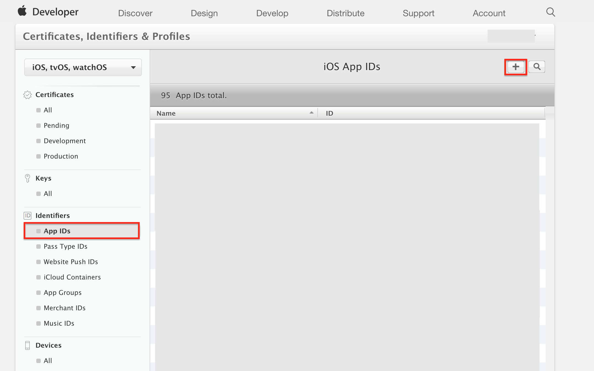
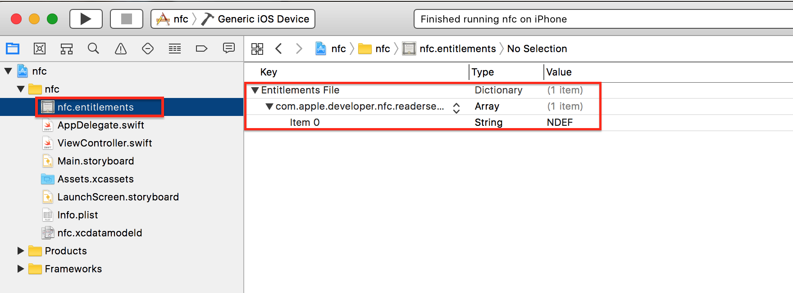

# NFCタグを読み込む


## 事前準備

新規作成したアプリのBundleIDをメモ。


[iOS Dev Center](https://developer.apple.com/account/ios/certificate/)でアプリIDを新規に作成し、BundleIDを登録する。




.entitielementファイルを作成するために、CapabilityのWalletをOnにし、ファイルが生成されたらOffにする。



```xml
<?xml version="1.0" encoding="UTF-8"?>
<!DOCTYPE plist PUBLIC "-//Apple//DTD PLIST 1.0//EN" "http://www.apple.com/DTDs/PropertyList-1.0.dtd">
<plist version="1.0">
    <dict>
        <key>com.apple.developer.nfc.readersession.formats</key>
        <array>
            <string>NDEF</string>
        </array>
    </dict>
</plist>
```


* `Privacy – NFC Scan Usage Description`<br>
* `NFCMyTag`<br>

## Swift 3.0

```swift
//
//  ViewController.swift
//  nfc001
//
//  Copyright © 2017年 FaBo, Inc. All rights reserved.
//

import UIKit
import CoreNFC

class ViewController: UIViewController, NFCNDEFReaderSessionDelegate {

    override func viewDidLoad() {
        super.viewDidLoad()
        let session = NFCNDEFReaderSession(delegate: self, queue: nil, invalidateAfterFirstRead: true)
        session.begin()
    }

    override func didReceiveMemoryWarning() {
        super.didReceiveMemoryWarning()
        // Dispose of any resources that can be recreated.
    }
    
    func readerSession(_ session: NFCNDEFReaderSession, didInvalidateWithError error: Error) {
        print(error)
    }
    
    func readerSession(_ session: NFCNDEFReaderSession, didDetectNDEFs messages: [NFCNDEFMessage]) {
        print(messages)
    }
}
```

## Reference

* CoreNFC
	* [https://developer.apple.com/documentation/corenfc](https://developer.apple.com/documentation/corenfc)
