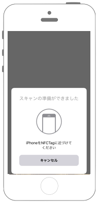

# NFCタグを読み込む



## 事前準備


## Swift 3.0

```swift
//
//  ViewController.swift
//  nfc001
//
//  Copyright © 2017年 FaBo, Inc. All rights reserved.
//

import UIKit
import CoreNFC

class ViewController: UIViewController, NFCNDEFReaderSessionDelegate {

    override func viewDidLoad() {
        super.viewDidLoad()
        let session = NFCNDEFReaderSession(delegate: self, queue: nil, invalidateAfterFirstRead: true)
        session.begin()
    }

    override func didReceiveMemoryWarning() {
        super.didReceiveMemoryWarning()
        // Dispose of any resources that can be recreated.
    }
    
    func readerSession(_ session: NFCNDEFReaderSession, didInvalidateWithError error: Error) {
        print(error)
    }
    
    func readerSession(_ session: NFCNDEFReaderSession, didDetectNDEFs messages: [NFCNDEFMessage]) {
        print(messages)
    }
}
```

## Reference

* CoreNFC
	* [https://developer.apple.com/documentation/corenfc](https://developer.apple.com/documentation/corenfc)
