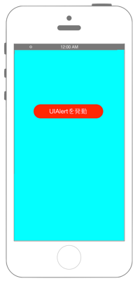
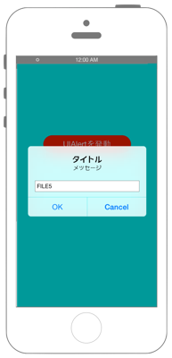
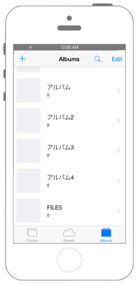

# アルバムを作る

   

## Swift 3.0

`Info.plist`に`NSPhotoLibraryUsageDescription`を追加します

```swift
//
//  ViewController.swift
//  phptokit002
//
//  Copyright © 2016年 FaBo, Inc. All rights reserved.
//
import UIKit
import Photos

class ViewController: UIViewController {
    
    // ユーザーへの許可のリクエスト.
    var request: PHCollectionListChangeRequest!
    
    // アラート.
    var myAlert: UIAlertController!
    
    // AlertのOKAction.
    var myOKAction: UIAlertAction!
    
    // アルバム名を保存するtext.
    var text: String!
    
    override func viewDidAppear(_ animated: Bool) {
        
        //PhotoKitの使用をユーザーから許可を得る.
        PHPhotoLibrary.requestAuthorization { status -> Void in
            switch(status){
            case .authorized:
                print("Authorized")
            case .denied:
                print("Denied")
            case .notDetermined:
                print("NotDetermined")
            case .restricted:
                print("Restricted")
            }
            
        }
        
        // Viewの背景を水色に.
        self.view.backgroundColor = UIColor.cyan
        
        // Buttonの定義.
        let myButton = UIButton()
        myButton.frame = CGRect(x: 0, y: 0, width: 200, height: 40)
        myButton.backgroundColor = UIColor.red
        myButton.layer.masksToBounds = true
        myButton.setTitle("アルバムを作成", for: UIControlState.normal)
        myButton.setTitleColor(UIColor.white, for: UIControlState.normal)
        myButton.layer.cornerRadius = 20.0
        myButton.layer.position = CGPoint(x: self.view.frame.width/2, y:200)
        myButton.addTarget(self, action: #selector(onClickMyButton(sender:)), for: .touchUpInside)
        
        // UIボタンをViewに追加.
        self.view.addSubview(myButton);
    }
    
    /*
     ボタンイベント.
     */
    func onClickMyButton(sender: UIButton){
        
        // UIAlertControllerを作成.
        myAlert = UIAlertController(title: "タイトル", message: "メッセージ", preferredStyle: .alert)
        
        // OKのアクションを作成.
        myOKAction = UIAlertAction(title: "OK", style: .default) { action in
            PHPhotoLibrary.shared().performChanges({
                // iOSのフォトアルバムにコレクション(アルバム)を追加する.
                
                self.request = PHCollectionListChangeRequest.creationRequestForCollectionList(withTitle: self.text)
                
                }, completionHandler: { (isSuccess, error) -> Void in
                    if isSuccess == true {
                        print("Success!")
                    } else{
                        print("error occured")
                    }
            })
        }
        
        // OKボタンを押せないようにする.
        myOKAction.isEnabled = false
        
        // キャンセルのアクションを作成.
        let myNoAction = UIAlertAction(title: "Cancel", style: UIAlertActionStyle.default) { action in
            print("cancel")
        }
        
        // タイトルを入力する用のTextFieldをAlertに追加する.
        myAlert.addTextField { textField in
            // 編集が終わる(returnキーが押される)とメソッドが呼び出される.
            textField.addTarget(self, action: #selector(self.onTextEnter(sender:)), for: UIControlEvents.editingChanged)
        }
        
        myAlert.addAction(myOKAction)
        myAlert.addAction(myNoAction)
        
        // UIAlertを発動する.
        present(myAlert, animated: true, completion: nil)
    }
    
    /*
     TextFieldのTextの編集が終了した時に呼ばれるメソッド.
     */
    func onTextEnter(sender: UITextField){
        text = sender.text
        myOKAction.isEnabled = true
    }
    
}
```

## Swift 2.3

```swift
//
//  ViewController.swift
//  phptokit002
//
//  Copyright © 2016年 FaBo, Inc. All rights reserved.
//
import UIKit
import Photos

class ViewController: UIViewController {
    
    // ユーザーへの許可のリクエスト.
    var request: PHCollectionListChangeRequest!
    
    // アラート.
    var myAlert: UIAlertController!
    
    // AlertのOKAction.
    var myOKAction: UIAlertAction!
    
    // アルバム名を保存するtext.
    var text: String!
    
    override func viewDidAppear(animated: Bool) {
        
        //PhotoKitの使用をユーザーから許可を得る.
        PHPhotoLibrary.requestAuthorization { status -> Void in
            switch(status){
            case .Authorized:
                print("Authorized")
            case .Denied:
                print("Denied")
            case .NotDetermined:
                print("NotDetermined")
            case .Restricted:
                print("Restricted")
            }
            
        }
        
        // Viewの背景を水色に.
        self.view.backgroundColor = UIColor.cyanColor()
        
        // Buttonの定義.
        let myButton = UIButton()
        myButton.frame = CGRectMake(0,0,200,40)
        myButton.backgroundColor = UIColor.redColor();
        myButton.layer.masksToBounds = true
        myButton.setTitle("アルバムを作成", forState: UIControlState.Normal)
        myButton.setTitleColor(UIColor.whiteColor(), forState: UIControlState.Normal)
        myButton.layer.cornerRadius = 20.0
        myButton.layer.position = CGPoint(x: self.view.frame.width/2, y:200)
        myButton.addTarget(self, action: #selector(ViewController.onClickMyButton(_:)), forControlEvents: .TouchUpInside)
        
        // UIボタンをViewに追加.
        self.view.addSubview(myButton);
    }
    
    /*
     ボタンイベント.
     */
    func onClickMyButton(sender: UIButton){
        
        // UIAlertControllerを作成.
        myAlert = UIAlertController(title: "タイトル", message: "メッセージ", preferredStyle: .Alert)
        
        // OKのアクションを作成.
        myOKAction = UIAlertAction(title: "OK", style: .Default) { action in
            PHPhotoLibrary.sharedPhotoLibrary().performChanges({
                // iOSのフォトアルバムにコレクション(アルバム)を追加する.
                self.request = PHCollectionListChangeRequest.creationRequestForCollectionListWithTitle(self.text)
                
                }, completionHandler: { (isSuccess, error) -> Void in
                    if isSuccess == true {
                        print("Success!")
                    } else{
                        print("error occured")
                    }
            })
        }
        
        // OKボタンを押せないようにする.
        myOKAction.enabled = false
        
        // キャンセルのアクションを作成.
        let myNoAction = UIAlertAction(title: "Cancel", style: UIAlertActionStyle.Default) { action in
            print("cancel")
        }
        
        // タイトルを入力する用のTextFieldをAlertに追加する.
        myAlert.addTextFieldWithConfigurationHandler { textField in
            print("addTextFieldWithConfigurationHandler")
            // 編集が終わる(returnキーが押される)とメソッドが呼び出される.
            textField.addTarget(self, action: #selector(ViewController.onTextEnter(_:)), forControlEvents: UIControlEvents.EditingChanged)
        }
        
        myAlert.addAction(myOKAction)
        myAlert.addAction(myNoAction)
        
        // UIAlertを発動する.
        presentViewController(myAlert, animated: true, completion: nil)
    }
    
    /*
     TextFieldのTextの編集が終了した時に呼ばれるメソッド.
     */
    func onTextEnter(sender: UITextField){
        print("onTextEnter")
        text = sender.text
        myOKAction.enabled = true
    }
    
}
```

## 2.xと3.xの差分

* enum列挙体`PHAuthorizationStatus`のイニシャルが小文字に変更
* `func viewDidAppear(animated: Bool)`から`func viewDidAppear(_ animated: Bool)`に変更
* `PHPhotoLibrary.sharedPhotoLibrary()`から`PHPhotoLibrary.shared()`に変更
* `PHCollectionListChangeRequest.creationRequestForCollectionListWithTitle(String)`から`PHCollectionListChangeRequest.creationRequestForCollectionList(withTitle: String)`に変更
* `UIAlertAction.enabled`から` UIAlertAction.isEnabled`に変更
* `UIAlertController.addTextFieldWithConfigurationHandler(configurationHandler: ((UITextField) -> Void)?)`から`UIAlertController.addTextField(configurationHandler: ((UITextField) -> Void)?)`に変更
* `UIViewController.presentViewController(UIViewController, animated: Bool, completion: (() -> Void)?)`から`UIViewController.present(UIViewController, animated: Bool, completion: (() -> Void)?)`に変更

## Reference

* Photos Framework
    * https://developer.apple.com/library/ios/documentation/Photos/Reference/Photos_Framework/
* PHPhotoLibrary
    * https://developer.apple.com/library/ios/documentation/Photos/Reference/PHPhotoLibrary_Class/
