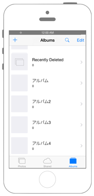

# アルバムを作る



## Swift 3.0

`Info.plist`に`NSPhotoLibraryUsageDescription`を追加します

```swift
```

## Swift 2.3

```swift
```

## 2.xと3.xの差分

* enum列挙体`PHAuthorizationStatus`のイニシャルが小文字に変更
* `func viewDidAppear(animated: Bool)`から`func viewDidAppear(_ animated: Bool)`に変更
* `PHPhotoLibrary.sharedPhotoLibrary()`から`PHPhotoLibrary.shared()`に変更
* `PHCollectionListChangeRequest.creationRequestForCollectionListWithTitle(String)`から`PHCollectionListChangeRequest.creationRequestForCollectionList(withTitle: String)`に変更
* `UIAlertAction.enabled`から` UIAlertAction.isEnabled`に変更
* `UIAlertController.addTextFieldWithConfigurationHandler(configurationHandler: ((UITextField) -> Void)?)`から`UIAlertController.addTextField(configurationHandler: ((UITextField) -> Void)?)`に変更
* `UIViewController.presentViewController(UIViewController, animated: Bool, completion: (() -> Void)?)`から`UIViewController.present(UIViewController, animated: Bool, completion: (() -> Void)?)`に変更

## Reference

* Photos Framework
    * https://developer.apple.com/library/ios/documentation/Photos/Reference/Photos_Framework/
* PHPhotoLibrary
    * https://developer.apple.com/library/ios/documentation/Photos/Reference/PHPhotoLibrary_Class/
