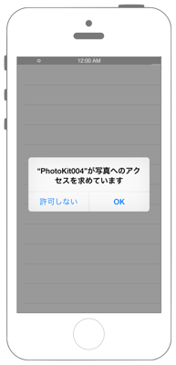

# アルバムを削除する

  

## Swift 3.0

```swift
```

## Swift 2.3

```swift
```

## 2.xと3.xの差分

## Reference

* Photos Framework
    * https://developer.apple.com/library/ios/documentation/Photos/Reference/Photos_Framework/
