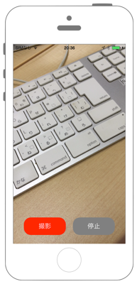
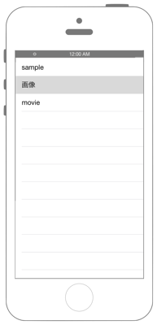
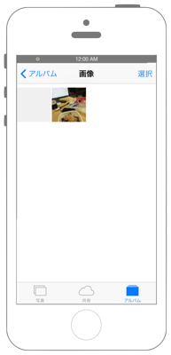

# アルバムのアセットを削除する

   

## Swift 3.0

`Info.plist`に`NSPhotoLibraryUsageDescription`を追加します。

```swift
//
//  ViewController.swift
//  phptokit006
//
//  Copyright © 2016年 FaBo, Inc. All rights reserved.
//
import UIKit
import Photos

extension PHPhotoLibrary {
    // ユーザーに許可を促す.
    class func Authorization(){
        PHPhotoLibrary.requestAuthorization { (status) in
            switch status {
            case .authorized:
                print("Authorized")
            case .denied:
                print("Denied")
            case .notDetermined:
                print("NotDetermined")
            case .restricted:
                print("Restricted")
            }
        }
    }
}

class ViewController: UIViewController, UITableViewDelegate, UITableViewDataSource {
    
    // アルバム.
    var myAlbum: [String] = []
    
    // 削除対象のアルバム.
    var targetAlbum: PHAssetCollection!
    
    // 削除対象のアセット.
    var targetAssets: [PHAsset]!
    
    override func viewDidLoad() {
        super.viewDidLoad()
        
        // フォトアプリの中にあるアルバムを検索する.
        let list = PHAssetCollection.fetchAssetCollections(with: PHAssetCollectionType.album, subtype: PHAssetCollectionSubtype.any, options: nil)
        
        // リストの中にあるオブジェクトに対して１つずつ呼び出す.
        for i in 0 ..< list.count {
            let item = list.object(at: i)
            // アルバムのタイトル名を配列にコレクションする.
            myAlbum.append(item.localizedTitle!)
        }

        // 結果表示用のTableViewを用意.
        let barHeight = UIApplication.shared.statusBarFrame.size.height
        let displayWidth = self.view.frame.width
        let displayHeight = self.view.frame.height
        
        // TableViewを生成.
        let myTableView = UITableView(frame: CGRect(x: 0, y: barHeight, width: displayWidth, height: displayHeight - barHeight))
        myTableView.register(UITableViewCell.self, forCellReuseIdentifier: "MyCell")
        myTableView.dataSource = self
        myTableView.delegate = self
        self.view.addSubview(myTableView)
        
    }
    
    
    // MARK: - UITableViewDelegate
    
    // Cellがタッチされた時に呼ばれるメソッド.
    func tableView(_ tableView: UITableView, didSelectRowAt indexPath: IndexPath) {
        
        // フォトアプリの中にあるアルバムを検索する.
        let list = PHAssetCollection.fetchAssetCollections(with: PHAssetCollectionType.album, subtype: PHAssetCollectionSubtype.any, options: nil)
        
        // リストの中にあるオブジェクトに対して１つずつ呼び出す.
        for i in 0 ..< list.count {
            let item = list.object(at: i)
            // 選択した名前と同じ名前のアルバムを取得.
            if item.localizedTitle == self.myAlbum[indexPath.row] {
                // 削除する対象のアルバムを代入する.
                self.targetAlbum = item
            }
        }
        
        // アルバムの中のアセットを検索する.
        let assetList = PHAsset.fetchAssets(in: targetAlbum, options: nil)
        targetAssets = []
        
        // アセットを１つずつ呼び出す.
        for i in 0 ..< assetList.count {
            let item = assetList.object(at: i)
            // アセットにfavoriteがついているものを目印に削除.
            if item.isFavorite == true {
                self.targetAssets.append(item)
            }
        }

        PHPhotoLibrary.shared().performChanges({
            let request = PHAssetCollectionChangeRequest(for: self.targetAlbum)
            // アセットを削除する.
            request!.removeAssets(self.targetAssets)
            }, completionHandler: { (isSuccess, error) in
                if let e = error {
                    print("Error: \(e.localizedDescription)")
                    return
                }
                if isSuccess {
                    print("削除が完了しました")
                }
        })
    }
    
    
    // MARK: - UITableViewDataSource
    
    // Cellの総数を返すメソッド.
    func tableView(_ tableView: UITableView, numberOfRowsInSection section: Int) -> Int {
        return myAlbum.count
    }
    
    // Cellの初期化をするメソッド.
    func tableView(_ tableView: UITableView, cellForRowAt indexPath: IndexPath) -> UITableViewCell {
        let cell = tableView.dequeueReusableCell(withIdentifier: "MyCell", for: indexPath)
        // Cellに値を設定.
        cell.textLabel?.text = "\(myAlbum[indexPath.row])"
        return cell
    }
}
```

## Swift 2.3

```swift
//
//  ViewController.swift
//  phptokit006
//
//  Copyright © 2016年 FaBo, Inc. All rights reserved.
//
import UIKit
import Photos

extension PHPhotoLibrary {
    // ユーザーに許可を促す.
    class func Authorization(){
        PHPhotoLibrary.requestAuthorization { (status) in
            switch status {
            case .Authorized:
                print("Authorized")
            case .Denied:
                print("Denied")
            case .NotDetermined:
                print("NotDetermined")
            case .Restricted:
                print("Restricted")
            }
        }
    }
}

class ViewController: UIViewController, UITableViewDelegate, UITableViewDataSource {
    
    // アルバム.
    var myAlbum: [String] = []
    
    // 削除対象のアルバム.
    var targetAlbum: PHAssetCollection!
    
    // 削除対象のアセット.
    var targetAssets: [PHAsset]!
    
    override func viewDidLoad() {
        super.viewDidLoad()
        
        // フォトアプリの中にあるアルバムを検索する.
        let list = PHAssetCollection.fetchAssetCollectionsWithType(PHAssetCollectionType.Album, subtype: PHAssetCollectionSubtype.Any, options: nil)
        
        // リストの中にあるオブジェクトに対して１つずつ呼び出す.
        list.enumerateObjectsUsingBlock { (album, index, isStop) -> Void in
            // アルバムのタイトル名を配列にコレクションする.
            self.myAlbum.append(album.localizedTitle)
        }
        
        // 結果表示用のTableViewを用意.
        let barHeight: CGFloat = UIApplication.sharedApplication().statusBarFrame.size.height
        let displayWidth: CGFloat = self.view.frame.width
        let displayHeight: CGFloat = self.view.frame.height
        
        // TableViewを生成.
        let myTableView: UITableView = UITableView(frame: CGRect(x: 0, y: barHeight, width: displayWidth, height: displayHeight - barHeight))
        myTableView.registerClass(UITableViewCell.self, forCellReuseIdentifier: "MyCell")
        myTableView.dataSource = self
        myTableView.delegate = self
        self.view.addSubview(myTableView)
        
    }
    
    
    // MARK: - UITableViewDelegate
    
    // Cellがタッチされた時に呼ばれるメソッド.
    func tableView(tableView: UITableView, didSelectRowAtIndexPath indexPath: NSIndexPath) {
        
        // フォトアプリの中にあるアルバムを検索する.
        let list = PHAssetCollection.fetchAssetCollectionsWithType(PHAssetCollectionType.Album, subtype: PHAssetCollectionSubtype.Any, options: nil)
        
        // リストの中にあるオブジェクトに対して１つずつ呼び出す.
        list.enumerateObjectsUsingBlock { (album, index, isStop) -> Void in
            // 選択した名前と同じ名前のアルバムを取得.
            if album.localizedTitle == self.myAlbum[indexPath.row] {
                // 削除する対象のアルバムを代入する.
                self.targetAlbum = album as! PHAssetCollection
            }
        }
        
        // アルバムの中のアセットを検索する.
        let assetList = PHAsset.fetchAssetsInAssetCollection(targetAlbum, options: nil)
        targetAssets = []
        
        // アセットを１つずつ呼び出す.
        assetList.enumerateObjectsUsingBlock { (asset, index, isStop) in
            // アセットにfavoriteがついているものを目印に削除.
            if (asset as! PHAsset).favorite == true {
                self.targetAssets.append(asset as! PHAsset)
            }
        }
        
        PHPhotoLibrary.sharedPhotoLibrary().performChanges({
            let request = PHAssetCollectionChangeRequest(forAssetCollection: self.targetAlbum)
            // アセットを削除する.
            request!.removeAssets(self.targetAssets)
            }, completionHandler: { (isSuccess, error) in
                if let e = error {
                    print("Error: \(e.localizedDescription)")
                    return
                }
                if isSuccess {
                    print("削除が完了しました")
                }
        })
    }
    
    
    // MARK: - UITableViewDataSource
    
    // Cellの総数を返すメソッド.
    func tableView(tableView: UITableView, numberOfRowsInSection section: Int) -> Int {
        return myAlbum.count
    }
    
    // Cellの初期化をするメソッド.
    func tableView(tableView: UITableView, cellForRowAtIndexPath indexPath: NSIndexPath) -> UITableViewCell {
        let cell = tableView.dequeueReusableCellWithIdentifier("MyCell", forIndexPath: indexPath)
        // Cellに値を設定.
        cell.textLabel?.text = "\(myAlbum[indexPath.row])"
        return cell
    }
}
```

## 2.xと3.xの差分

* `PHAssetCollection.fetchAssetCollectionsWithType(PHAssetCollectionType, subtype: PHAssetCollectionSubtype, options: PHFetchOptions?)`から`PHAssetCollection.fetchAssetCollections(with: PHAssetCollectionType, subtype: PHAssetCollectionSubtype, options: PHFetchOptions?)`に変更
* `UIApplication.sharedApplication()`から`UIApplication.shared`に変更
* `UITableView.registerClass(AnyClass?, forCellReuseIdentifier: String)`から`UITableView.register(AnyClass?, forCellReuseIdentifier: String)`に変更
* `PHPhotoLibrary.sharedPhotoLibrary()`から`PHPhotoLibrary.shared()`に変更
* `PHAssetCollectionChangeRequest(forAssetCollection: PHAssetCollection)`から`PHAssetCollectionChangeRequest(for: PHAssetCollection)`に変更

## Reference

* Photos Framework
    * https://developer.apple.com/library/ios/documentation/Photos/Reference/Photos_Framework/
* PHPhotoLibrary
    * https://developer.apple.com/library/ios/documentation/Photos/Reference/PHPhotoLibrary_Class/
