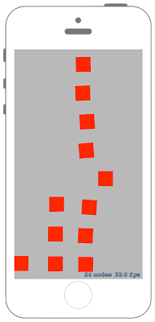
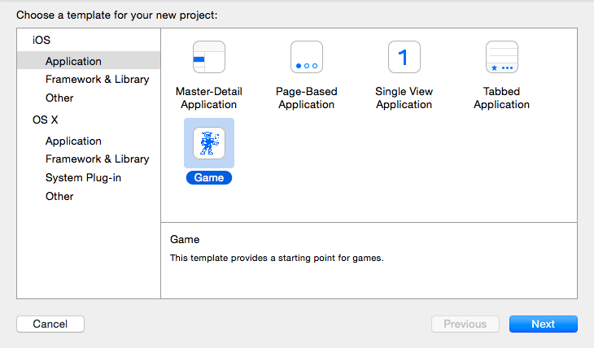

# GameViewControllerの設定をする






## Swift3.0
### GameScene.swift
```swift
//
//  GameScene.swift
//  SpriteKit000
//
//  Created by Misato Morino on 2016/08/30.
//  Copyright (c) 2016年 Misato Morino. All rights reserved.
//

import SpriteKit

class GameScene: SKScene {
    
    override func didMove(to view: SKView) {
        
        self.physicsBody = SKPhysicsBody(edgeLoopFrom: self.frame)
    }
    
    override func touchesBegan(_ touches: Set<UITouch>, with event: UIEvent?) {
        
        for touch in touches {
            
            let myTouch = touch
            
            let myredRect = SKShapeNode(rectOf: CGSize(width: 50, height: 50))
            myredRect.fillColor = UIColor.red
            myredRect.position = myTouch.location(in: self)
            myredRect.physicsBody = SKPhysicsBody(rectangleOf: CGSize(width: 100, height: 100))
            
            
            self.addChild(myredRect)
        }
    }
    
    override func update(_ currentTime: CFTimeInterval) {
        /* Called before each frame is rendered */
    }
}
```
### GameViewController.swift
```swiftdocs
//
//  GameViewController.swift
//  SpriteKit000
//
//  Created by Misato Morino on 2016/08/30.
//  Copyright (c) 2016年 Misato Morino. All rights reserved.
//

import UIKit
import SpriteKit

extension SKNode {
    class func unarchiveFromFile(file : NSString) -> SKNode? {
        
        if let myPath = Bundle.main.path(forResource: file as String, ofType: "sks") {
            
            var sceneData: NSData!
            do {
                sceneData = try NSData(contentsOfFile: myPath, options: .mappedIfSafe)
            } catch {
                sceneData = NSData()
                print(error)
            }
            let myArchiver = NSKeyedUnarchiver(forReadingWith: sceneData as Data)
            
            myArchiver.setClass(self.classForKeyedUnarchiver(), forClassName: "SKScene")
            let myScene = myArchiver.decodeObject(forKey: NSKeyedArchiveRootObjectKey) as! GameScene
            myArchiver.finishDecoding()
            return myScene
        } else {
            return nil
        }
    }
}


class GameViewController: UIViewController {
    
    override func viewDidLoad() {
        super.viewDidLoad()
        
        if let scene = GameScene.unarchiveFromFile(file: "GameScene") as? GameScene {
            
            // ビューを得る.
            let mySkView = self.view as! SKView
            
            // FPSを表示させる.
            mySkView.showsFPS = true
            
            // 現在存在するノードの数を表示させる.
            mySkView.showsNodeCount = true
            
            // レンダリングパフォーマンスの設定.
            mySkView.ignoresSiblingOrder = true
            
            // 剛体を表示させない.
            mySkView.showsPhysics = false
            
            // シーンのサイズをスクリーンに見合ったサイズに変える.
            scene.size = mySkView.frame.size
            
            scene.scaleMode = .aspectFill
            
            mySkView.presentScene(scene)
        }
    }
    
    override var shouldAutorotate: Bool {
        return true
    }
    
    override var supportedInterfaceOrientations: UIInterfaceOrientationMask {
        if UIDevice.current.userInterfaceIdiom == .phone {
            return .allButUpsideDown
        } else {
            return .all
        }
    }
    
    override func didReceiveMemoryWarning() {
        super.didReceiveMemoryWarning()
        // Release any cached data, images, etc that aren't in use.
    }

    override var prefersStatusBarHidden: Bool {
        return true
    }
    
}
```

## Swift 2.3
### GameScene.swift
```swift
//
//  GameScene.swift
//  SpriteKit000
//
//  Created by Misato Morino on 2016/08/30.
//  Copyright (c) 2016年 Misato Morino. All rights reserved.
//

import SpriteKit

class GameScene: SKScene {
    override func didMoveToView(view: SKView) {
        
        self.physicsBody = SKPhysicsBody(edgeLoopFromRect: self.frame)
        
    }
    
    override func touchesBegan(touches: Set<UITouch>, withEvent event: UIEvent?) {
       /* Called when a touch begins */
        
        for touch in touches {
            
            let myTouch = touch
            
            let myredRect = SKShapeNode(rectOfSize: CGSizeMake(50, 50))
            myredRect.fillColor = UIColor.redColor()
            myredRect.position = myTouch.locationInNode(self)
            myredRect.physicsBody = SKPhysicsBody(rectangleOfSize: CGSizeMake(100, 100))
            
            
            self.addChild(myredRect)
        }
    }
   
    override func update(currentTime: CFTimeInterval) {
        /* Called before each frame is rendered */
    }
}
```
### GameViewController.swift
```swift
//
//  GameViewController.swift
//  SpriteKit000
//
//  Created by Misato Morino on 2016/08/30.
//  Copyright (c) 2016年 Misato Morino. All rights reserved.
//

import UIKit
import SpriteKit

extension SKNode {
    class func unarchiveFromFile(file : NSString) -> SKNode? {
        
        if let myPath = NSBundle.mainBundle().pathForResource(file as String, ofType: "sks") {
            
            var sceneData: NSData!
            do {
                sceneData = try NSData(contentsOfFile: myPath, options: .DataReadingMappedIfSafe)
            } catch {
                sceneData = NSData()
                print(error)
            }
            let myArchiver = NSKeyedUnarchiver(forReadingWithData: sceneData)
            
            myArchiver.setClass(self.classForKeyedUnarchiver(), forClassName: "SKScene")
            let myScene = myArchiver.decodeObjectForKey(NSKeyedArchiveRootObjectKey) as! GameScene
            myArchiver.finishDecoding()
            return myScene
        } else {
            return nil
        }
    }
}


class GameViewController: UIViewController {
    
    override func viewDidLoad() {
        super.viewDidLoad()
        
        if let scene = GameScene.unarchiveFromFile("GameScene") as? GameScene {
            
            // ビューを得る.
            let mySkView = self.view as! SKView
            
            // FPSを表示させる.
            mySkView.showsFPS = true
            
            // 現在存在するノードの数を表示させる.
            mySkView.showsNodeCount = true
            
            // レンダリングパフォーマンスの設定.
            mySkView.ignoresSiblingOrder = true
            
            // 剛体を表示させない.
            mySkView.showsPhysics = false
            
            // シーンのサイズをスクリーンに見合ったサイズに変える.
            scene.size = mySkView.frame.size
            
            scene.scaleMode = .AspectFill
            
            mySkView.presentScene(scene)
        }
    }
    
    override func shouldAutorotate() -> Bool {
        return true
    }
    
    override func supportedInterfaceOrientations() -> UIInterfaceOrientationMask {
        if UIDevice.currentDevice().userInterfaceIdiom == .Phone {
            return .AllButUpsideDown
        } else {
            return .All
        }
    }
    
    override func didReceiveMemoryWarning() {
        super.didReceiveMemoryWarning()
        // Release any cached data, images, etc that aren't in use.
    }
    
    override func prefersStatusBarHidden() -> Bool {
        return true
    }
}
```

## 2.3と3.0の差分

* ```unarchiveFromFile("GameScene")``` から ```unarchiveFromFile(file: "GameScene")``` に変更
* ```override func shouldAutorotate() -> Bool``` から ```override var shouldAutorotate: Bool``` に変更
* ```override func prefersStatusBarHidden() -> Bool``` から ```override var prefersStatusBarHidden: Bool``` に変更

## Reference
* SKPhysicsBody
    * [https://developer.apple.com/reference/spritekit/skphysicsbody](https://developer.apple.com/reference/spritekit/skphysicsbody)
* SKShapeNode
    * [https://developer.apple.com/reference/spritekit/skshapenode](https://developer.apple.com/reference/spritekit/skshapenode)
* SKView
    * [https://developer.apple.com/reference/spritekit/skview](https://developer.apple.com/reference/spritekit/skview)
