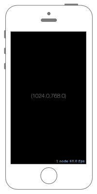

# 画面のサイズを得る



## Swift3.0
### GameScene.swift
```swift
//
//  GameScene.swift
//  SpriteKit001
//
//  Created by Misato Morino on 2016/08/30.
//  Copyright (c) 2016年 Misato Morino. All rights reserved.
//

import SpriteKit

class GameScene: SKScene {
    
    override func didMove(to view: SKView) {
        
        let Label = SKLabelNode(text: "\(self.size)")
        Label.position = CGPoint(x: self.size.width/2.0, y: self.size.height/2.0)
        
        self.addChild(Label)
        
        self.backgroundColor = UIColor.black
    } 
} 
```

## Swift 2.3
### GameScene.swift
```swift
//
//  GameScene.swift
//  SpriteKit001
//
//  Created by Misato Morino on 2016/08/30.
//  Copyright (c) 2016年 Misato Morino. All rights reserved.
//

import SpriteKit

class GameScene: SKScene {
    
    override func didMoveToView(view: SKView) {
        
        let Label = SKLabelNode(text: "\(self.size)")
        Label.position = CGPointMake(self.size.width/2.0,self.size.height/2.0)
        
        self.addChild(Label)
        
        self.backgroundColor = UIColor.blackColor()
    }
    
}
```

## 2.3と3.0の差分
* ```didMoveToView(view: SKView)``` から ```didMove(to view: SKView)``` に変更

## Reference
* SKScene
    * [https://developer.apple.com/reference/spritekit/skscene](https://developer.apple.com/reference/spritekit/skscene)
