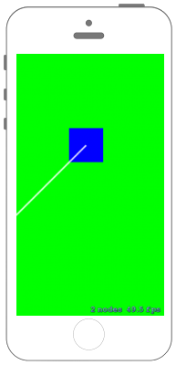

# 図形を描画する



## Swift3.0
### GameScene.swift
```swift
//
//  GameScene.swift
//  SpriteKit002
//
//  Created by Misato Morino on 2016/09/20.
//  Copyright © 2016年 Misato Morino. All rights reserved.
//

import SpriteKit

class GameScene: SKScene {
    override func didMove(to view: SKView) {
        
        // 背景を緑に.
        self.backgroundColor = SKColor(red: 0.0, green: 1.0, blue: 0.0, alpha: 1.0)
        
        
        // 四角形を生成.
        let myBox = SKSpriteNode(color: SKColor.blue, size:CGSize(width: 80, height: 80))
        
        // 四角形を表示する座標を指定.
        myBox.position = CGPoint(x: 0, y: 150)
        
        // 線を生成.
        let myLine = SKShapeNode()
        
        // 線のパスを生成.
        let myPath = UIBezierPath()
        myPath.move(to: CGPoint(x: 0, y: 150))
        myPath.addLine(to: CGPoint(x: -150, y: 0))
        
        // パスを線に反映.
        myLine.path = myPath.cgPath
        
        // 線の色を設定.
        myLine.strokeColor = SKColor.white
        
        // 線の太さ.
        myLine.lineWidth = 1.0
        
        // グローの幅.
        myLine.glowWidth = 3.0
        
        // Sceneに追加.
        self.addChild(myBox)
        self.addChild(myLine)
    }
} 
```

## Swift 2.3
### GameScene.swift
```swift
//
//  GameScene.swift
//  SpriteKit002
//
//  Created by Misato Morino on 2016/09/20.
//  Copyright © 2016年 Misato Morino. All rights reserved.
//

import SpriteKit

class GameScene: SKScene {
    override func didMoveToView(view: SKView) {
        
        // 背景を緑に.
        self.backgroundColor = SKColor(red: 0.0, green: 1.0, blue: 0.0, alpha: 1.0)
        
        
        // 四角形を生成.
        let myBox = SKSpriteNode(color: SKColor.blueColor(), size:CGSizeMake(80,80))
        
        // 四角形を表示する座標を指定.
        myBox.position = CGPointMake(0,150)
        
        // 線を生成.
        let myLine = SKShapeNode()
        
        // 線のパスを生成.
        let myPath = UIBezierPath()
        myPath.moveToPoint(CGPointMake(0,150))
        myPath.addLineToPoint(CGPointMake(-150, 0))
        
        // パスを線に反映.
        myLine.path = myPath.CGPath
        
        // 線の色を設定.
        myLine.strokeColor = SKColor.whiteColor()
        
        // 線の太さ.
        myLine.lineWidth = 1.0
        
        // グローの幅.
        myLine.glowWidth = 3.0
        
        // Sceneに追加.
        self.addChild(myBox)
        self.addChild(myLine)
    }
} 
```

## 2.3と3.0の差分
* ```didMoveToView(view: SKView)``` から ```didMove(to view: SKView)``` に変更

## Reference
* SKScene
    * [https://developer.apple.com/reference/spritekit/skscene](https://developer.apple.com/reference/spritekit/skscene)
