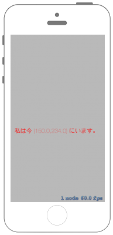

# Nodeの位置を得る



## Swift3.0
### GameScene.swift
```swift
//
//  GameScene.swift
//  SpriteKit003
//
//  Created by Misato Morino on 2016/09/20.
//  Copyright © 2016年 Misato Morino. All rights reserved.
//

import SpriteKit

class GameScene: SKScene {
    
    override func didMove(to view: SKView) {
        
        // Labelを作成.
        let Label = SKLabelNode()
        Label.position = CGPoint(x: 0, y: 0)
        Label.fontSize = 20
        Label.text = "私は今 \(Label.position) にいます。"
        Label.fontColor = UIColor.red
        
        self.addChild(Label)
    }
    
} 
```

## Swift 2.3
### GameScene.swift
```swift
//
//  GameScene.swift
//  SpriteKit003
//
//  Created by Misato Morino on 2016/09/20.
//  Copyright © 2016年 Misato Morino. All rights reserved.
//

import SpriteKit

class GameScene: SKScene {
    
    override func didMoveToView(view: SKView) {
        
        // Labelを作成.
        let Label = SKLabelNode()
        Label.position = CGPointMake(0, 0)
        Label.fontSize = 20
        Label.text = "私は今 \(Label.position) にいます。"
        Label.fontColor = UIColor.redColor()
        
        self.addChild(Label)
    }
    
} 
```

## 2.3と3.0の差分
* ```didMoveToView(view: SKView)``` から ```didMove(to view: SKView)``` に変更

## Reference
* SKScene
    * [https://developer.apple.com/reference/spritekit/skscene](https://developer.apple.com/reference/spritekit/skscene)
