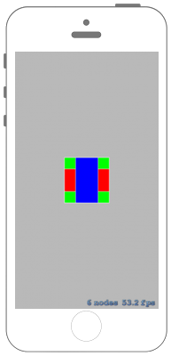

# Nodeの描画順を設定する



## Swift3.0
### GameScene.swift
```swift
//
//  GameScene.swift
//  SpriteKit004
//
//  Created by Misato Morino on 2016/09/20.
//  Copyright © 2016年 Misato Morino. All rights reserved.
//

import SpriteKit

extension SKScene{
    
    func GetMid()->CGPoint{
        return CGPoint(x: self.frame.midX, y: self.frame.midY)
    }
    
}

class GameScene: SKScene{
    
    override func didMove(to view: SKView) {
        
        // 赤い四角形を作る.
        let redRect = SKShapeNode(rectOf: CGSize(width: 100.0, height: 50.0))
        redRect.fillColor = UIColor.red
        redRect.position = GetMid()
        
        // zPositionを０に設定.
        redRect.zPosition = 0
        
        // 青い四角形を作る.
        let blueRect = SKShapeNode(rectOf: CGSize(width: 50.0, height: 100.0))
        blueRect.fillColor = UIColor.blue
        blueRect.position = GetMid()
        
        // zPositionを１に設定.
        blueRect.zPosition = 1
        
        // 緑な四角形を作る.
        let greennRect = SKShapeNode(rectOf: CGSize(width: 100.0, height: 100.0))
        greennRect.fillColor = UIColor.green
        greennRect.position = GetMid()
        
        // zPositionを-1に設定.
        greennRect.zPosition = -1
        
        self.addChild(redRect)
        self.addChild(blueRect)
        self.addChild(greennRect)
        
    }
    
}
```

## Swift 2.3
### GameScene.swift
```swift
//
//  GameScene.swift
//  SpriteKit004
//
//  Created by Misato Morino on 2016/09/20.
//  Copyright © 2016年 Misato Morino. All rights reserved.
//

import SpriteKit

extension SKScene{
    
    func GetMid()->CGPoint{
        return CGPointMake(self.frame.midX, self.frame.midY)
    }
    
}

class GameScene: SKScene{
    
    override func didMoveToView(view: SKView) {
        
        // 赤い四角形を作る.
        let redRect = SKShapeNode(rectOfSize: CGSizeMake(100.0, 50.0))
        redRect.fillColor = UIColor.redColor()
        redRect.position = GetMid()
        
        // zPositionを０に設定.
        redRect.zPosition = 0
        
        // 青い四角形を作る.
        let blueRect = SKShapeNode(rectOfSize: CGSizeMake(50.0, 100.0))
        blueRect.fillColor = UIColor.blueColor()
        blueRect.position = GetMid()
        
        // zPositionを１に設定.
        blueRect.zPosition = 1
        
        // 緑な四角形を作る.
        let greennRect = SKShapeNode(rectOfSize: CGSizeMake(100.0, 100.0))
        greennRect.fillColor = UIColor.greenColor()
        greennRect.position = GetMid()
        
        // zPositionを-1に設定.
        greennRect.zPosition = -1
        
        self.addChild(redRect)
        self.addChild(blueRect)
        self.addChild(greennRect)
        
    }
    
} 
```

## 2.3と3.0の差分
* ```didMoveToView(view: SKView)``` から ```didMove(to view: SKView)``` に変更

## Reference
* SKScene
    * [https://developer.apple.com/reference/spritekit/skscene](https://developer.apple.com/reference/spritekit/skscene)
* SKShapeNode
    * [https://developer.apple.com/reference/spritekit/skshapenode](https://developer.apple.com/reference/spritekit/skshapenode)
