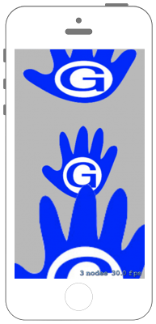

# Nodeのサイズを変える



## Swift3.0
### GameScene.swift
```swift
//
//  GameScene.swift
//  SpriteKit005
//
//  Created by Misato Morino on 2016/09/20.
//  Copyright © 2016年 Misato Morino. All rights reserved.
//

import SpriteKit

class GameScene: SKScene {
    
    override func didMove(to view: SKView) {
        
        // SKSpriteNodeを生成する.
        let logo1 = SKSpriteNode(imageNamed: "sample")
        let logo2 = SKSpriteNode(imageNamed: "sample")
        let logo3 = SKSpriteNode(imageNamed: "sample")
        
        // それぞれ位置調整.
        logo1.position = CGPoint(x: 0, y: logo1.size.height + 50.0)
        logo2.position = CGPoint(x: 0, y: 0)
        logo3.position = CGPoint(x: 0, y: -logo3.size.height - 50.0)
        
        // x方向に1.5倍　y方向に1.0倍する.
        logo1.xScale = 1.5
        logo1.yScale = 1.0
        
        // x方向に1.0倍　y方向に1.0倍する.
        logo2.xScale = 1.0
        logo2.yScale = 1.0
        
        // xとy方向どちらにも2.0倍する.
        logo3.setScale(1.5)
        
        // sceneに追加.
        self.addChild(logo1)
        self.addChild(logo2)
        self.addChild(logo3)
    }
    
} 
```

## Swift 2.3
### GameScene.swift
```swift
//
//  GameScene.swift
//  SpriteKit005
//
//  Created by Misato Morino on 2016/09/20.
//  Copyright © 2016年 Misato Morino. All rights reserved.
//

import SpriteKit

class GameScene: SKScene {
    
    override func didMoveToView(view: SKView) {
        
        // SKSpriteNodeを生成する.
        let logo1 = SKSpriteNode(imageNamed: "sample")
        let logo2 = SKSpriteNode(imageNamed: "sample")
        let logo3 = SKSpriteNode(imageNamed: "sample")
        
        // それぞれ位置調整.
        logo1.position = CGPoint(x: 0, y: logo1.size.height + 50.0)
        logo2.position = CGPoint(x: 0, y: 0)
        logo3.position = CGPoint(x: 0, y: -logo3.size.height - 50.0)
        
        // x方向に1.5倍　y方向に1.0倍する.
        logo1.xScale = 1.5
        logo1.yScale = 1.0
        
        // x方向に1.0倍　y方向に1.0倍する.
        logo2.xScale = 1.0
        logo2.yScale = 1.0
        
        // xとy方向どちらにも2.0倍する.
        logo3.setScale(1.5)
        
        // sceneに追加.
        self.addChild(logo1)
        self.addChild(logo2)
        self.addChild(logo3)
    }
    
} 
```

## 2.3と3.0の差分
* ```didMoveToView(view: SKView)``` から ```didMove(to view: SKView)``` に変更

## Reference
* SKScene
    * [https://developer.apple.com/reference/spritekit/skscene](https://developer.apple.com/reference/spritekit/skscene)
* SKShapeNode
    * [https://developer.apple.com/reference/spritekit/skshapenode](https://developer.apple.com/reference/spritekit/skshapenode)
* SKSpriteNode
    * [https://developer.apple.com/reference/spritekit/skspritenode](https://developer.apple.com/reference/spritekit/skspritenode)
