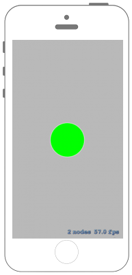

# 親Nodeから特定のNodeを削除する

 

## Swift3.0
### GameScene.swift
```swift
//
//  GameScene.swift
//  SpriteKit008
//
//  Created by Misato Morino on 2016/09/20.
//  Copyright © 2016年 Misato Morino. All rights reserved.
//

import SpriteKit

class GameScene: SKScene {
    
    var Circle : SKShapeNode!
    var BlueRect : SKShapeNode!
    var RedRect : SKShapeNode!
    
    override func didMove(to view: SKView) {
        
        // 円形のNodeを作成.
        Circle = SKShapeNode(circleOfRadius: 50.0)
        Circle.position = CGPoint(x: self.frame.midX, y: self.frame.midY)
        Circle.fillColor = UIColor.green
        
        // 青の正方形のNodeを作成.
        BlueRect = SKShapeNode(rectOf: CGSize(width: 25.0, height: 25.0))
        BlueRect.position = CGPoint(x: self.frame.midX, y: self.frame.midY + 100)
        BlueRect.zPosition = -1.0
        BlueRect.fillColor = UIColor.blue
        
        // 赤の正方形のNodeを作成.
        RedRect = SKShapeNode(rectOf: CGSize(width: 25.0, height: 50.0))
        RedRect.position = CGPoint(x: self.frame.midX, y: self.frame.midY - 100)
        RedRect.zPosition = 0.0
        RedRect.fillColor = UIColor.red
        
        // sceneにNodeを追加.
        self.addChild(BlueRect)
        self.addChild(RedRect)
        self.addChild(Circle)
        
    }
    
    override func touchesBegan(_ touches: Set<UITouch>, with event: UIEvent?) {
        
        // BlueRectとRedRectを削除.
        self.removeChildren(in: [BlueRect,RedRect])
        
    }
    
} 
```

## Swift 2.3
### GameScene.swift
```swift
//
//  GameScene.swift
//  SpriteKit008
//
//  Created by Misato Morino on 2016/09/20.
//  Copyright © 2016年 Misato Morino. All rights reserved.
//

import SpriteKit

class GameScene: SKScene {
    
    var Circle : SKShapeNode!
    var BlueRect : SKShapeNode!
    var RedRect : SKShapeNode!
    
    override func didMoveToView(view: SKView) {
        
        // 円形のNodeを作成.
        Circle = SKShapeNode(circleOfRadius: 50.0)
        Circle.position = CGPointMake(self.frame.midX,self.frame.midY)
        Circle.fillColor = UIColor.greenColor()
        
        // 青の正方形のNodeを作成.
        BlueRect = SKShapeNode(rectOfSize: CGSizeMake(25.0, 25.0))
        BlueRect.position = CGPointMake(self.frame.midX,self.frame.midY + 100)
        BlueRect.zPosition = -1.0
        BlueRect.fillColor = UIColor.blueColor()
        
        // 赤の正方形のNodeを作成.
        RedRect = SKShapeNode(rectOfSize: CGSizeMake(25.0, 50.0))
        RedRect.position = CGPointMake(self.frame.midX,self.frame.midY - 100)
        RedRect.zPosition = 0.0
        RedRect.fillColor = UIColor.redColor()
        
        // sceneにNodeを追加.
        self.addChild(BlueRect)
        self.addChild(RedRect)
        self.addChild(Circle)
        
    }
    
    override func touchesBegan(touches: Set<UITouch>, withEvent event: UIEvent?) {
        
        // BlueRectとRedRectを削除.
        self.removeChildrenInArray([BlueRect,RedRect])
        
    }
    
} 
```

## 2.3と3.0の差分
* ```didMoveToView(view: SKView)``` から ```didMove(to view: SKView)``` に変更

## Reference
* SKScene
    * [https://developer.apple.com/reference/spritekit/skscene](https://developer.apple.com/reference/spritekit/skscene)
* SKShapeNode
    * [https://developer.apple.com/reference/spritekit/skshapenode](https://developer.apple.com/reference/spritekit/skshapenode)
