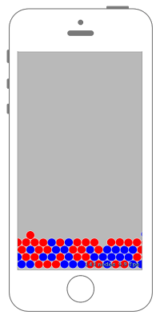

# 親Nodeの中の特定のnameのNodeを全て得る



## Swift3.0
### GameScene.swift
```swift
//
//  GameScene.swift
//  SpriteKit010
//
//  Created by Misato Morino on 2016/09/20.
//  Copyright © 2016年 Misato Morino. All rights reserved.
//

import SpriteKit

extension SKNode{
    
    /*
     文字列から親ノードの中に入っている子ノードを探して配列に入れて配列で返すメソッド.
     */
    func findNodesWithName(NodeName : String)->[SKNode]!{
        
        var Nodes : [SKNode]
        Nodes = [SKNode]()
        
        for Node : AnyObject in self.children{
            
            if (Node as! SKNode).name == nil  {
                print("name is nil")
                return nil
            }
            else{
                if Node.name == NodeName{
                    Nodes.append(Node as! SKNode)
                }
                
            }
            
        }
        
        return Nodes
    }
    
}

extension SKScene{
    
    /*
     指定された乱数の範囲を返すメソッド.
     */
    func getRandomNumber(Min _Min : Int, Max _Max : Int)->Int {
        return Int(arc4random_uniform(UInt32(_Max))) + _Min
    }
    
    /*
     SceneのRectの範囲でランダムな座標を返すメソッド.
     */
    func RandomPosition() -> CGPoint{
        
        let maxX = self.frame.maxX
        let maxY = self.frame.maxY
        
        let x = getRandomNumber(Min: 0, Max: Int(maxX))
        let y = getRandomNumber(Min: 0, Max: Int(maxY))
        
        return CGPoint(x: CGFloat(x), y: CGFloat(y))
        
    }
    
    /*
     Sceneの中央値を返すメソッド.
     */
    func GetMid()->CGPoint{
        return CGPoint(x: self.frame.midX, y: self.frame.midY)
    }
    
}

class GameScene: SKScene{
    
    override func didMove(to view: SKView) {
        
        // シーンの剛体を作る.
        self.physicsBody = SKPhysicsBody(edgeLoopFrom: self.frame)
        
        for i in 0..<150 {
            
            // 円の形を作る.
            let circle = SKShapeNode(circleOfRadius: 15.0)
            
            // 円の剛体を作る.
            circle.physicsBody = SKPhysicsBody(circleOfRadius: 15.0)
            
            circle.position = self.RandomPosition()
            
            // 偶数なら.
            if i % 2 == 0{
                // 名前をつける.
                circle.name = "Even"
                
                // 色を赤色で満たす.
                circle.fillColor = UIColor.red
            }
                // 奇数なら.
            else{
                // 名前をつける.
                circle.name = "UnEven"
                
                // 色を青色で満たす.
                circle.fillColor = UIColor.blue
                
            }
            
            self.addChild(circle)
        }
    }
    
    override func touchesBegan(_ touches: Set<UITouch>, with event: UIEvent?) {
        
        // シーン内に入っている名前が"Even"のNodeを全て得る.
        let nodes = self.findNodesWithName(NodeName: "Even")
        
        // nodeを全て削除.
        self.removeChildren(in: nodes!)
        
    }
}
```

## Swift 2.3
### GameScene.swift
```swift
//
//  GameScene.swift
//  SpriteKit010
//
//  Created by Misato Morino on 2016/09/20.
//  Copyright © 2016年 Misato Morino. All rights reserved.
//

import SpriteKit

extension SKNode{
    
    /*
     文字列から親ノードの中に入っている子ノードを探して配列に入れて配列で返すメソッド.
     */
    func findNodesWithName(NodeName : String)->[SKNode]!{
        
        var Nodes : [SKNode]
        Nodes = [SKNode]()
        
        for Node : AnyObject in self.children{
            
            if (Node as! SKNode).name == nil  {
                print("name is nil")
                return nil
            }
            else{
                if Node.name == NodeName{
                    Nodes.append(Node as! SKNode)
                }
                
            }
            
        }
        
        return Nodes
    }
    
}

extension SKScene{
    
    /*
     指定された乱数の範囲を返すメソッド.
     */
    func getRandomNumber(Min _Min : Int, Max _Max : Int)->Int {
        return Int(arc4random_uniform(UInt32(_Max))) + _Min
    }
    
    /*
     SceneのRectの範囲でランダムな座標を返すメソッド.
     */
    func RandomPosition() -> CGPoint{
        
        let maxX = self.frame.maxX
        let maxY = self.frame.maxY
        
        let x = getRandomNumber(Min: 0, Max: Int(maxX))
        let y = getRandomNumber(Min: 0, Max: Int(maxY))
        
        return CGPointMake(CGFloat(x),CGFloat(y))
        
    }
    
    /*
     Sceneの中央値を返すメソッド.
     */
    func GetMid()->CGPoint{
        return CGPointMake(self.frame.midX, self.frame.midY)
    }
    
}

class GameScene: SKScene{
    
    override func didMoveToView(view: SKView) {
        
        // シーンの剛体を作る.
        self.physicsBody = SKPhysicsBody(edgeLoopFromRect: self.frame)
        
        for i in 0..<150 {
            
            // 円の形を作る.
            let circle = SKShapeNode(circleOfRadius: 15.0)
            
            // 円の剛体を作る.
            circle.physicsBody = SKPhysicsBody(circleOfRadius: 15.0)
            
            circle.position = self.RandomPosition()
            
            // 偶数なら.
            if i % 2 == 0{
                // 名前をつける.
                circle.name = "Even"
                
                // 色を赤色で満たす.
                circle.fillColor = UIColor.redColor()
            }
                // 奇数なら.
            else{
                // 名前をつける.
                circle.name = "UnEven"
                
                // 色を青色で満たす.
                circle.fillColor = UIColor.blueColor()
                
            }
            
            self.addChild(circle)
        }
    }
    
    override func touchesBegan(touches: Set<UITouch>, withEvent event: UIEvent?) {
        
        // シーン内に入っている名前が"Even"のNodeを全て得る.
        let nodes = self.findNodesWithName("Even")
        
        // nodeを全て削除.
        self.removeChildrenInArray(nodes)
        
    }
} 
```

## 2.3と3.0の差分
* ```didMoveToView(view: SKView)``` から ```didMove(to view: SKView)``` に変更

## Reference
* SKScene
    * [https://developer.apple.com/reference/spritekit/skscene](https://developer.apple.com/reference/spritekit/skscene)
* SKPhysicsBody
    * [https://developer.apple.com/reference/spritekit/skphysicsbody](https://developer.apple.com/reference/spritekit/skphysicsbody)
