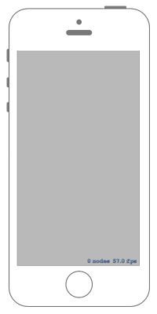

# Nodeを非表示にする

 

## Swift3.0
### GameScene.swift
```swift
//
//  GameScene.swift
//  SpriteKit011
//
//  Created by Misato Morino on 2016/09/20.
//  Copyright © 2016年 Misato Morino. All rights reserved.
//

import SpriteKit

class GameScene: SKScene {
    
    var SpaceShip : SKSpriteNode!
    
    override func didMove(to view: SKView) {
        
        SpaceShip = SKSpriteNode(imageNamed: "Spaceship.png")
        
        // 位置を変更.
        SpaceShip.position = CGPoint(x: 0, y: 0)
        
        // シーンに追加.
        self.addChild(SpaceShip)
        
    }
    
    override func touchesBegan(_ touches: Set<UITouch>, with event: UIEvent?) {
        
        SpaceShip.isHidden = !SpaceShip.isHidden
        
    }
}
```

## Swift 2.3
### GameScene.swift
```swift
//
//  GameScene.swift
//  SpriteKit011
//
//  Created by Misato Morino on 2016/09/20.
//  Copyright © 2016年 Misato Morino. All rights reserved.
//

import SpriteKit

class GameScene: SKScene {
    
    var SpaceShip : SKSpriteNode!
    
    override func didMoveToView(view: SKView) {
        
        SpaceShip = SKSpriteNode(imageNamed: "Spaceship.png")
        
        // 位置を変更.
        SpaceShip.position = CGPointMake(0, 0)
        
        // シーンに追加.
        self.addChild(SpaceShip)
        
    }
    
    override func touchesBegan(touches: Set<UITouch>, withEvent event: UIEvent?) {
        
        SpaceShip.hidden = !SpaceShip.hidden
        
    }
}
```

## 2.3と3.0の差分
* ```didMoveToView(view: SKView)``` から ```didMove(to view: SKView)``` に変更

## Reference
* SKScene
    * [https://developer.apple.com/reference/spritekit/skscene](https://developer.apple.com/reference/spritekit/skscene)
* SKSpriteNode
    * [https://developer.apple.com/reference/spritekit/skspritenode](https://developer.apple.com/reference/spritekit/skspritenode)
