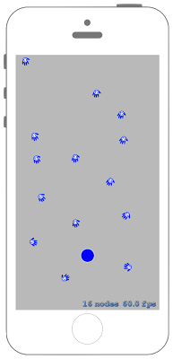

# Nodeを特定の方向に向かせ続ける



## Swift3.0
### GameScene.swift
```swift
//
//  GameScene.swift
//  SpriteKit012
//
//  Created by Misato Morino on 2016/09/20.
//  Copyright © 2016年 Misato Morino. All rights reserved.
//

import SpriteKit

extension SKScene{
    
    /*
     度数からラジアンに変換するメソッド.
     */
    func DegreeToRadian(Degree : Double!)-> CGFloat{
        
        return CGFloat(Degree) / CGFloat(180.0 * M_1_PI)
        
    }
    
}

class GameScene: SKScene{
    
    var bluecircle : SKShapeNode!
    
    override func didMove(to view: SKView) {
        
        self.physicsBody = SKPhysicsBody(edgeLoopFrom: self.frame)
        
        // 青い円を生成.
        bluecircle = SKShapeNode(circleOfRadius: 15.0)
        bluecircle.position = CGPoint(x: self.frame.midX + 50, y: self.frame.midY)
        bluecircle.fillColor = UIColor.blue
        
        // 画面中央を上下に動くアクションを作成.
        let sequence = SKAction.sequence([
            SKAction.move(to: CGPoint(x: self.frame.midX, y: self.frame.maxY), duration: 1.0),
            SKAction.move(to: CGPoint(x: self.frame.midX, y: self.frame.minY), duration: 1.0)
            ])
        
        // アクションを無限ループさせる.
        bluecircle.run(SKAction.repeatForever(sequence))
        
        self.addChild(bluecircle)
        
    }
    
    override func touchesBegan(_ touches: Set<UITouch>, with event: UIEvent?) {
        
        for touch : UITouch in touches{
            
            let location = touch.location(in: self) 
            
            let texture = SKTexture(imageNamed: "Vector.png")
            let Vector = SKSpriteNode(texture: texture)
            Vector.position = location
            Vector.setScale(0.1)
            
            // 姿勢へのConstraintsを作成.
            let cons = SKConstraint.orient(to: bluecircle, offset: SKRange(constantValue: DegreeToRadian(Degree: -90)))
            
            // Constraintsを適用.
            Vector.constraints = [cons]
            
            self.addChild(Vector)
            
        }
    }
} 
```

## Swift 2.3
### GameScene.swift
```swift
//
//  GameScene.swift
//  SpriteKit012
//
//  Created by Misato Morino on 2016/09/20.
//  Copyright © 2016年 Misato Morino. All rights reserved.
//

import SpriteKit

extension SKScene{
    
    /*
     度数からラジアンに変換するメソッド.
     */
    func DegreeToRadian(Degree : Double!)-> CGFloat{
        
        return CGFloat(Degree) / CGFloat(180.0 * M_1_PI)
        
    }
    
}

class GameScene: SKScene{
    
    var bluecircle : SKShapeNode!
    
    override func didMoveToView(view: SKView) {
        
        self.physicsBody = SKPhysicsBody(edgeLoopFromRect: self.frame)
        
        // 青い円を生成.
        bluecircle = SKShapeNode(circleOfRadius: 15.0)
        bluecircle.position = CGPointMake(self.frame.midX + 50,self.frame.midY)
        bluecircle.fillColor = UIColor.blueColor()
        
        // 画面中央を上下に動くアクションを作成.
        let sequence = SKAction.sequence([
            SKAction.moveTo(CGPointMake(self.frame.midX,self.frame.maxY), duration: 1.0),
            SKAction.moveTo(CGPointMake(self.frame.midX, self.frame.minY), duration: 1.0)
            ])
        
        // アクションを無限ループさせる.
        bluecircle.runAction(SKAction.repeatActionForever(sequence))
        
        self.addChild(bluecircle)
        
    }
    
    override func touchesBegan(touches: Set<UITouch>, withEvent event: UIEvent?) {
        
        for touch : AnyObject in touches{
            
            let location = touch.locationInNode(self)
            
            let texture = SKTexture(imageNamed: "Vector.png")
            let Vector = SKSpriteNode(texture: texture)
            Vector.position = location
            Vector.setScale(0.1)
            
            // 姿勢へのConstraintsを作成.
            let cons = SKConstraint.orientToNode(bluecircle, offset: SKRange(constantValue: DegreeToRadian(-90)))
            
            // Constraintsを適用.
            Vector.constraints = [cons]
            
            self.addChild(Vector)
            
        }
    }
} 
```

## 2.3と3.0の差分
* ```didMoveToView(view: SKView)``` から ```didMove(to view: SKView)``` に変更
* ```init(edgeLoopFromRect:)``` から ```init(edgeLoopFrom:)``` に変更
* ```moveTo()``` から ```move(to:)``` に変更
* ```runAction(SKAction.repeatActionForever(sequence))``` から `````` に変更

## Reference
* SKTexture
    * [https://developer.apple.com/reference/spritekit/sktexture](https://developer.apple.com/reference/spritekit/sktexture)
* SKConstraint
    * [https://developer.apple.com/reference/spritekit/skconstraint](https://developer.apple.com/reference/spritekit/skconstraint)
* SKAction
    * [https://developer.apple.com/reference/spritekit/skaction](https://developer.apple.com/reference/spritekit/skaction)
