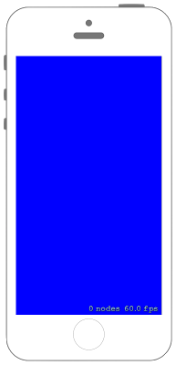

# 



## Swift3.0
### GameScene.swift
```swift
//
//  GameScene.swift
//  SpriteKit014
//
//  Created by Misato Morino on 2016/09/20.
//  Copyright © 2016年 Misato Morino. All rights reserved.
//

import SpriteKit

class GameScene: SKScene {
    
    override func didMove(to view: SKView) {
        
        // GameSceneの背景色を青色にする.
        self.backgroundColor = UIColor.blue
        
    }
    
}

```

## Swift 2.3
### GameScene.swift
```swift
//
//  GameScene.swift
//  SpriteKit014
//
//  Created by Misato Morino on 2016/09/20.
//  Copyright © 2016年 Misato Morino. All rights reserved.
//

import SpriteKit

class GameScene: SKScene {
    
    override func didMoveToView(view: SKView) {
        
        // GameSceneの背景色を青色にする.
        self.backgroundColor = UIColor.blueColor()
        
    }
    
} 
```

## 2.3と3.0の差分
* ```didMoveToView(view: SKView)``` から ```didMove(to view: SKView)``` に変更

## Reference
* SKScene
    * [https://developer.apple.com/reference/spritekit/skscene](https://developer.apple.com/reference/spritekit/skscene)
