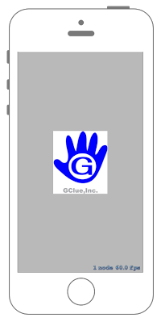
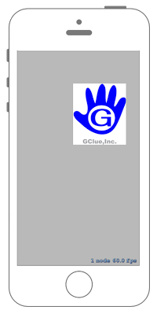

# タッチイベントを取得する

 

## Swift3.0
### GameScene.swift
```swift
//
//  GameScene.swift
//  SpriteKit015
//
//  Created by Misato Morino on 2016/09/20.
//  Copyright © 2016年 Misato Morino. All rights reserved.
//

import SpriteKit

class GameScene: SKScene {
    
    var myImage : SKSpriteNode!
    
    override func didMove(to view: SKView) {
        
        // 画像を生成.
        myImage = SKSpriteNode(imageNamed:"sample")
        
        // 画像の描画場所を指定.
        myImage.position = CGPoint(x:self.frame.midX, y:self.frame.midY);
        
        // シーンに追加.
        self.addChild(myImage)
    }
    
    /*
     Called when a touch begins
     */
    override func touchesBegan(_ touches: Set<UITouch>, with event: UIEvent?) {
        
        for touch: AnyObject in touches {
            
            // タッチされた場所の座標を取得.
            let location = touch.location(in: self)
            
            // タッチされた場所に画像を移動.
            myImage.position = location
        }
    }
    
} 
```

## Swift 2.3
### GameScene.swift
```swift 
//
//  GameScene.swift
//  SpriteKit015
//
//  Created by Misato Morino on 2016/09/20.
//  Copyright © 2016年 Misato Morino. All rights reserved.
//

import SpriteKit

class GameScene: SKScene {
    
    var myImage : SKSpriteNode!
    
    override func didMoveToView(view: SKView) {
        
        // 画像を生成.
        myImage = SKSpriteNode(imageNamed:"sample")
        
        // 画像の描画場所を指定.
        myImage.position = CGPoint(x:CGRectGetMidX(self.frame), y:CGRectGetMidY(self.frame));
        
        // シーンに追加.
        self.addChild(myImage)
    }
    
    /*
     Called when a touch begins
     */
    override func touchesBegan(touches: Set<UITouch>, withEvent event: UIEvent?) {
        
        for touch: AnyObject in touches {
            
            // タッチされた場所の座標を取得.
            let location = touch.locationInNode(self)
            
            // タッチされた場所に画像を移動.
            myImage.position = location
        }
    }
    
} 
```

## 2.3と3.0の差分
* ```didMoveToView(view: SKView)``` から ```didMove(to view: SKView)``` に変更
* ```CGRectGetMidX(self.frame)``` に ```self.frame.midX``` に変更

## Reference
* SKScene
    * [https://developer.apple.com/reference/spritekit/skscene](https://developer.apple.com/reference/spritekit/skscene)
* SKSpriteNode
    * [https://developer.apple.com/reference/spritekit/skspritenode](https://developer.apple.com/reference/spritekit/skspritenode)
