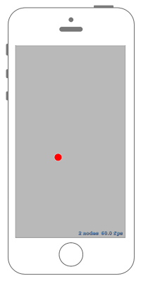

# タッチした座標にNodeを移動させる



## Swift3.0
### GameScene.swift
```swift
//
//  GameScene.swift
//  SpriteKit016
//
//  Created by Misato Morino on 2016/09/20.
//  Copyright © 2016年 Misato Morino. All rights reserved.
//

import SpriteKit

extension SKScene{
    
    /*
     Sceneの中央値を返すメソッド.
     */
    func GetMidPoint()->CGPoint{
        return CGPoint(x: self.frame.midX, y: self.frame.midY)
    }
    
}

class GameScene: SKScene{
    
    var circle : SKShapeNode!
    
    override func didMove(to view: SKView) {
        
        // 赤い円を作る.
        circle = SKShapeNode(circleOfRadius: 15.0)
        circle.fillColor = UIColor.red
        circle.position = self.GetMidPoint()
        
        self.addChild(circle)
    }
    
    override func touchesBegan(_ touches: Set<UITouch>, with event: UIEvent?) {
        
        for touch : AnyObject in touches{
            
            // タッチした点を得る.
            let location = touch.location(in: self)
            
            circle.position = location
        } 
    } 
} 
```

## Swift 2.3
### GameScene.swift
```swift 
//
//  GameScene.swift
//  SpriteKit016
//
//  Created by Misato Morino on 2016/09/20.
//  Copyright © 2016年 Misato Morino. All rights reserved.
//

import SpriteKit

extension SKScene{
    
    /*
     Sceneの中央値を返すメソッド.
     */
    func GetMidPoint()->CGPoint{
        return CGPointMake(self.frame.midX, self.frame.midY)
    }
    
}

class GameScene: SKScene{
    
    var circle : SKShapeNode!
    
    override func didMoveToView(view: SKView) {
        
        // 赤い円を作る.
        circle = SKShapeNode(circleOfRadius: 15.0)
        circle.fillColor = UIColor.redColor()
        circle.position = self.GetMidPoint()
        
        self.addChild(circle)
    }
    
    override func touchesBegan(touches: Set<UITouch>, withEvent event: UIEvent?) {
        
        for touches : AnyObject in touches{
            
            // タッチした点を得る.
            let location = touches.locationInNode(self)
            
            circle.position = location
        } 
    } 
} 
```

## 2.3と3.0の差分
* ```didMoveToView(view: SKView)``` から ```didMove(to view: SKView)``` に変更
* ```CGRectGetMidX(self.frame)``` に ```self.frame.midX``` に変更

## Reference
* SKScene
    * [https://developer.apple.com/reference/spritekit/skscene](https://developer.apple.com/reference/spritekit/skscene)
* SKShapeNode
    * [https://developer.apple.com/reference/spritekit/skshapenode](https://developer.apple.com/reference/spritekit/skshapenode)
