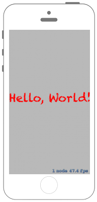

# 文字列を描画する



## Swift3.0
### GameScene.swift
```swift
//
//  GameScene.swift
//  SpriteKit018
//
//  Created by Misato Morino on 2016/09/20.
//  Copyright © 2016年 Misato Morino. All rights reserved.
//

import SpriteKit

class GameScene: SKScene {
    
    override func didMove(to view: SKView) {
        
        // Labelの作成.
        let myLabel = SKLabelNode(fontNamed:"Chalkduster")
        
        // Labelに文字列を設定.
        myLabel.text = "Hello, World!"
        
        // フォントサイズを設定.
        myLabel.fontSize = 45
        
        // 色を指定(赤).
        myLabel.fontColor = UIColor.red
        
        // 表示するポジションを指定.
        myLabel.position = CGPoint(x:self.frame.midX, y:self.frame.midY);
        
        // シーンに追加.
        self.addChild(myLabel)
    }
} 
```

## Swift 2.3
### GameScene.swift
```swift 
//
//  GameScene.swift
//  SpriteKit018
//
//  Created by Misato Morino on 2016/09/20.
//  Copyright © 2016年 Misato Morino. All rights reserved.
//

import SpriteKit

class GameScene: SKScene {
    
    override func didMoveToView(view: SKView) {
        
        // Labelの作成.
        let myLabel = SKLabelNode(fontNamed:"Chalkduster")
        
        // Labelに文字列を設定.
        myLabel.text = "Hello, World!"
        
        // フォントサイズを設定.
        myLabel.fontSize = 45
        
        // 色を指定(赤).
        myLabel.fontColor = UIColor.redColor()
        
        // 表示するポジションを指定.
        myLabel.position = CGPoint(x:CGRectGetMidX(self.frame), y:CGRectGetMidY(self.frame));
        
        // シーンに追加.
        self.addChild(myLabel)
    }
}
```

## 2.3と3.0の差分
* ```didMoveToView(view: SKView)``` から ```didMove(to view: SKView)``` に変更
* ```didBeginContact(contact: SKPhysicsContact)``` から ```didBegin(_ contact: SKPhysicsContact) ``` に変更

## Reference
* SKScene
    * [https://developer.apple.com/reference/spritekit/skscene](https://developer.apple.com/reference/spritekit/skscene)
* SKShapeNode
    * [https://developer.apple.com/reference/spritekit/skshapenode](https://developer.apple.com/reference/spritekit/skshapenode)
