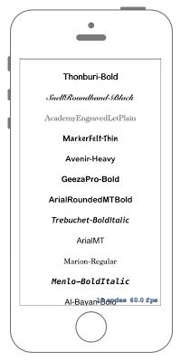

# ラベルのFontを変える



## Swift3.0
### GameScene.swift
```swift
//
//  GameScene.swift
//  SpriteKit019
//
//  Created by Misato Morino on 2016/09/20.
//  Copyright © 2016年 Misato Morino. All rights reserved.
//

import SpriteKit

class GameScene: SKScene {
    
    override func didMove(to view: SKView) {
        
        // Fontの名前の配列.
        let FontNames =
            [
                "Thonburi-Bold",
                "SnellRoundhand-Black",
                "AcademyEngravedLetPlain",
                "MarkerFelt-Thin"
                ,"Avenir-Heavy",
                 "GeezaPro-Bold",
                 "ArialRoundedMTBold",
                 "Trebuchet-BoldItalic",
                 "ArialMT",
                 "Marion-Regular",
                 "Menlo-BoldItalic",
                 "Al-Bayan-Bold",
                 ]
        
        // 背景色を白にする.
        self.backgroundColor = UIColor.white
        
        for i in 0 ..< FontNames.count {
            
            // labelを生成.
            let Label = SKLabelNode(text:FontNames[i])
            
            Label.fontSize = 25
            Label.fontColor = UIColor.black
            Label.position = CGPoint(x: 0, y: -self.size.height/3 + (2 * Label.fontSize * CGFloat(i+1)))
            Label.fontName = FontNames[i]
            self.addChild(Label)
        }
    }
} 
```

## Swift 2.3
### GameScene.swift
```swift 
//
//  GameScene.swift
//  SpriteKit019
//
//  Created by Misato Morino on 2016/09/20.
//  Copyright © 2016年 Misato Morino. All rights reserved.
//

import SpriteKit

class GameScene: SKScene {
    
    override func didMoveToView(view: SKView) {
        
        // Fontの名前の配列.
        let FontNames =
            [
                "Thonburi-Bold",
                "SnellRoundhand-Black",
                "AcademyEngravedLetPlain",
                "MarkerFelt-Thin"
                ,"Avenir-Heavy",
                 "GeezaPro-Bold",
                 "ArialRoundedMTBold",
                 "Trebuchet-BoldItalic",
                 "ArialMT",
                 "Marion-Regular",
                 "Menlo-BoldItalic",
                 "Al-Bayan-Bold",
                 ]
        
        // 背景色を白にする.
        self.backgroundColor = UIColor.whiteColor()
        
        for i in 0 ..< FontNames.count {
            
            // labelを生成.
            let Label = SKLabelNode(text:FontNames[i])
            
            Label.fontSize = 25
            Label.fontColor = UIColor.blackColor()
            Label.position = CGPoint(x: 0, y: -self.size.height/3 + (1.3 * Label.fontSize * CGFloat(i+1)))
            Label.fontName = FontNames[i]
            self.addChild(Label)
        }
    }
}
```

## 2.3と3.0の差分
* ```didMoveToView(view: SKView)``` から ```didMove(to view: SKView)``` に変更

## Reference
* SKScene
    * [https://developer.apple.com/reference/spritekit/skscene](https://developer.apple.com/reference/spritekit/skscene)
* SKLabel
    * [https://developer.apple.com/reference/spritekit/sklabel](https://developer.apple.com/reference/spritekit/sklabel)
