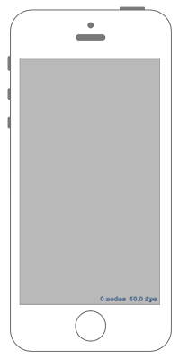
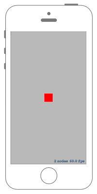

# Nodeを表示するアクション

 

## Swift3.0
### GameScene.swift
```swift
//
//  GameScene.swift
//  SpriteKit029
//
//  Created by Misato Morino on 2016/09/20.
//  Copyright © 2016年 Misato Morino. All rights reserved.
//

import SpriteKit

class GameScene: SKScene {
    
    private var unHideAction : SKAction!
    private var rect : SKShapeNode!
    
    override func didMove(to view: SKView) {
        
        // Nodeを表示させるアクションを作る.
        unHideAction = SKAction.unhide()
        
        // 赤い四角形を作る.
        rect = SKShapeNode(rectOf: CGSize(width: 50.0, height: 50.0))
        rect.fillColor = UIColor.red
        rect.position = CGPoint(x: self.frame.midX, y: self.frame.midY)
        
        // 非表示にする.
        rect.isHidden = true
        
        self.addChild(rect)
    }
    
    override func touchesBegan(_ touches: Set<UITouch>, with event: UIEvent?) {
        
        // アクションを実行させる.
        rect.run(unHideAction)
    }
} 
```

## Swift 2.3
### GameScene.swift
```swift 
//
//  GameScene.swift
//  SpriteKit029
//
//  Created by Misato Morino on 2016/09/20.
//  Copyright © 2016年 Misato Morino. All rights reserved.
//

import SpriteKit

class GameScene: SKScene {
    
    private var unHideAction : SKAction!
    private var rect : SKShapeNode!
    
    override func didMoveToView(view: SKView) {
        
        // Nodeを表示させるアクションを作る.
        unHideAction = SKAction.unhide()
        
        // 赤い四角形を作る.
        rect = SKShapeNode(rectOfSize: CGSizeMake(50.0, 50.0))
        rect.fillColor = UIColor.redColor()
        rect.position = CGPointMake(self.frame.midX, self.frame.midY)
        
        // 非表示にする.
        rect.hidden = true
        
        self.addChild(rect)
    }
    
    override func touchesBegan(touches: Set<UITouch>, withEvent event: UIEvent?) {
        
        // アクションを実行させる.
        rect.runAction(unHideAction)
    }
}
```

## 2.3と3.0の差分
* ```didMoveToView(view: SKView)``` から ```didMove(to view: SKView)``` に変更
* ```runAction``` から ```run``` に変更

## Reference
* SKShapeNode
    * [https://developer.apple.com/reference/spritekit/skshapenode](https://developer.apple.com/reference/spritekit/skshapenode)
