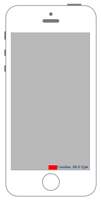

# NodeをRectに従って動かせるアクションを作る



## Swift3.0
### GameScene.swift
```swift
//
//  GameScene.swift
//  SpriteKit030
//
//  Created by Misato Morino on 2016/09/20.
//  Copyright © 2016年 Misato Morino. All rights reserved.
//

import SpriteKit

class GameScene: SKScene {
    
    private var FollowRectMoveAction : SKAction!
    private var rect : SKShapeNode!
    
    override func didMove(to view: SKView) {
        
        // 赤い四角形の形を作る.
        rect = SKShapeNode(rectOf: CGSize(width: 50.0, height: 50.0))
        rect.fillColor = UIColor.red
        rect.position = CGPoint(x: 0, y: 0)
        
        // パスを生成.
        let path : CGMutablePath = CGMutablePath()
        
        // Rectからパスを作る.
        path.addRect(self.frame)
        path.closeSubpath()
        
        // パスに従って動くアクションを作る.
        FollowRectMoveAction = SKAction.follow(path, duration: 5)
        
        self.addChild(rect)
    }
    
    override func touchesBegan(_ touches: Set<UITouch>, with event: UIEvent?) {
        
        // アクションを実行させる.
        rect.run(FollowRectMoveAction)
        
    }
}
```

## Swift 2.3
### GameScene.swift
```swift 
//
//  GameScene.swift
//  SpriteKit030
//
//  Created by Misato Morino on 2016/09/20.
//  Copyright © 2016年 Misato Morino. All rights reserved.
//

import SpriteKit

class GameScene: SKScene {
    
    private var FollowRectMoveAction : SKAction!
    private var rect : SKShapeNode!
    
    override func didMoveToView(view: SKView) {
        
        // 赤い四角形の形を作る.
        rect = SKShapeNode(rectOfSize: CGSizeMake(50.0, 50.0))
        rect.fillColor = UIColor.redColor()
        rect.position = CGPointMake(0, 0)
        
        // パスを生成.
        let path : CGMutablePath = CGPathCreateMutable()
        
        // Rectからパスを作る.
        CGPathAddRect(path, nil, self.frame)
        CGPathCloseSubpath(path)
        
        // パスに従って動くアクションを作る.
        FollowRectMoveAction = SKAction.followPath(path, duration: 5)
        
        self.addChild(rect)
    }
    
    override func touchesBegan(touches: Set<UITouch>, withEvent event: UIEvent?) {
        
        // アクションを実行させる.
        rect.runAction(FollowRectMoveAction)
        
    }
}
```

## 2.3と3.0の差分
* ```didMoveToView(view: SKView)``` から ```didMove(to view: SKView)``` に変更
* ```runAction``` から ```run``` に変更
* ```CGPathCreateMutable()``` から ```CGMutablePath()``` に変更
* ``` CGPathAddRect``` から ```addRect``` に変更

## Reference
* SKShapeNode
    * [https://developer.apple.com/reference/spritekit/skshapenode](https://developer.apple.com/reference/spritekit/skshapenode)
* SKAction
    * [https://developer.apple.com/reference/spritekit/skaction](https://developer.apple.com/reference/spritekit/skaction)
