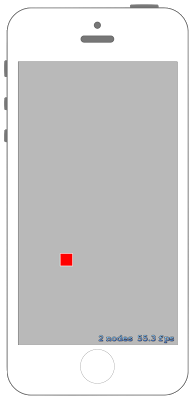

# 相対的に回転させるアクションを作る



## Swift3.0
### GameScene.swift
```swift
//
//  GameScene.swift
//  SpriteKit034
//
//  Created by Misato Morino on 2016/09/20.
//  Copyright © 2016年 Misato Morino. All rights reserved.
//

import SpriteKit

extension SKScene{
    
    /*
     度数からラジアンに変換するメソッド
     */
    func DegreeToRadian(Degree : Double!)-> CGFloat{
        return CGFloat(Degree) / CGFloat(180.0 * M_1_PI)
    }
    
}

class GameScene: SKScene {
    
    private var rotateAction :SKAction!
    private var rect : SKShapeNode!
    
    override func didMove(to view: SKView) {
        
        // 相対値で回転させるアクションを作る.
        rotateAction = SKAction.rotate( byAngle: DegreeToRadian(Degree: 90.0) , duration: 1)
        
        // 赤い四角形のShapeNodeを生成.
        rect = SKShapeNode(rectOf: CGSize(width: 50.0, height: 50.0))
        rect.fillColor = UIColor.red
        rect.position = CGPoint(x: self.frame.midX, y: self.frame.midY)
        
        // sceneにshapeNodeを追加.
        self.addChild(rect)
    }
    
    override func touchesBegan(_ touches: Set<UITouch>, with event: UIEvent?) {
        
        // アクションを実行.
        rect.run(rotateAction)
    }
}
```

## Swift 2.3
### GameScene.swift
```swift
//
//  GameScene.swift
//  SpriteKit034
//
//  Created by Misato Morino on 2016/09/20.
//  Copyright © 2016年 Misato Morino. All rights reserved.
//

import SpriteKit

extension SKScene{
    
    /*
     度数からラジアンに変換するメソッド
     */
    func DegreeToRadian(Degree : Double!)-> CGFloat{
        return CGFloat(Degree) / CGFloat(180.0 * M_1_PI)
    }
    
}

class GameScene: SKScene {
    
    private var rotateAction :SKAction!
    private var rect : SKShapeNode!
    
    override func didMoveToView(view: SKView) {
        
        // 相対値で回転させるアクションを作る.
        rotateAction = SKAction.rotateByAngle( DegreeToRadian(90.0) , duration: 1)
        
        // 赤い四角形のShapeNodeを生成.
        rect = SKShapeNode(rectOfSize: CGSizeMake(50.0, 50.0))
        rect.fillColor = UIColor.redColor()
        rect.position = CGPointMake(self.frame.midX,self.frame.midY)
        
        // sceneにshapeNodeを追加.
        self.addChild(rect)
    }
    
    override func touchesBegan(touches: Set<UITouch>, withEvent event: UIEvent?) {
        
        // アクションを実行.
        rect.runAction(rotateAction)
    }
}
```

## 2.3と3.0の差分
* ```didMoveToView(view: SKView)``` から ```didMove(to view: SKView)``` に変更
* ```runAction``` から ```run``` に変更

## Reference
* SKShapeNode
    * [https://developer.apple.com/reference/spritekit/skshapenode](https://developer.apple.com/reference/spritekit/skshapenode)
* SKAction
    * [https://developer.apple.com/reference/spritekit/skaction](https://developer.apple.com/reference/spritekit/skaction)
