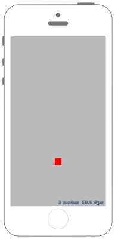

# 相対的に移動するアクションを作る



## Swift3.0
### GameScene.swift
```swift
//
//  GameScene.swift
//  SpriteKit036
//
//  Created by Misato Morino on 2016/09/20.
//  Copyright © 2016年 Misato Morino. All rights reserved.
//

import SpriteKit

class GameScene: SKScene {
    
    private var moveByAction :SKAction!
    private var rect : SKShapeNode!
    
    override func didMove(to view: SKView) {
        
        // 相対的に移動するアクションを生成.
        moveByAction = SKAction.move(by: CGVector(dx: 0.0, dy: 50.0), duration: 1.0)
        
        // 赤い四角形のshapeNodeを生成.
        rect = SKShapeNode(rectOf: CGSize(width: 25.0, height: 25.0))
        rect.fillColor = UIColor.red
        rect.position = CGPoint(x: self.frame.midX, y: self.frame.minY)
        
        // sceneにshapeNodeを追加.
        self.addChild(rect)
    }
    
    /*
     touchを感知したときに呼ばれるメソッド
     */
    override func touchesBegan(_ touches: Set<UITouch>, with event: UIEvent?) {
        
        // アクションを実行.
        rect.run(moveByAction)
        
    } 
} 
```

## Swift 2.3
### GameScene.swift
```swift
//
//  GameScene.swift
//  SpriteKit036
//
//  Created by Misato Morino on 2016/09/20.
//  Copyright © 2016年 Misato Morino. All rights reserved.
//

import SpriteKit

class GameScene: SKScene {
    
    private var moveByAction :SKAction!
    private var rect : SKShapeNode!
    
    override func didMoveToView(view: SKView) {
        
        // 相対的に移動するアクションを生成.
        moveByAction = SKAction.moveBy(CGVectorMake(0.0,50.0), duration: 1.0)
        
        // 赤い四角形のshapeNodeを生成.
        rect = SKShapeNode(rectOfSize: CGSizeMake(25.0, 25.0))
        rect.fillColor = UIColor.redColor()
        rect.position = CGPointMake(self.frame.midX,self.frame.minY)
        
        // sceneにshapeNodeを追加.
        self.addChild(rect)
    }
    
    /*
     touchを感知したときに呼ばれるメソッド
     */
    override func touchesBegan(touches: Set<UITouch>, withEvent event: UIEvent?) {
        
        // アクションを実行.
        rect.runAction(moveByAction)
        
    } 
} 
```

## 2.3と3.0の差分
* ```didMoveToView(view: SKView)``` から ```didMove(to view: SKView)``` に変更
* ```runAction``` から ```run``` に変更

## Reference
* SKShapeNode
    * [https://developer.apple.com/reference/spritekit/skshapenode](https://developer.apple.com/reference/spritekit/skshapenode)
* SKAction
    * [https://developer.apple.com/reference/spritekit/skaction](https://developer.apple.com/reference/spritekit/skaction)
