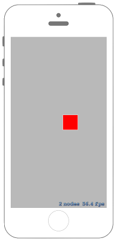

# アクションを無限ループさせる



## Swift3.0
### GameScene.swift
```swift
//
//  GameScene.swift
//  SpriteKit039
//
//  Created by Misato Morino on 2016/09/20.
//  Copyright © 2016年 Misato Morino. All rights reserved.
//

import SpriteKit

class GameScene: SKScene {
    
    private var repeatForevrAction : SKAction!
    private var rect : SKShapeNode!
    
    override func didMove(to view: SKView) {
        
        // スクリーンの左側に移動するアクションを作る.
        let leftMoveAction = SKAction.move(to: CGPoint(x: self.frame.minX, y: self.frame.midY), duration: 1.0)
        
        // スクリーンの右側に移動するアクションを作る.
        let rightMoveAction = SKAction.move(to: CGPoint(x: self.frame.maxX, y: self.frame.midY), duration: 1.0)
        
        // シーケンスアクションを作る.
        let sequenceAction = SKAction.sequence([
            leftMoveAction,
            rightMoveAction
            ])
        
        // シーケンスアクションから無限ループ実行されるアクションを作る.
        repeatForevrAction = SKAction.repeatForever(sequenceAction)
        
        // 赤い四角形のshapeNodeを作る.
        rect = SKShapeNode(rectOf: CGSize(width: 50.0, height: 50.0))
        rect.fillColor = UIColor.red
        rect.position = CGPoint(x: self.frame.maxX, y: self.frame.midY)
        
        // sceneにshapeNodeを追加.
        self.addChild(rect)
    }
    
    /*
     touchを感知したときに呼ばれるメソッド
     */
    override func touchesBegan(_ touches: Set<UITouch>, with event: UIEvent?) {
        
        // アクションを実行させる.
        rect.run(repeatForevrAction)
    }
}
```

## Swift 2.3
### GameScene.swift
```swift
//
//  GameScene.swift
//  SpriteKit039
//
//  Created by Misato Morino on 2016/09/20.
//  Copyright © 2016年 Misato Morino. All rights reserved.
//

import SpriteKit

class GameScene: SKScene {
    
    private var repeatForevrAction : SKAction!
    private var rect : SKShapeNode!
    
    override func didMoveToView(view: SKView) {
        
        // スクリーンの左側に移動するアクションを作る.
        let leftMoveAction = SKAction.moveTo(CGPointMake(self.frame.minX,self.frame.midY), duration: 1.0)
        
        // スクリーンの右側に移動するアクションを作る.
        let rightMoveAction = SKAction.moveTo(CGPointMake(self.frame.maxX,self.frame.midY), duration: 1.0)
        
        // シーケンスアクションを作る.
        let sequenceAction = SKAction.sequence([
            leftMoveAction,
            rightMoveAction
            ])
        
        // シーケンスアクションから無限ループ実行されるアクションを作る.
        repeatForevrAction = SKAction.repeatActionForever(sequenceAction)
        
        // 赤い四角形のshapeNodeを作る.
        rect = SKShapeNode(rectOfSize: CGSizeMake(50.0, 50.0))
        rect.fillColor = UIColor.redColor()
        rect.position = CGPointMake(self.frame.maxX, self.frame.midY)
        
        // sceneにshapeNodeを追加.
        self.addChild(rect)
    }
    
    /*
     touchを感知したときに呼ばれるメソッド
     */
    override func touchesBegan(touches: Set<UITouch>, withEvent event: UIEvent?) {
        
        // アクションを実行させる.
        rect.runAction(repeatForevrAction)
    }
}
```

## 2.3と3.0の差分
* ```didMoveToView(view: SKView)``` から ```didMove(to view: SKView)``` に変更
* ```runAction``` から ```run``` に変更
* ```repeatForevrAction``` から ```repeatForever``` に変更

## Reference
* SKShapeNode
    * [https://developer.apple.com/reference/spritekit/skshapenode](https://developer.apple.com/reference/spritekit/skshapenode)
* SKAction
    * [https://developer.apple.com/reference/spritekit/skaction](https://developer.apple.com/reference/spritekit/skaction)
