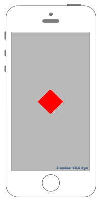

# アクションを逆転させる



## Swift3.0
### GameScene.swift
```swift
//
//  GameScene.swift
//  SpriteKit040
//
//  Created by Misato Morino on 2016/09/20.
//  Copyright © 2016年 Misato Morino. All rights reserved.
//

import SpriteKit

extension SKScene{
    
    /*
     度数からラジアンに変換するメソッド.
     */
    func DegreeToRadian(Degree : Double!)-> CGFloat{
        return CGFloat(Degree) / CGFloat(180.0 * M_1_PI)
    }
}

class GameScene: SKScene{
    
    var redRect : SKShapeNode!
    var repeatAction : SKAction!
    
    override func didMove(to view: SKView) {
        
        redRect = SKShapeNode(rectOf: CGSize(width: 100, height: 100))
        redRect.fillColor = UIColor.red
        redRect.position = CGPoint(x: self.frame.midX, y: self.frame.midY)
        
        // 相対的に回転するアクションを作る.
        let rotateAction = SKAction.rotate(byAngle: DegreeToRadian(Degree: 50.0), duration: 1.0)
        
        // アクションを無限ループさせる.
        repeatAction = SKAction.repeatForever(rotateAction)
        
        // アクションを実行させる.
        redRect.run(repeatAction)
        
        self.addChild(redRect)
        
    }
    
    override func touchesBegan(_ touches: Set<UITouch>, with event: UIEvent?) {
        
        // 逆転させたアクションを実行.
        redRect.run(repeatAction.reversed())
        
    }
} 
```

## Swift 2.3
### GameScene.swift
```swift
//
//  GameScene.swift
//  SpriteKit040
//
//  Created by Misato Morino on 2016/09/20.
//  Copyright © 2016年 Misato Morino. All rights reserved.
//

import SpriteKit

extension SKScene{
    
    /*
     度数からラジアンに変換するメソッド.
     */
    func DegreeToRadian(Degree : Double!)-> CGFloat{
        return CGFloat(Degree) / CGFloat(180.0 * M_1_PI)
    }
}

class GameScene: SKScene{
    
    var redRect : SKShapeNode!
    var repeatAction : SKAction!
    
    override func didMoveToView(view: SKView) {
        
        redRect = SKShapeNode(rectOfSize: CGSizeMake(100, 100))
        redRect.fillColor = UIColor.redColor()
        redRect.position = CGPointMake(self.frame.midX, self.frame.midY)
        
        // 相対的に回転するアクションを作る.
        let rotateAction = SKAction.rotateByAngle(DegreeToRadian(50.0), duration: 1.0)
        
        // アクションを無限ループさせる.
        repeatAction = SKAction.repeatActionForever(rotateAction)
        
        // アクションを実行させる.
        redRect.runAction(repeatAction)
        
        self.addChild(redRect)
        
    }
    
    override func touchesBegan(touches: Set<UITouch>, withEvent event: UIEvent?) {
        
        // 逆転させたアクションを実行.
        redRect.runAction(repeatAction.reversedAction())
        
    }
} 
```

## 2.3と3.0の差分
* ```didMoveToView(view: SKView)``` から ```didMove(to view: SKView)``` に変更
* ```runAction``` から ```run``` に変更
* ```reversedAction``` から ```reversed``` に変更

## Reference
* SKShapeNode
    * [https://developer.apple.com/reference/spritekit/skshapenode](https://developer.apple.com/reference/spritekit/skshapenode)
* SKAction
    * [https://developer.apple.com/reference/spritekit/skaction](https://developer.apple.com/reference/spritekit/skaction)
