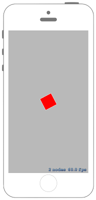

# 複数のアクションを逐次実行



## Swift3.0
### GameScene.swift
```swift
//
//  GameScene.swift
//  SpriteKit042
//
//  Created by Misato Morino on 2016/09/20.
//  Copyright © 2016年 Misato Morino. All rights reserved.
//

import SpriteKit

extension SKScene{
    
    /*
     度数からラジアンに変換するメソッド
     */
    func DegreeToRadian(Degree : Double!)-> CGFloat{
        return CGFloat(Degree) / CGFloat(180.0 * M_1_PI)
    }
    
}

class GameScene: SKScene {
    
    private var sequenceAction : SKAction!
    private var rect : SKShapeNode!
    
    override func didMove(to view: SKView) {
        
        // フェードインするアクションを作る.
        let FadeInAction = SKAction.fadeIn(withDuration: 1.0)
        
        // 相対的に回転するアクションを作る.
        let RotateAction = SKAction.rotate(byAngle: DegreeToRadian(Degree: 360.0), duration: 1.0)
        
        // フェードアウトするアクションを作る.
        let FadeOutAction = SKAction.fadeOut(withDuration: 1.0)
        
        // 逐次実行させるアクションを作る.
        sequenceAction = SKAction.sequence(
            [
                FadeInAction,
                RotateAction,
                FadeOutAction
            ]
        )
        
        // 赤い四角形のshapeNodeを作る.
        rect = SKShapeNode(rectOf: CGSize(width: 50.0, height: 50.0))
        rect.fillColor = UIColor.red
        rect.position = CGPoint(x: self.frame.midX, y: self.frame.midY)
        
        // アルファ値を0にして見えなくさせる.
        rect.alpha = 0.0
        
        // sceneにshapeNodeを追加.
        self.addChild(rect)
    }
    
    /*
     touchを感知したら呼ばれるメソッド
     */
    override func touchesBegan(_ touches: Set<UITouch>, with event: UIEvent?) {
        
        //　アクションが実行中でないなら.
        if rect.hasActions() == false {
            
            //　アクションを実行させる.
            rect.run(sequenceAction)
        }
    }
} 
```

## Swift 2.3
### GameScene.swift
```swift
//
//  GameScene.swift
//  SpriteKit042
//
//  Created by Misato Morino on 2016/09/20.
//  Copyright © 2016年 Misato Morino. All rights reserved.
//

import SpriteKit

extension SKScene{
    
    /*
     度数からラジアンに変換するメソッド
     */
    func DegreeToRadian(Degree : Double!)-> CGFloat{
        return CGFloat(Degree) / CGFloat(180.0 * M_1_PI)
    }
    
}

class GameScene: SKScene {
    
    private var sequenceAction : SKAction!
    private var rect : SKShapeNode!
    
    override func didMoveToView(view: SKView) {
        
        // フェードインするアクションを作る.
        let FadeInAction = SKAction.fadeInWithDuration(1.0)
        
        // 相対的に回転するアクションを作る.
        let RotateAction = SKAction.rotateByAngle(DegreeToRadian(360.0), duration: 1.0)
        
        // フェードアウトするアクションを作る.
        let FadeOutAction = SKAction.fadeOutWithDuration(1.0)
        
        // 逐次実行させるアクションを作る.
        sequenceAction = SKAction.sequence(
            [
                FadeInAction,
                RotateAction,
                FadeOutAction
            ]
        )
        
        // 赤い四角形のshapeNodeを作る.
        rect = SKShapeNode(rectOfSize: CGSizeMake(50.0, 50.0))
        rect.fillColor = UIColor.redColor()
        rect.position = CGPointMake(self.frame.midX, self.frame.midY)
        
        // アルファ値を0にして見えなくさせる.
        rect.alpha = 0.0
        
        // sceneにshapeNodeを追加.
        self.addChild(rect)
    }
    
    /*
     touchを感知したら呼ばれるメソッド
     */
    override func touchesBegan(touches: Set<UITouch>, withEvent event: UIEvent?) {
        
        //　アクションが実行中でないなら.
        if rect.hasActions() == false {
            
            //　アクションを実行させる.
            rect.runAction(sequenceAction)
        }
    }
} 
```

## 2.3と3.0の差分
* ```didMoveToView(view: SKView)``` から ```didMove(to view: SKView)``` に変更
* ```runAction``` から ```run``` に変更

## Reference
* SKShapeNode
    * [https://developer.apple.com/reference/spritekit/skshapenode](https://developer.apple.com/reference/spritekit/skshapenode)
* SKAction
    * [https://developer.apple.com/reference/spritekit/skaction](https://developer.apple.com/reference/spritekit/skaction)
