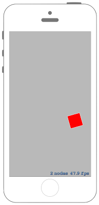

# Nodeをパスに従って動かせるアクション



## Swift3.0
### GameScene.swift
```swift
//
//  GameScene.swift
//  SpriteKit046
//
//  Created by Misato Morino on 2016/09/20.
//  Copyright © 2016年 Misato Morino. All rights reserved.
//

import SpriteKit

class GameScene: SKScene {
    
    // Pathに従って移動させるアクション.
    private var PathMoveAction : SKAction!
    
    // logoを表示させるNode.
    private var rect : SKShapeNode!
    
    override func didMove(to view: SKView) {
        
        // 赤い四角形を作る.
        rect = SKShapeNode(rectOf: CGSize(width: 50.0, height: 50.0))
        rect.fillColor = UIColor.red
        rect.position = CGPoint(x: 0, y: 0)
        
        // Pathを生成.
        let Path = CGMutablePath()
        
        // 始点をNodeの中心に指定.
        Path.move(to: CGPoint(x: 0, y: 0))
        
        // Nodeの現在の座標から画面上部に移動.
        Path.addLine(to: CGPoint(x: 0, y: self.frame.maxY))
        
        // Nodeの現在ん座標から画面右下に移動.
        Path.addLine(to: CGPoint(x: 150, y: self.frame.minY))
        
        // Pathを閉じる.
        Path.closeSubpath()
        
        // Pathに従って動くアクションを作成.
        PathMoveAction = SKAction.follow(Path, duration: 3.0)
        
        // sceneにshapeNodeを追加.
        self.addChild(rect)
    }
    
    override func touchesBegan(_ touches: Set<UITouch>, with event: UIEvent?) {
        
        // アクションを実行する.
        rect.run(PathMoveAction)
        
    }
}
```

## Swift 2.3
### GameScene.swift
```swift
//
//  GameScene.swift
//  SpriteKit046
//
//  Created by Misato Morino on 2016/09/20.
//  Copyright © 2016年 Misato Morino. All rights reserved.
//

import SpriteKit

class GameScene: SKScene {
    
    // Pathに従って移動させるアクション.
    private var PathMoveAction : SKAction!
    
    // logoを表示させるNode.
    private var rect : SKShapeNode!
    
    override func didMoveToView(view: SKView) {
        
        // 赤い四角形を作る.
        rect = SKShapeNode(rectOfSize: CGSizeMake(50.0, 50.0))
        rect.fillColor = UIColor.redColor()
        rect.position = CGPointMake(0, 0)
        
        // Pathを生成.
        let Path = CGPathCreateMutable()
        
        // 始点をNodeの中心に指定.
        CGPathMoveToPoint(Path, nil, 0, 0)
        
        // Nodeの現在の座標から画面上部に移動.
        CGPathAddLineToPoint(Path, nil, 0, self.frame.maxY)
        
        // Nodeの現在ん座標から画面右下に移動.
        CGPathAddLineToPoint(Path, nil, 150, self.frame.minY)
        
        // Pathを閉じる.
        CGPathCloseSubpath(Path)
        
        // Pathに従って動くアクションを作成.
        PathMoveAction = SKAction.followPath(Path, duration: 3.0)
        
        // sceneにshapeNodeを追加.
        self.addChild(rect)
    }
    
    override func touchesBegan(touches: Set<UITouch>, withEvent event: UIEvent?) {
        
        // アクションを実行する.
        rect.runAction(PathMoveAction)
        
    }
}
```

## 2.3と3.0の差分
* ```didMoveToView(view: SKView)``` から ```didMove(to view: SKView)``` に変更
* ```runAction``` から ```run``` に変更

## Reference
* SKShapeNode
    * [https://developer.apple.com/reference/spritekit/skshapenode](https://developer.apple.com/reference/spritekit/skshapenode)
* SKAction
    * [https://developer.apple.com/reference/spritekit/skaction](https://developer.apple.com/reference/spritekit/skaction)
