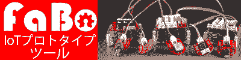
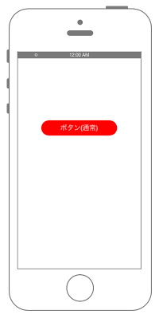
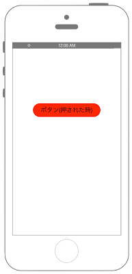

[](http://www.fabo.io)

 


# Swift 3.0

```swift
//
//  ViewController.swift
//  UIKit002
//
//  Copyright © 2016年 FaBo, Inc. All rights reserved.
//

import UIKit

class ViewController: UIViewController {
    
    private var myButton: UIButton!
    
    override func viewDidLoad() {
        super.viewDidLoad()
        
        // Buttonを生成する.
        myButton = UIButton()
        
        // ボタンのサイズ.
        let bWidth: CGFloat = 200
        let bHeight: CGFloat = 50
        
        // ボタンのX,Y座標.
        let posX: CGFloat = self.view.frame.width/2 - bWidth/2
        let posY: CGFloat = self.view.frame.height/2 - bHeight/2
        
        // ボタンの設置座標とサイズを設定する.
        myButton.frame = CGRect(x: posX, y: posY, width: bWidth, height: bHeight)
        
        // ボタンの背景色を設定.
        myButton.backgroundColor = UIColor.red
        
        // ボタンの枠を丸くする.
        myButton.layer.masksToBounds = true
        
        // コーナーの半径を設定する.
        myButton.layer.cornerRadius = 20.0
        
        // タイトルを設定する(通常時).
        myButton.setTitle("ボタン(通常)", for: .normal)
        myButton.setTitleColor(UIColor.white, for: .normal)
        
        // タイトルを設定する(ボタンがハイライトされた時).
        myButton.setTitle("ボタン(押された時)", for: .highlighted)
        myButton.setTitleColor(UIColor.black, for: .highlighted)
        
        // ボタンにタグをつける.
        myButton.tag = 1
        
        // イベントを追加する
        myButton.addTarget(self, action: #selector(ViewController.onClickMyButton(sender:)), for: .touchUpInside)
        
        // ボタンをViewに追加.
        self.view.addSubview(myButton)
        
    }
    
    override func didReceiveMemoryWarning() {
        super.didReceiveMemoryWarning()
        // Dispose of any resources that can be recreated.
    }
    
    /*
     ボタンのイベント.
     */
    internal func onClickMyButton(sender: UIButton) {
        print("onClickMyButton:");
        print("sender.currentTitle: \(sender.currentTitle)")
        print("sender.tag: \(sender.tag)")
    }
    
}


```

# Swift 2.3

```swift
//
//  ViewController.swift
//  UIKit002
//
//  Copyright © 2016年 FaBo, Inc. All rights reserved.
//

import UIKit

class ViewController: UIViewController {

    private var myButton: UIButton!
    
    override func viewDidLoad() {
        super.viewDidLoad()
        
        // Buttonを生成する.
        myButton = UIButton()
        
        // ボタンのサイズ.
        let bWidth: CGFloat = 200
        let bHeight: CGFloat = 50
        
        // ボタンのX,Y座標.
        let posX: CGFloat = self.view.frame.width/2 - bWidth/2
        let posY: CGFloat = self.view.frame.height/2 - bHeight/2
        
        // ボタンの設置座標とサイズを設定する.
        myButton.frame = CGRectMake(posX, posY, bWidth, bHeight)
        
        // ボタンの背景色を設定.
        myButton.backgroundColor = UIColor.redColor()
        
        // ボタンの枠を丸くする.
        myButton.layer.masksToBounds = true
        
        // コーナーの半径を設定する.
        myButton.layer.cornerRadius = 20.0
        
        // タイトルを設定する(通常時).
        myButton.setTitle("ボタン(通常)", forState: .Normal)
        myButton.setTitleColor(UIColor.whiteColor(), forState: .Normal)
        
        // タイトルを設定する(ボタンがハイライトされた時).
        myButton.setTitle("ボタン(押された時)", forState: .Highlighted)
        myButton.setTitleColor(UIColor.blackColor(), forState: .Highlighted)
        
        // ボタンにタグをつける.
        myButton.tag = 1
        
        // イベントを追加する
        myButton.addTarget(self, action: #selector(ViewController.onClickMyButton(_:)), forControlEvents: .TouchUpInside)
        
        // ボタンをViewに追加.
        self.view.addSubview(myButton)
        
    }

    override func didReceiveMemoryWarning() {
        super.didReceiveMemoryWarning()
        // Dispose of any resources that can be recreated.
    }
    
    /*
     ボタンのイベント.
    */
    internal func onClickMyButton(sender: UIButton) {
        print("onClickMyButton:");
        print("sender.currentTitle: \(sender.currentTitle)")
        print("sender.tag: \(sender.tag)")
    }

}
```

## 2.3と3.0の差分

* UIColor.grayColor()がUIColor.grayに変更
* CGRectMake()がCGReat()に変更
* UIButton.setTitle()のforState: .Normalが for: .normalに変更
* UIButton.addTarget()の#selector(ViewController.onClickMyButton(_:))が、#selector(ViewController.onClickMyButton(sender:)に変更
* UIButton.addTarget()のforControlEvents: .TouchUpInsideがfor: .touchUpInsideに変更

## Reference

* UIColor
	* [https://developer.apple.com/reference/uikit/uicolor](https://developer.apple.com/reference/uikit/uicolor)
* UILabel
	* [https://developer.apple.com/reference/uikit/uibutton](https://developer.apple.com/reference/uikit/uibutton)
