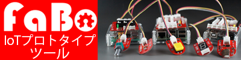

[](http://www.fabo.io)

 


# Swift 3.X

```swift
//
//  ViewController.swift
//  uikit001
//
//  Copyright © 2016年 FaBo, Inc. All rights reserved.
//

import UIKit

class ViewController: UIViewController {

    override func viewDidLoad() {
        super.viewDidLoad()
        
        // ボタンのサイズを定義.
        let bWidth: CGFloat = 200
        let bHeight: CGFloat = 50
        
        // 配置する座標を定義(画面の中心).
        let posX: CGFloat = self.view.bounds.width/2 - bWidth/2
        let posY: CGFloat = self.view.bounds.height/2 - bHeight/2

        // Labelを作成.
        let label: UILabel = UILabel(frame: CGRect(x: posX, y: posY, width: bWidth, height: bHeight))
        
        // UILabelの背景をオレンジ色に.
        label.backgroundColor = UIColor.orange
        
        // UILabelの枠を丸くする.
        label.layer.masksToBounds = true
        
        // 丸くするコーナーの半径.
        label.layer.cornerRadius = 20.0
        
        // 文字の色を白に定義.
        label.textColor = UIColor.white
        
        // UILabelに文字を代入.
        label.text = "Hello Swift!!"
        
        // 文字の影をグレーに定義.
        label.shadowColor = UIColor.gray
        
        // Textを中央寄せにする.
        label.textAlignment = NSTextAlignment.center
        
        // Viewの背景を青にする.
        self.view.backgroundColor = UIColor.cyan
        
        // ViewにLabelを追加.
        self.view.addSubview(label)
        
    }

    override func didReceiveMemoryWarning() {
        super.didReceiveMemoryWarning()
        // Dispose of any resources that can be recreated.
    }


}
```

# Swift 2.X

```swift
//
//  ViewController.swift
//  UIKit002
//
//  Copyright © 2016年 FaBo, Inc. All rights reserved.
//

import UIKit

class ViewController: UIViewController {

    private var myButton: UIButton!
    
    override func viewDidLoad() {
        super.viewDidLoad()
        
        // Buttonを生成する.
        myButton = UIButton()
        
        // ボタンのサイズ.
        let bWidth: CGFloat = 200
        let bHeight: CGFloat = 50
        
        // ボタンのX,Y座標.
        let posX: CGFloat = self.view.frame.width/2
        let posY: CGFloat = self.view.frame.height/2
        
        // ボタンの設置座標とサイズを設定する.
        myButton.frame = CGRectMake(posX, posY, bWidth, bHeight)
        
        // ボタンの背景色を設定.
        myButton.backgroundColor = UIColor.redColor()
        
        // ボタンの枠を丸くする.
        myButton.layer.masksToBounds = true
        
        // コーナーの半径を設定する.
        myButton.layer.cornerRadius = 20.0
        
        // タイトルを設定する(通常時).
        myButton.setTitle("ボタン(通常)", forState: .Normal)
        myButton.setTitleColor(UIColor.whiteColor(), forState: .Normal)
        
        // タイトルを設定する(ボタンがハイライトされた時).
        myButton.setTitle("ボタン(押された時)", forState: .Highlighted)
        myButton.setTitleColor(UIColor.blackColor(), forState: .Highlighted)
        
        // ボタンにタグをつける.
        myButton.tag = 1
        
        // イベントを追加する
        myButton.addTarget(self, action: "onClickMyButton", forControlEvents: .TouchUpInside)
        
        // ボタンをViewに追加.
        self.view.addSubview(myButton)
        
    }

    override func didReceiveMemoryWarning() {
        super.didReceiveMemoryWarning()
        // Dispose of any resources that can be recreated.
    }
    
    /*
     ボタンのイベント.
    */
    internal func onClickMyButton(sender: UIButton) {
        print("onClickMyButton:");
        print("sender.currentTitle: \(sender.currentTitle)")
        print("sender.tag: \(sender.tag)")
    }

}


```

## 2.xと3.xの差分

* UIColor.grayColor()がUIColor.gray()に変更
* NSTextAlignment.Centerが、NSTextAlignment.centerに変更

## Reference

* UIColor
	* [https://developer.apple.com/reference/uikit/uicolor](https://developer.apple.com/reference/uikit/uicolor)
* UILabel
	* [https://developer.apple.com/reference/uikit/uibutton](https://developer.apple.com/reference/uikit/uibutton)
