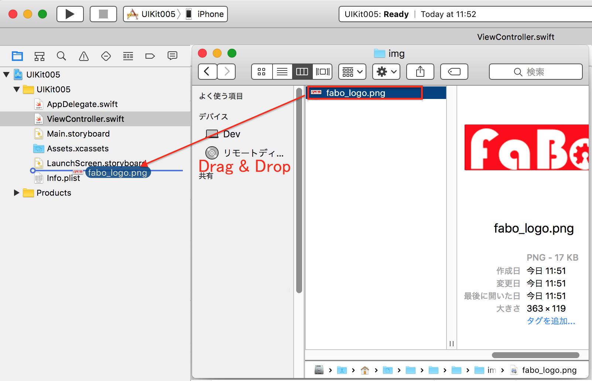
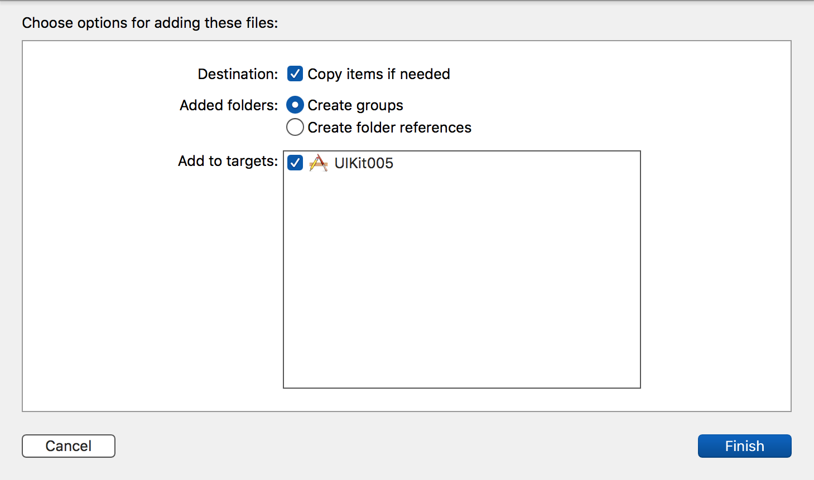
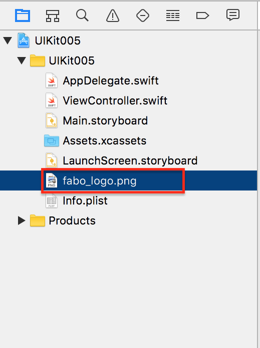

# UIImageViewで画像を表示


[](http://www.fabo.io)

## Swift 3.0

```swift
//
//  ViewController.swift
//  UIKit005
//
//  Copyright © 2016年 FaBo, Inc. All rights reserved.
//

import UIKit

class ViewController: UIViewController {
    
    private var myImageView: UIImageView!
    
    override func viewDidLoad() {
        super.viewDidLoad()
        
        // UIImageViewのサイズを設定する
        let iWidth: CGFloat = 300
        let iHeight: CGFloat = 100
        
        // UIImageViewのx,yを設定する
        let posX: CGFloat = (self.view.bounds.width - iWidth)/2
        let posY: CGFloat = (self.view.bounds.height - iHeight)/2
        
        // UIImageViewを作成.
        myImageView = UIImageView(frame: CGRect(x: posX, y: posY, width: iWidth, height: iHeight))
        
        // UIImageを作成.
        let myImage: UIImage = UIImage(named: "fabo_logo.png")!
        
        // 画像をUIImageViewに設定する.
        myImageView.image = myImage
        
        
        // UIImageViewをViewに追加する
        self.view.addSubview(myImageView)
    }
    
    override func didReceiveMemoryWarning() {
        super.didReceiveMemoryWarning()
        // Dispose of any resources that can be recreated.
    }
    
}


```

## Swift 2.3

```swift
//
//  ViewController.swift
//  UIKit005
//
//  Copyright © 2016年 FaBo, Inc. All rights reserved.
//

import UIKit

class ViewController: UIViewController {

    private var myImageView: UIImageView!
    
    override func viewDidLoad() {
        super.viewDidLoad()

        // UIImageViewのサイズを設定する
        let iWidth: CGFloat = 300
        let iHeight: CGFloat = 100
        
        // UIImageViewのx,yを設定する
        let posX: CGFloat = (self.view.bounds.width - iWidth)/2
        let posY: CGFloat = (self.view.bounds.height - iHeight)/2

        // UIImageViewを作成.
        myImageView = UIImageView(frame: CGRectMake(posX, posY, iWidth, iHeight))

        // UIImageを作成.
        let myImage: UIImage = UIImage(named: "fabo_logo.png")!
        
        // 画像をUIImageViewに設定する.
        myImageView.image = myImage
        
        
        // UIImageViewをViewに追加する
        self.view.addSubview(myImageView)
    }

    override func didReceiveMemoryWarning() {
        super.didReceiveMemoryWarning()
        // Dispose of any resources that can be recreated.
    }

}

```

## 2.3と3.0の差分

* CGRectMake()がCGRect()に変更.

## 事前準備








## Reference

* UITextField
	* [https://developer.apple.com/reference/uikit/uitextfield](https://developer.apple.com/reference/uikit/uitextfield)
