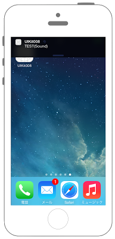

# UserNotificationを表示




## Swift 3.0

```swift
//
//  ViewController.swift
//  UIKit008
//
//  Copyright © 2016年 FaBo, Inc. All rights reserved.
//

import UIKit
import UserNotifications

class ViewController: UIViewController {
    
    private let BUTTON_NORMAL: Int = 1
    private let BUTTON_FIRE: Int = 2
    
    override func viewDidLoad() {
        super.viewDidLoad()
        
        // Notificationの表示許可をもらう.
        let center = UNUserNotificationCenter.current()
        center.requestAuthorization(options: [.alert, .sound]) { (granted, error) in
            
        }
        
        // すぐにNotificationを発火するボタン.
        let buttonWidth: CGFloat = 200
        let buttonHeight: CGFloat = 80
        let posX: CGFloat = (self.view.bounds.width - buttonWidth) / 2
        let posY: CGFloat = 200
        
        let myButton: UIButton = UIButton(frame: CGRect(x: posX, y: posY, width: buttonWidth, height: buttonHeight))
        myButton.backgroundColor = UIColor.orange
        myButton.layer.masksToBounds = true
        myButton.layer.cornerRadius = 20.0
        myButton.tag = BUTTON_NORMAL
        myButton.setTitle("Notification", for: .normal)
        myButton.addTarget(self, action: #selector(onClickMyButton(sender:)), for: .touchDown)
        view.addSubview(myButton)
        
        // 時間をおいてNotificationを発火するボタン.
        let posFireX: CGFloat = (self.view.bounds.width - buttonWidth) / 2
        let posFireY: CGFloat = 400
        
        let myFireButton: UIButton = UIButton(frame: CGRect(x: posFireX, y: posFireY, width: buttonWidth, height: buttonHeight))
        myFireButton.backgroundColor = UIColor.blue
        myFireButton.layer.masksToBounds = true
        myFireButton.layer.cornerRadius = 20.0
        myFireButton.tag = BUTTON_FIRE
        myFireButton.setTitle("Fire Notification", for: .normal)
        myFireButton.addTarget(self, action: #selector(onClickMyButton(sender:)), for: .touchDown)
        view.addSubview(myFireButton)
    }
    
    override func didReceiveMemoryWarning() {
        super.didReceiveMemoryWarning()
        // Dispose of any resources that can be recreated.
    }
    
    /*
     ボタンイベント.
     */
    internal func onClickMyButton(sender: UIButton) {
        print("onClickMyButton")
        if sender.tag == BUTTON_NORMAL {
            showNotification()
        } else if sender.tag == BUTTON_FIRE {
            showNotificationFire()
        }
    }
    
    /*
     Notificationを表示.
     */
    private func showNotification() {
        print("showNotification")
        
        // Notificationを生成.
        let content = UNMutableNotificationContent()
        
        // Titleを代入する.
        content.title = "Title1"
        
        // Bodyを代入する.
        content.body = "Hello Notification"
        
        // 音を設定する.
        content.sound = UNNotificationSound.default()
        
        // Requestを生成する.
        let request = UNNotificationRequest.init(identifier: "Title1", content: content, trigger: nil)

        // Noticationを発行する.
        let center = UNUserNotificationCenter.current()
        center.add(request) { (error) in
            print(error)
        }
    }
    
    /*
     Notificationを表示(10秒後)
     */
    private func showNotificationFire() {
        // Notificationを生成.
        let content = UNMutableNotificationContent()
        
        // Titleを代入する.
        content.title = "Title1"
        
        // Bodyを代入する.
        content.body = "Hello Notification"
        
        // 音を設定する.
        content.sound = UNNotificationSound.default()
        
        // Triggerを生成する.
        let trigger = UNTimeIntervalNotificationTrigger.init(timeInterval: 5, repeats: false)
        
        // Requestを生成する.
        let request = UNNotificationRequest.init(identifier: "Title1", content: content, trigger: trigger)
        
        // Noticationを発行する.
        let center = UNUserNotificationCenter.current()
        center.add(request) { (error) in
            print(error)
        }

    }
    
}


```

## Swift 2.3

```swift
//
//  ViewController.swift
//  UIKit008
//
//  Copyright © 2016年 FaBo, Inc. All rights reserved.
//

import UIKit

class ViewController: UIViewController {

    private let BUTTON_NORMAL: Int = 1
    private let BUTTON_FIRE: Int = 2
    
    override func viewDidLoad() {
        super.viewDidLoad()
        
        // アラートの表示許可をもらう.
        let setting = UIUserNotificationSettings(forTypes: [.Sound, .Alert], categories: nil)
        UIApplication.sharedApplication().registerUserNotificationSettings(setting)
        
        // すぐにNotificationを発火するボタン.
        let buttonWidth: CGFloat = 200
        let buttonHeight: CGFloat = 80
        let posX: CGFloat = (self.view.bounds.width - buttonWidth) / 2
        let posY: CGFloat = 200
        
        let myButton: UIButton = UIButton(frame: CGRectMake(posX, posY, buttonWidth, buttonHeight))
        myButton.backgroundColor = UIColor.orangeColor()
        myButton.layer.masksToBounds = true
        myButton.layer.cornerRadius = 20.0
        myButton.tag = BUTTON_NORMAL
        myButton.setTitle("Notification", forState: .Normal)
        myButton.addTarget(self, action: #selector(onClickMyButton(_:)), forControlEvents: .TouchDown)
        view.addSubview(myButton)
        
        // 時間をおいてNotificationを発火するボタン.
        let posFireX: CGFloat = (self.view.bounds.width - buttonWidth) / 2
        let posFireY: CGFloat = 400
        
        let myFireButton: UIButton = UIButton(frame: CGRectMake(posFireX, posFireY, buttonWidth, buttonHeight))
        myFireButton.backgroundColor = UIColor.blueColor()
        myFireButton.layer.masksToBounds = true
        myFireButton.layer.cornerRadius = 20.0
        myFireButton.tag = BUTTON_FIRE
        myFireButton.setTitle("Fire Notification", forState: .Normal)
        myFireButton.addTarget(self, action: #selector(onClickMyButton(_:)), forControlEvents: .TouchDown)
        view.addSubview(myFireButton)
        
    }

    override func didReceiveMemoryWarning() {
        super.didReceiveMemoryWarning()
        // Dispose of any resources that can be recreated.
    }

    /*
     ボタンイベント.
    */
    internal func onClickMyButton(sender: UIButton) {
        print("onClickMyButton")
        if sender.tag == BUTTON_NORMAL {
            showNotification()
        } else if sender.tag == BUTTON_FIRE {
            showNotificationFire()
        }
    }
    
    /*
     Notificationを表示.
    */
    private func showNotification() {
        print("showNotification")
        
        // Notificationを生成.
        let myNotification: UILocalNotification = UILocalNotification()
        
        // メッセージを代入する.
        myNotification.alertBody = "TEST1"
        
        // Timezoneを設定する.
        myNotification.timeZone = NSTimeZone.defaultTimeZone()
        
        // Noticationを発行する.
        UIApplication.sharedApplication().scheduleLocalNotification(myNotification)
    }
    
    /*
     Notificationを表示(10秒後)
    */
    private func showNotificationFire() {
        print("showNotificationFire")
        
        // Notificationを生成.
        let myFireNotification: UILocalNotification = UILocalNotification()
        
        // メッセージを代入する.
        myFireNotification.alertBody = "TEST2"
        
        // 再生サウンドを設定する.
        myFireNotification.soundName = UILocalNotificationDefaultSoundName
        
        // Timezoneを設定する.
        myFireNotification.timeZone = NSTimeZone.defaultTimeZone()
        
        // 10秒後に設定する.
        myFireNotification.fireDate = NSDate(timeIntervalSinceNow: 10)
        
        // Notificationを発行する.
        UIApplication.sharedApplication().scheduleLocalNotification(myFireNotification)
    }

}

```

## 2.3と3.0の差分

* UILocalNotificationがDepricateにて、UNUserNotificationCenterに変更

## Reference

* UIFont
	* [https://developer.apple.com/reference/uikit/uifont](https://developer.apple.com/reference/uikit/uifont)