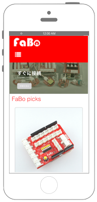
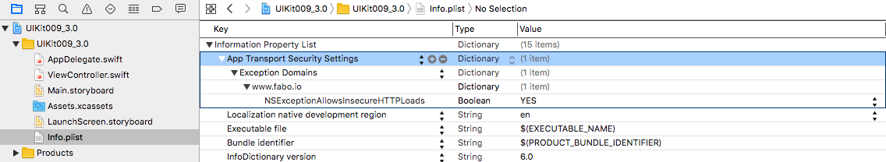
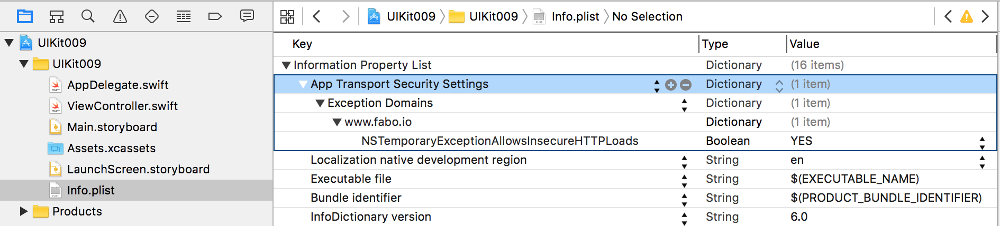

# UIWebViewでWebページを表示　



## Swift 3.0

```swift
//
//  ViewController.swift
//  UIKit009
//
//  Copyright © 2016年 FaBo, Inc. All rights reserved.
//

import UIKit

class ViewController: UIViewController, UIWebViewDelegate {
    
    private var myWebView: UIWebView!
    
    override func viewDidLoad() {
        super.viewDidLoad()
        
        // WebViewの生成.
        myWebView = UIWebView()
        
        // Deletegateを自身に設定.
        myWebView.delegate = self
        
        // WebViewのサイズを設定.
        myWebView.frame = self.view.bounds
        
        // URLを設定.
        let url: URL = URL(string: "http://www.fabo.io")!
        
        // リエストを発行する.
        let request: NSURLRequest = NSURLRequest(url: url)
        
        // リクエストを発行する.
        myWebView.loadRequest(request as URLRequest)
        
        // Viewに追加する
        self.view.addSubview(myWebView)
        
    }
    
    override func didReceiveMemoryWarning() {
        super.didReceiveMemoryWarning()
        // Dispose of any resources that can be recreated.
    }
    
    /*
     Pageが全て読み終わったら呼ばれる.
     */
    func webViewDidFinishLoad(_ webView: UIWebView) {
        print("webViewDidFinishLoad")
    }
    
    /*
     PageがLoadされ始めた時、呼ばれる.
     */
    func webViewDidStartLoad(_ webView: UIWebView) {
        print("webViewDidStartLoad")
    }
    
}


```

## Swift 2.3

```swift
//
//  ViewController.swift
//  UIKit009
//
//  Copyright © 2016年 FaBo, Inc. All rights reserved.
//

import UIKit

class ViewController: UIViewController, UIWebViewDelegate {

    private var myWebView: UIWebView!
    
    override func viewDidLoad() {
        super.viewDidLoad()
        
        // WebViewの生成.
        myWebView = UIWebView()
        
        // Deletegateを自身に設定.
        myWebView.delegate = self
        
        // WebViewのサイズを設定.
        myWebView.frame = self.view.bounds
        
        // URLを設定.
        let url: NSURL = NSURL(string: "http://www.fabo.io")!
        
        // リエストを発行する.
        let request: NSURLRequest = NSURLRequest(URL: url)
        
        // リクエストを発行する.
        myWebView.loadRequest(request)
        
        // Viewに追加する
        self.view.addSubview(myWebView)
        
    }

    override func didReceiveMemoryWarning() {
        super.didReceiveMemoryWarning()
        // Dispose of any resources that can be recreated.
    }
    
    /*
     Pageが全て読み終わったら呼ばれる.
    */
    func webViewDidFinishLoad(webView: UIWebView) {
        print("webViewDidFinishLoad")
    }
    
    /*
     PageがLoadされ始めた時、呼ばれる.
     */
    func webViewDidStartLoad(webView: UIWebView) {
        print("webViewDidStartLoad")
    }

}


```

## 2.3と3.0の差分

* ATSのキーがNSTemporaryExceptionAllowsInsecureHTTPLoadsからNSExceptionAllowsInsecureHTTPLoadsに変更.

## ATSの設定(3.0)

info.plist


info.plist
```xml
<key>NSAppTransportSecurity</key>
    <dict>
        <key>NSExceptionDomains</key>
        <dict>
            <key>www.fabo.io</key>
            <dict>
            <key>NSExceptionAllowsInsecureHTTPLoads</key>
            <true/>
            </dict>
        </dict>
    </dict>
```

## ATSの設定(2.3)

info.plist


info.plist
```xml
<key>NSAppTransportSecurity</key>
    <dict>
        <key>NSExceptionDomains</key>
        <dict>
            <key>www.fabo.io</key>
            <dict>
                <key>NSTemporaryExceptionAllowsInsecureHTTPLoads</key>
                <true/>
            </dict>
        </dict>
    </dict>
```

## Reference

* UserNotifications
	* [https://developer.apple.com/reference/uiwebview](https://developer.apple.com/reference/uiwebview)