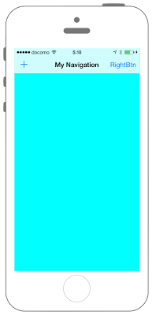
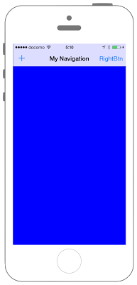
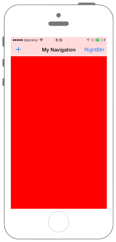

# UIBarButtonItemの設置





## Swift3.0
```swift
//
//  ViewController.swift
//  UIKit015_3.0
//
//  Created by akira on 2016/08/13.
//  Copyright © 2016年 FaBo, Inc. All rights reserved.
//

```

### ViewController.swift


## Swift 2.3
```swift
//
//  AppDelegate.swift
//  UIKit017_2.3
//
//  Created by akira on 2016/08/13.
//  Copyright © 2016年 FaBo, Inc. All rights reserved.
//

import UIKit

@UIApplicationMain
class AppDelegate: UIResponder, UIApplicationDelegate {

    internal var window: UIWindow?

    func application(application: UIApplication, didFinishLaunchingWithOptions launchOptions: [NSObject: AnyObject]?) -> Bool {

        // viewConrollerを生成.
        let myViewController = ViewController()

        // navigationControllerを生成.
        let navigationController = UINavigationController(rootViewController: myViewController)

        // windowを生成.
        window = UIWindow(frame: UIScreen.mainScreen().bounds)

        // rootViewControllerにnavigationControllerを設定.
        window?.rootViewController = navigationController

        window?.makeKeyAndVisible()
        return true
    }

}
```

```swift
//
//  ViewController.swift
//  UIKit017_2.3
//
//  Created by akira on 2016/08/13.
//  Copyright © 2016年 FaBo, Inc. All rights reserved.
//

import UIKit

class ViewController: UIViewController {

    private var myLeftButton: UIBarButtonItem!
    private var myRightButton: UIBarButtonItem!

    override func viewDidLoad() {
        super.viewDidLoad()

        // 背景色をCyanに設定する.
        self.view.backgroundColor = UIColor.cyanColor()

        // NavigationControllerのタイトルを設定する.
        self.title = "My Navigation"

        // 左ボタンを作成する..
        myLeftButton = UIBarButtonItem(barButtonSystemItem: .Add, target: self, action: "onClickMyButton:")

        // 右ボタンを作成する.
        myRightButton = UIBarButtonItem(title: "RightBtn", style: .Plain, target: self, action: "onClickMyButton:")

        // tagを設定する.
        myLeftButton.tag = 1
        myRightButton.tag = 2

        // ナビゲーションバーの左に設置する.
        self.navigationItem.leftBarButtonItem = myLeftButton

        // ナビゲーションバーの右に設置する.
        self.navigationItem.rightBarButtonItem = myRightButton
    }

    /*
     ボタンイベント.
     */
    internal func onClickMyButton(sender: UIButton){

        switch(sender.tag){

        // 背景色を青色に変える.
        case 1:
            self.view.backgroundColor = UIColor.blueColor()

        // 背景色を赤色に変える.
        case 2:
            self.view.backgroundColor = UIColor.redColor()

        default:
            print("error")
        }
    }

    override func didReceiveMemoryWarning() {
        super.didReceiveMemoryWarning()
    }
}
```

### ViewController.swift

## 2.3と3.0の差分

## Reference
