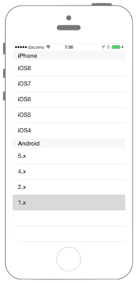

# セクション分けしたUITableViewを作る



## Swift3.0
```swift
//
//  ViewController.swift
//  UIKit019_3.0
//
//  Created by KimikoWatanabe on 2016/08/16.
//  Copyright © 2016年 FaBo, Inc. All rights reserved.
//

import UIKit

class ViewController: UIViewController, UITableViewDelegate, UITableViewDataSource {

    // Tableで使用する配列を定義する.
    private let myiPhoneItems: NSArray = ["iOS9","iOS8", "iOS7", "iOS6", "iOS5", "iOS4"]
    private let myAndroidItems: NSArray = ["5.x", "4.x", "2.x", "1.x"]

    // Sectionで使用する配列を定義する.
    private let mySections: NSArray = ["iPhone", "Android"]

    override func viewDidLoad() {
        super.viewDidLoad()

        // Status Barの高さを取得を.する.
        let barHeight: CGFloat = UIApplication.shared.statusBarFrame.size.height

        // Viewの高さと幅を取得する.
        let displayWidth: CGFloat = self.view.frame.width
        let displayHeight: CGFloat = self.view.frame.height

        // TableViewの生成( status barの高さ分ずらして表示 ).
        let myTableView: UITableView = UITableView(frame: CGRect(x: 0, y: barHeight, width: displayWidth, height: displayHeight - barHeight))

        // Cell名の登録をおこなう.
        myTableView.register(UITableViewCell.self, forCellReuseIdentifier: "MyCell")

        // DataSourceの設定をする.
        myTableView.dataSource = self

        // Delegateを設定する.
        myTableView.delegate = self

        // Viewに追加する.
        self.view.addSubview(myTableView)
    }

    override func didReceiveMemoryWarning() {
        super.didReceiveMemoryWarning()
    }

    /*
     セクションの数を返す.
     */
    func numberOfSections(in tableView: UITableView) -> Int {
        return mySections.count
    }

    /*
     セクションのタイトルを返す.
     */
    func tableView(_ tableView: UITableView, titleForHeaderInSection section: Int) -> String? {
        return mySections[section] as? String
    }

    /*
     Cellが選択された際に呼び出される.
     */
    func tableView(_ tableView: UITableView, didSelectRowAt indexPath: IndexPath) {
        if indexPath.section == 0 {
            print("Value: \(myiPhoneItems[indexPath.row])")
        } else if indexPath.section == 1 {
            print("Value: \(myAndroidItems[indexPath.row])")
        }
    }

    /*
     テーブルに表示する配列の総数を返す.
     */
    func tableView(_ tableView: UITableView, numberOfRowsInSection section: Int) -> Int {
        if section == 0 {
            return myiPhoneItems.count
        } else if section == 1 {
            return myAndroidItems.count
        } else {
            return 0
        }
    }

    /*
     Cellに値を設定する.
     */
    func tableView(_ tableView: UITableView, cellForRowAt indexPath: IndexPath) -> UITableViewCell {

        let cell = tableView.dequeueReusableCell(withIdentifier: "MyCell", for: indexPath)

        if indexPath.section == 0 {
            cell.textLabel?.text = "\(myiPhoneItems[indexPath.row])"
        } else if indexPath.section == 1 {
            cell.textLabel?.text = "\(myAndroidItems[indexPath.row])"
        }

        return cell
    }

}

```


## Swift 2.3
```swift
//
//  ViewController.swift
//  UIKit019_2.3
//
//  Created by KimikoWatanabe on 2016/08/16.
//  Copyright © 2016年 FaBo, Inc. All rights reserved.
//

import UIKit

class ViewController: UIViewController, UITableViewDelegate, UITableViewDataSource {

    // Tableで使用する配列を定義する.
    private let myiPhoneItems: NSArray = ["iOS9","iOS8", "iOS7", "iOS6", "iOS5", "iOS4"]
    private let myAndroidItems: NSArray = ["5.x", "4.x", "2.x", "1.x"]

    // Sectionで使用する配列を定義する.
    private let mySections: NSArray = ["iPhone", "Android"]

    override func viewDidLoad() {
        super.viewDidLoad()

        // Status Barの高さを取得を.する.
        let barHeight: CGFloat = UIApplication.sharedApplication().statusBarFrame.size.height

        // Viewの高さと幅を取得する.
        let displayWidth: CGFloat = self.view.frame.width
        let displayHeight: CGFloat = self.view.frame.height

        // TableViewの生成( status barの高さ分ずらして表示 ).
        let myTableView: UITableView = UITableView(frame: CGRect(x: 0, y: barHeight, width: displayWidth, height: displayHeight - barHeight))

        // Cell名の登録をおこなう.
        myTableView.registerClass(UITableViewCell.self, forCellReuseIdentifier: "MyCell")

        // DataSourceの設定をする.
        myTableView.dataSource = self

        // Delegateを設定する.
        myTableView.delegate = self

        // Viewに追加する.
        self.view.addSubview(myTableView)
    }

    override func didReceiveMemoryWarning() {
        super.didReceiveMemoryWarning()
    }

    /*
     セクションの数を返す.
     */
    func numberOfSectionsInTableView(tableView: UITableView) -> Int {
        return mySections.count
    }

    /*
     セクションのタイトルを返す.
     */
    func tableView(tableView: UITableView, titleForHeaderInSection section: Int) -> String? {
        return mySections[section] as? String
    }

    /*
     Cellが選択された際に呼び出される.
     */
    func tableView(tableView: UITableView, didSelectRowAtIndexPath indexPath: NSIndexPath) {

        if indexPath.section == 0 {
            print("Value: \(myiPhoneItems[indexPath.row])")
        } else if indexPath.section == 1 {
            print("Value: \(myAndroidItems[indexPath.row])")
        }
    }

    /*
     テーブルに表示する配列の総数を返す.
     */
    func tableView(tableView: UITableView, numberOfRowsInSection section: Int) -> Int {
        if section == 0 {
            return myiPhoneItems.count
        } else if section == 1 {
            return myAndroidItems.count
        } else {
            return 0
        }
    }

    /*
     Cellに値を設定する.
     */
    func tableView(tableView: UITableView, cellForRowAtIndexPath indexPath: NSIndexPath) -> UITableViewCell {

        let cell = tableView.dequeueReusableCellWithIdentifier("MyCell", forIndexPath: indexPath)

        if indexPath.section == 0 {
            cell.textLabel?.text = "\(myiPhoneItems[indexPath.row])"
        } else if indexPath.section == 1 {
            cell.textLabel?.text = "\(myAndroidItems[indexPath.row])"
        }

        return cell
    }

}


```

## 2.3と3.0の差分
* UITableViewDelegateのメソッドの引数が一部変更

## Reference
