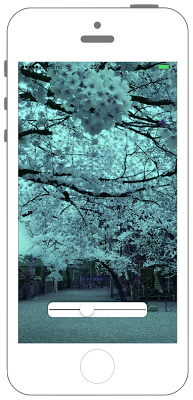

# UISliderの表示




## Swift4.0
```swift
//
//  ViewController.swift
//  UIKit021_4.0
//
//  Created by KimikoWatanabe on 2016/08/13.
//  Copyright © 2016年 FaBo, Inc. All rights reserved.
//

import UIKit

class ViewController: UIViewController{
    
    // 画像を設定する.
    private let myInputImage = CIImage(image: UIImage(named: "sakura.jpg")!)
    
    // ImageViewを.定義する.
    private var myImageView: UIImageView!
    
    override func viewDidLoad() {
        
        // UIImageViewを作成する.
        myImageView = UIImageView(frame: self.view.frame)
        myImageView.image = UIImage(ciImage: myInputImage!)
        
        self.view.addSubview(myImageView)
        
        // Sliderを作成する.
        let myGreenSlider = UISlider(frame: CGRect(x:0, y:0, width:200, height:30))
        myGreenSlider.layer.position = CGPoint(x:self.view.frame.midX, y:500)
        myGreenSlider.backgroundColor = UIColor.white
        myGreenSlider.layer.cornerRadius = 10.0
        myGreenSlider.layer.shadowOpacity = 0.5
        myGreenSlider.layer.masksToBounds = false
        
        // 最小値と最大値を設定する.
        myGreenSlider.minimumValue = 0
        myGreenSlider.maximumValue = 1
        
        // Sliderの位置を設定する.
        myGreenSlider.value = 0.5
        
        // Sliderの現在位置より右のTintカラーを変える.
        myGreenSlider.maximumTrackTintColor = UIColor.gray
        
        // Sliderの現在位置より左のTintカラーを変える.
        myGreenSlider.minimumTrackTintColor = UIColor.black
        
        myGreenSlider.addTarget(self, action: #selector(ViewController.onChangeValueMySlider(sender:)), for: UIControl.Event.valueChanged)
        
        self.view.addSubview(myGreenSlider)
        
        self.view.backgroundColor = UIColor(red: 0, green: CGFloat(myGreenSlider.value), blue: 0, alpha: 1)
    }
    
    /*
     Sliderの値が変わった時に呼ばれるメソッド
     */
    @objc internal func onChangeValueMySlider(sender : UISlider){

        
        // Sliderの値に応じてviewの背景のgreen値を変える.
        self.view.backgroundColor = UIColor(red: 0, green: CGFloat(sender.value), blue: 0, alpha: 1)
        
        // カラーエフェクトを指定してCIFilterをインスタンス化する.
        let myColorFilter = CIFilter(name: "CIColorCrossPolynomial")
        
        // イメージを設定する.
        myColorFilter!.setValue(myInputImage, forKey: kCIInputImageKey)
        
        // RGBの変換値を作成する.
        let r: [CGFloat] = [0.0, CGFloat(sender.value), 0.0, 0.0, 0.0, 0.0, 0.0, 0.0, 0.0, 0.0]
        let g: [CGFloat] = [0.0, 0.0, 1.0, 0.0, 0.0, 0.0, 0.0, 0.0, 0.0, 0.0]
        let b: [CGFloat] = [1.0, 0.0, 0.0, 0.0, 0.0, 0.0, 0.0, 0.0, 0.0, 0.0]
        
        // 値の調整をする.
        myColorFilter!.setValue(CIVector(values: r, count: 10), forKey: "inputRedCoefficients")
        myColorFilter!.setValue(CIVector(values: g, count: 10), forKey: "inputGreenCoefficients")
        myColorFilter!.setValue(CIVector(values: b, count: 10), forKey: "inputBlueCoefficients")
        
        // フィルターで処理した画像をアウトプットする.
        let myOutputImage : CIImage = myColorFilter!.outputImage!
        
        // 再びUIView処理済み画像を設定する.
        myImageView.image = UIImage(ciImage: myOutputImage)
        
        // 再描画をおこなう.
        myImageView.setNeedsDisplay()
    }
}

```
## Swift3.0
```swift
//
//  ViewController.swift
//  UIKit021_3.0
//
//  Created by KimikoWatanabe on 2016/08/13.
//  Copyright © 2016年 FaBo, Inc. All rights reserved.
//

import UIKit

class ViewController: UIViewController{

    // 画像を設定する.
    private let myInputImage = CIImage(image: UIImage(named: "sakura.jpg")!)

    // ImageViewを.定義する.
    private var myImageView: UIImageView!

    override func viewDidLoad() {

        // UIImageViewを作成する.
        myImageView = UIImageView(frame: self.view.frame)
        myImageView.image = UIImage(ciImage: myInputImage!)

        self.view.addSubview(myImageView)

        // Sliderを作成する.
        let myGreenSlider = UISlider(frame: CGRect(x:0, y:0, width:200, height:30))
        myGreenSlider.layer.position = CGPoint(x:self.view.frame.midX, y:500)
        myGreenSlider.backgroundColor = UIColor.white
        myGreenSlider.layer.cornerRadius = 10.0
        myGreenSlider.layer.shadowOpacity = 0.5
        myGreenSlider.layer.masksToBounds = false

        // 最小値と最大値を設定する.
        myGreenSlider.minimumValue = 0
        myGreenSlider.maximumValue = 1

        // Sliderの位置を設定する.
        myGreenSlider.value = 0.5

        // Sliderの現在位置より右のTintカラーを変える.
        myGreenSlider.maximumTrackTintColor = UIColor.gray

        // Sliderの現在位置より左のTintカラーを変える.
        myGreenSlider.minimumTrackTintColor = UIColor.black

        myGreenSlider.addTarget(self, action: #selector(ViewController.onChangeValueMySlider(sender:)), for: UIControlEvents.valueChanged)

        self.view.addSubview(myGreenSlider)

        self.view.backgroundColor = UIColor(red: 0, green: CGFloat(myGreenSlider.value), blue: 0, alpha: 1)
    }

    /*
     Sliderの値が変わった時に呼ばれるメソッド
     */
    internal func onChangeValueMySlider(sender : UISlider){

        // Sliderの値に応じてviewの背景のgreen値を変える.
        self.view.backgroundColor = UIColor(red: 0, green: CGFloat(sender.value), blue: 0, alpha: 1)

        // カラーエフェクトを指定してCIFilterをインスタンス化する.
        let myColorFilter = CIFilter(name: "CIColorCrossPolynomial")

        // イメージを設定する.
        myColorFilter!.setValue(myInputImage, forKey: kCIInputImageKey)

        // RGBの変換値を作成する.
        let r: [CGFloat] = [0.0, CGFloat(sender.value), 0.0, 0.0, 0.0, 0.0, 0.0, 0.0, 0.0, 0.0]
        let g: [CGFloat] = [0.0, 0.0, 1.0, 0.0, 0.0, 0.0, 0.0, 0.0, 0.0, 0.0]
        let b: [CGFloat] = [1.0, 0.0, 0.0, 0.0, 0.0, 0.0, 0.0, 0.0, 0.0, 0.0]

        // 値の調整をする.
        myColorFilter!.setValue(CIVector(values: r, count: 10), forKey: "inputRedCoefficients")
        myColorFilter!.setValue(CIVector(values: g, count: 10), forKey: "inputGreenCoefficients")
        myColorFilter!.setValue(CIVector(values: b, count: 10), forKey: "inputBlueCoefficients")

        // フィルターで処理した画像をアウトプットする.
        let myOutputImage : CIImage = myColorFilter!.outputImage!

        // 再びUIView処理済み画像を設定する.
        myImageView.image = UIImage(ciImage: myOutputImage)

        // 再描画をおこなう.
        myImageView.setNeedsDisplay()
    }
}

```

## Swift 2.3
```swift
//
//  ViewController.swift
//  UIKit021_2.3
//
//  Created by KimikoWatanabe on 2016/08/16.
//  Copyright © 2016年 FaBo, Inc. All rights reserved.
//

import UIKit

class ViewController: UIViewController{

    // 画像を設定する.
    private let myInputImage = CIImage(image: UIImage(named: "sakura.jpg")!)

    // ImageViewを.定義する.
    private var myImageView: UIImageView!

    override func viewDidLoad() {

        // UIImageViewを作成する.
        myImageView = UIImageView(frame: self.view.frame)
        myImageView.image = UIImage(CIImage: myInputImage!)
        self.view.addSubview(myImageView)

        // Sliderを作成する.
        let myGreenSlider = UISlider(frame: CGRectMake(0, 0, 200, 30))
        myGreenSlider.layer.position = CGPointMake(self.view.frame.midX, 500)
        myGreenSlider.backgroundColor = UIColor.whiteColor()
        myGreenSlider.layer.cornerRadius = 10.0
        myGreenSlider.layer.shadowOpacity = 0.5
        myGreenSlider.layer.masksToBounds = false

        // 最小値と最大値を設定する.
        myGreenSlider.minimumValue = 0
        myGreenSlider.maximumValue = 1

        // Sliderの位置を設定する.
        myGreenSlider.value = 0.5

        // Sliderの現在位置より右のTintカラーを変える.
        myGreenSlider.maximumTrackTintColor = UIColor.grayColor()

        // Sliderの現在位置より左のTintカラーを変える.
        myGreenSlider.minimumTrackTintColor = UIColor.blackColor()

        myGreenSlider.addTarget(self, action: #selector(ViewController.onChangeValueMySlider(_:)), forControlEvents: UIControlEvents.ValueChanged)

        self.view.addSubview(myGreenSlider)

        self.view.backgroundColor = UIColor(red: 0, green: CGFloat(myGreenSlider.value), blue: 0, alpha: 1)
    }

    /*
     Sliderの値が変わった時に呼ばれるメソッド
     */
    internal func onChangeValueMySlider(sender : UISlider){

        // Sliderの値に応じてviewの背景のgreen値を変える.
        self.view.backgroundColor = UIColor(red: 0, green: CGFloat(sender.value), blue: 0, alpha: 1)

        // カラーエフェクトを指定してCIFilterをインスタンス化する.
        let myColorFilter = CIFilter(name: "CIColorCrossPolynomial")

        // イメージを設定する.
        myColorFilter!.setValue(myInputImage, forKey: kCIInputImageKey)

        // RGBの変換値を作成する.
        let r: [CGFloat] = [0.0, CGFloat(sender.value), 0.0, 0.0, 0.0, 0.0, 0.0, 0.0, 0.0, 0.0]
        let g: [CGFloat] = [0.0, 0.0, 1.0, 0.0, 0.0, 0.0, 0.0, 0.0, 0.0, 0.0]
        let b: [CGFloat] = [1.0, 0.0, 0.0, 0.0, 0.0, 0.0, 0.0, 0.0, 0.0, 0.0]

        // 値の調整をする.
        myColorFilter!.setValue(CIVector(values: r, count: 10), forKey: "inputRedCoefficients")
        myColorFilter!.setValue(CIVector(values: g, count: 10), forKey: "inputGreenCoefficients")
        myColorFilter!.setValue(CIVector(values: b, count: 10), forKey: "inputBlueCoefficients")

        // フィルターで処理した画像をアウトプットする.
        let myOutputImage : CIImage = myColorFilter!.outputImage!

        // 再びUIView処理済み画像を設定する.
        myImageView.image = UIImage(CIImage: myOutputImage)

        // 再描画をおこなう.
        myImageView.setNeedsDisplay()
    }
}

```

## 3.0と4.0の差分
* myGreenSlider.addTarget(self, action: #selector(ViewController.onChangeValueMySlider(sender:)), for: UIControlEvents.valueChanged)が、
myGreenSlider.addTarget(self, action: #selector(ViewController.onChangeValueMySlider(sender:)), for: UIControl.Event.valueChanged)に変更
* internal func onChangeValueMySlider(sender : UISlider)が、
@objc internal func onChangeValueMySlider(sender : UISlider)に変更


## 2.3と3.0の差分
* CGRect,CGPointの初期化方法の変更(CGRectMake,CGPointMakeメソッドの廃止)
* UIColorの呼び出し方法の変更(UIColor.whiteColor() -> UIColor.white)
* UIImageの初期化の引数のラベル名が変更(CIImage -> ciImage)

## Reference
* UISlider Class
 * [https://developer.apple.com/reference/uikit/uislider](https://developer.apple.com/reference/uikit/uislider)
