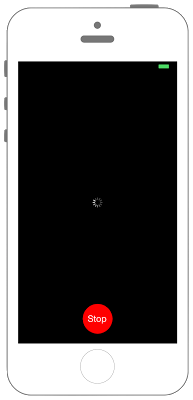

# UIActivityIndicatorの表示




## Swift3.0
```swift
//
//  ViewController.swift
//  UIKit0_3.0
//
//  Created by KimikoWatanabe on 2016/08/13.
//  Copyright © 2016年 FaBo, Inc. All rights reserved.
//

```

## Swift 2.3
```swift
//
//  ViewController.swift
//  UIKit0_2.3
//
//  Created by KimikoWatanabe on 2016/08/16.
//  Copyright © 2016年 FaBo, Inc. All rights reserved.
//

import UIKit

class ViewController: UIViewController {

    private var myActivityIndicator: UIActivityIndicatorView!
    private var myButton: UIButton!

    override func viewDidLoad() {
        super.viewDidLoad()

        // 背景色を黒に設定する.
        self.view.backgroundColor = UIColor.blackColor()

        // インジケータを作成する.
        myActivityIndicator = UIActivityIndicatorView()
        myActivityIndicator.frame = CGRectMake(0, 0, 50, 50)
        myActivityIndicator.center = self.view.center

        // アニメーションが停止している時もインジケータを表示させる.
        myActivityIndicator.hidesWhenStopped = false
        myActivityIndicator.activityIndicatorViewStyle = UIActivityIndicatorViewStyle.White

        // アニメーションを開始する.
        myActivityIndicator.startAnimating()

        // インジケータをViewに追加する.
        self.view.addSubview(myActivityIndicator)

        // ボタンを生成する.
        myButton = UIButton(frame: CGRectMake(0, 0, 60, 60))
        myButton.backgroundColor = UIColor.redColor()
        myButton.layer.masksToBounds = true
        myButton.layer.cornerRadius = 30.0
        myButton.setTitle("Stop", forState: .Normal)
        myButton.layer.position = CGPoint(x: self.view.bounds.width/2, y: self.view.bounds.height-50)
        myButton.addTarget(self, action: #selector(ViewController.onClickMyButton(_:)), forControlEvents: .TouchUpInside)

        // ボタンをViewに追加する.
        self.view.addSubview(myButton)
    }

    /*
     ボタンイベント.
     */
    internal func onClickMyButton(sender: UIButton){

        if myActivityIndicator.isAnimating() {
            myActivityIndicator.stopAnimating()
            myButton.setTitle("Start", forState: .Normal)
            myButton.backgroundColor = UIColor.blueColor()
        }
        else {
            myActivityIndicator.startAnimating()
            myButton.setTitle("Stop", forState: .Normal)
            myButton.backgroundColor = UIColor.redColor()
        }
    }

    override func didReceiveMemoryWarning() {
        super.didReceiveMemoryWarning()
    }
}

```

## 2.3と3.0の差分


## Reference
