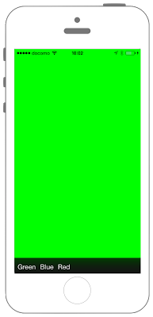

# UIToolBarの表示




## Swift3.0
```swift
//
//  ViewController.swift
//  UIKit0_3.0
//
//  Created by KimikoWatanabe on 2016/08/13.
//  Copyright © 2016年 FaBo, Inc. All rights reserved.
//

```

## Swift 2.3
```swift
//
//  ViewController.swift
//  UIKit0_2.3
//
//  Created by KimikoWatanabe on 2016/08/16.
//  Copyright © 2016年 FaBo, Inc. All rights reserved.
//

import UIKit

class ViewController: UIViewController, UIToolbarDelegate{

    private var myToolbar: UIToolbar!

    override func viewDidLoad() {
        super.viewDidLoad()

        // 背景を青色に変更する.
        self.view.backgroundColor = UIColor.cyanColor()

        // ツールバーのサイズを決める.
        myToolbar = UIToolbar(frame: CGRectMake(0, self.view.bounds.size.height - 44, self.view.bounds.size.width, 40.0))

        // ツールバーの位置を決める.
        myToolbar.layer.position = CGPoint(x: self.view.bounds.width/2, y: self.view.bounds.height-20.0)

        // ツールバーの色を決める.
        myToolbar.barStyle = .BlackTranslucent
        myToolbar.tintColor = UIColor.whiteColor()
        myToolbar.backgroundColor = UIColor.blackColor()

        // ボタン１を生成する.
        let myUIBarButtonGreen: UIBarButtonItem = UIBarButtonItem(title: "Green", style:.Plain, target: self, action: #selector(ViewController.onClickBarButton(_:)))
        myUIBarButtonGreen.tag = 1

        // ボタン２を生成する.
        let myUIBarButtonBlue: UIBarButtonItem = UIBarButtonItem(title: "Blue", style:.Plain, target: self, action: #selector(ViewController.onClickBarButton(_:)))
        myUIBarButtonBlue.tag = 2

        // ボタン3を生成する.
        let myUIBarButtonRed: UIBarButtonItem = UIBarButtonItem(title: "Red", style:.Plain, target: self, action: #selector(ViewController.onClickBarButton(_:)))
        myUIBarButtonRed.tag = 3

        // ボタンをツールバーに入れる.
        myToolbar.items = [myUIBarButtonGreen, myUIBarButtonBlue, myUIBarButtonRed]

        // ツールバーに追加する.
        self.view.addSubview(myToolbar)
    }

    /*
     UIBarButtonItemが押された際に呼ばれる.
     */
    internal func onClickBarButton(sender: UIBarButtonItem) {

        switch sender.tag {
        case 1:
            self.view.backgroundColor = UIColor.greenColor()
        case 2:
            self.view.backgroundColor = UIColor.blueColor()
        case 3:
            self.view.backgroundColor = UIColor.redColor()
        default:
            print("ERROR!!")
        }
    }

    override func didReceiveMemoryWarning() {
        super.didReceiveMemoryWarning()
    }
}


```

## 2.3と3.0の差分


## Reference
