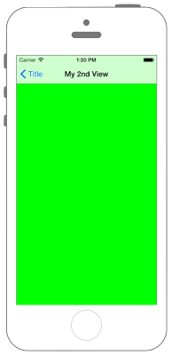

# UINavigationItemでUINavigationBarを設定




## Swift3.0
### AppDelegate.swift
```swift
//
//  AppDelegate.swift
//  UIKit031_3.0
//
//  Created by KimikoWatanabe on 2016/08/18.
//  Copyright © 2016年 FaBo, Inc. All rights reserved.
//

import UIKit

@UIApplicationMain
class AppDelegate: UIResponder, UIApplicationDelegate {

    var window: UIWindow?

    func application(_ application: UIApplication, didFinishLaunchingWithOptions launchOptions: [NSObject : AnyObject]?) -> Bool {

        // ViewControllerを生成する.
        let myFirstViewController: FirstViewController = FirstViewController()

        // Navication Controllerを生成する.
        let myNavigationController: UINavigationController = UINavigationController(rootViewController: myFirstViewController)

        // UIWindowを生成する.
        self.window = UIWindow(frame: UIScreen.main.bounds)

        // rootViewControllerにNatigationControllerを設定する.
        self.window?.rootViewController = myNavigationController

        self.window?.makeKeyAndVisible()

        return true
    }

}
```

### FirstViewController.swift
```swift
//
//  ViewController.swift
//  UIKit031_3.0
//
//  Created by KimikoWatanabe on 2016/08/18.
//  Copyright © 2016年 FaBo, Inc. All rights reserved.
//

import UIKit

class FirstViewController: UIViewController {

    override func viewDidLoad() {
        super.viewDidLoad()

        // Viewの背景色を定義する.
        self.view.backgroundColor = UIColor.cyan

        // ボタンを生成する.
        let myButton = UIButton(frame: CGRect(x:0,y:0,width:100,height:50))
        myButton.backgroundColor = UIColor.orange
        myButton.layer.masksToBounds = true
        myButton.setTitle("ボタン", for: .normal)
        myButton.layer.cornerRadius = 20.0
        myButton.layer.position = CGPoint(x: self.view.bounds.width/2, y:200)
        myButton.addTarget(self, action: #selector(FirstViewController.onClickMyButton(sender:)), for: .touchUpInside)

        // ボタンをViewに追加する.
        self.view.addSubview(myButton);

        // BarButtonItemを作成する.
        let myBarButton_1 = UIBarButtonItem(barButtonSystemItem: UIBarButtonSystemItem.camera, target: self, action: #selector(FirstViewController.onClickMyButton(sender:)))
        let myBarButton_2 = UIBarButtonItem(barButtonSystemItem: UIBarButtonSystemItem.add, target: self, action: #selector(FirstViewController.onClickMyButton(sender:)))
        let myBarButton_3 = UIBarButtonItem(barButtonSystemItem: UIBarButtonSystemItem.done, target: self, action: #selector(FirstViewController.onClickMyButton(sender:)))

        // Barの右に配置するボタンを配列に格納する.
        let myRightButtons: NSArray = [myBarButton_1, myBarButton_2]

        // NavigationBarの表示する.
        self.navigationController?.setNavigationBarHidden(false, animated: false)


        // タイトルを設定する.
        self.navigationItem.title = "Title"

        // プロンプトを設定する.
        self.navigationItem.prompt = "Prompt"

        // Barの右側に複数配置する.
        self.navigationItem.setRightBarButtonItems(myRightButtons as? [UIBarButtonItem], animated: true)

        // Barの左側に配置する.
        self.navigationItem.setLeftBarButton(myBarButton_3, animated: true)
    }

    /*
     ボタンイベント
     */
    internal func onClickMyButton(sender: UIButton){
        print("onClickMyButton:")

        let secondViewController = SecondViewController()
        self.navigationController?.pushViewController(secondViewController, animated: true)
    }

    /*
     BarButtonイベント
     */
    internal func onClickMyBarButton(sender: UIButton){
        print("onClickMyBarButton:")
    }

    override func didReceiveMemoryWarning() {
        super.didReceiveMemoryWarning()
        // Dispose of any resources that can be recreated.
    }
}
```

### SecoundViewController.swift
```swift
//
//  SecoundViewController.swift
//  UIKit031_3.0
//
//  Created by KimikoWatanabe on 2016/08/18.
//  Copyright © 2016年 FaBo, Inc. All rights reserved.
//

import UIKit

class SecondViewController: UIViewController {

    override func viewDidLoad() {
        super.viewDidLoad()

        // Controllerのタイトルを設定する.
        self.title = "My 2nd View"

        // Viewの背景色を定義する.
        self.view.backgroundColor = UIColor.green
    }


    override func didReceiveMemoryWarning() {
        super.didReceiveMemoryWarning()
        // Dispose of any resources that can be recreated.
    }

}

```

## Swift 2.3
### AppDelegate.swift
```swift
//
//  AppDelegate.swift
//  UIKit031_2.3
//
//  Created by KimikoWatanabe on 2016/08/18.
//  Copyright © 2016年 FaBo, Inc. All rights reserved.
//

import UIKit

@UIApplicationMain
class AppDelegate: UIResponder, UIApplicationDelegate {

    var window: UIWindow?

    func application(application: UIApplication, didFinishLaunchingWithOptions launchOptions: [NSObject : AnyObject]?) -> Bool {

        // ViewControllerを生成する.
        let myFirstViewController: FirstViewController = FirstViewController()

        // Navication Controllerを生成する.
        let myNavigationController: UINavigationController = UINavigationController(rootViewController: myFirstViewController)

        // UIWindowを生成する.
        self.window = UIWindow(frame: UIScreen.mainScreen().bounds)

        // rootViewControllerにNatigationControllerを設定する.
        self.window?.rootViewController = myNavigationController

        self.window?.makeKeyAndVisible()

        return true
    }

}
```

### FirstViewController.swift
```swift
//
//  ViewController.swift
//  UIKit031_2.3
//
//  Created by KimikoWatanabe on 2016/08/18.
//  Copyright © 2016年 FaBo, Inc. All rights reserved.
//

import UIKit

class FirstViewController: UIViewController {

    override func viewDidLoad() {
        super.viewDidLoad()

        // Viewの背景色を定義する.
        self.view.backgroundColor = UIColor.cyanColor()

        // ボタンを生成する.
        let myButton = UIButton(frame: CGRectMake(0,0,100,50))
        myButton.backgroundColor = UIColor.orangeColor()
        myButton.layer.masksToBounds = true
        myButton.setTitle("ボタン", forState: .Normal)
        myButton.layer.cornerRadius = 20.0
        myButton.layer.position = CGPoint(x: self.view.bounds.width/2, y:200)
        myButton.addTarget(self, action: #selector(FirstViewController.onClickMyButton(_:)), forControlEvents: .TouchUpInside)

        // ボタンをViewに追加する.
        self.view.addSubview(myButton);

        // BarButtonItemを作成する.
        let myBarButton_1 = UIBarButtonItem(barButtonSystemItem: UIBarButtonSystemItem.Camera, target: self, action: #selector(FirstViewController.onClickMyBarButton(_:)))
        let myBarButton_2 = UIBarButtonItem(barButtonSystemItem: UIBarButtonSystemItem.Add, target: self, action: #selector(FirstViewController.onClickMyBarButton(_:)))
        let myBarButton_3 = UIBarButtonItem(barButtonSystemItem: UIBarButtonSystemItem.Done, target: self, action: #selector(FirstViewController.onClickMyBarButton(_:)))

        // Barの右に配置するボタンを配列に格納する.
        let myRightButtons: NSArray = [myBarButton_1, myBarButton_2]

        // NavigationBarを取得する.
        self.navigationController?.navigationBar

        // NavigationBarの表示する.
        self.navigationController?.setNavigationBarHidden(false, animated: false)

        // NavigationItemの取得する.
        self.navigationItem

        // タイトルを設定する.
        self.navigationItem.title = "Title"

        // プロンプトを設定する.
        self.navigationItem.prompt = "Prompt"

        // Barの右側に複数配置する.
        self.navigationItem.setRightBarButtonItems(myRightButtons as? [UIBarButtonItem], animated: true)

        // Barの左側に配置する.
        self.navigationItem.setLeftBarButtonItem(myBarButton_3, animated: true)
    }

    /*
     ボタンイベント
     */
    internal func onClickMyButton(sender: UIButton){
        print("onClickMyButton:")

        let secondViewController = SecondViewController()
        self.navigationController?.pushViewController(secondViewController, animated: true)
    }

    /*
     BarButtonイベント
     */
    internal func onClickMyBarButton(sender: UIButton){
        print("onClickMyBarButton:")
    }

    override func didReceiveMemoryWarning() {
        super.didReceiveMemoryWarning()
        // Dispose of any resources that can be recreated.
    }
}
```

### SecoundViewController.swift
```swift
//
//  SecoundViewController.swift
//  UIKit031_2.3
//
//  Created by KimikoWatanabe on 2016/08/18.
//  Copyright © 2016年 FaBo, Inc. All rights reserved.
//

import UIKit

class SecondViewController: UIViewController {

    override func viewDidLoad() {
        super.viewDidLoad()

        // Controllerのタイトルを設定する.
        self.title = "My 2nd View"

        // Viewの背景色を定義する.
        self.view.backgroundColor = UIColor.greenColor()
    }


    override func didReceiveMemoryWarning() {
        super.didReceiveMemoryWarning()
        // Dispose of any resources that can be recreated.
    }

}
```

## 2.3と3.0の差分
* UIColorの参照方法が変更(UIColor.grayColor()->UIColor.gray)
* CGRect,CGPointの初期化方法の変更(CGRectMake,CGPointMakeの廃止)
* ```UIScreen.mainScreen().bounds```が```UIScreen.main.bounds```に変更
* senderの記述方法の変更(```.onClickMyBarButton(_:)``` -> ```.onClickMyButton(sender:)```)

## Reference
