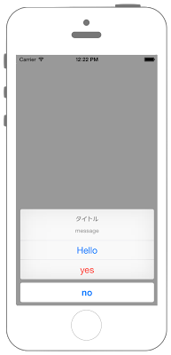

# UIAlertControllerでActionSheet表示



## Swift3.0
```swift
//
//  ViewController.swift
//  UIKit032_3.0
//
//  Created by KimikoWatanabe on 2016/08/18.
//  Copyright © 2016年 FaBo, Inc. All rights reserved.
//

import UIKit

class ViewController: UIViewController {

    override func viewDidAppear(_ animated: Bool) {

        // インスタンス生成　styleはActionSheet.
        let myAlert = UIAlertController(title: "タイトル", message: "message", preferredStyle: UIAlertControllerStyle.actionSheet)

        // アクションを生成.
        let myAction_1 = UIAlertAction(title: "Hello", style: UIAlertActionStyle.default, handler: {
            (action: UIAlertAction!) in
            print("Hello")
        })

        let myAction_2 = UIAlertAction(title: "yes", style: UIAlertActionStyle.destructive, handler: {
            (action: UIAlertAction!) in
            print("yes")
        })

        let myAction_3 = UIAlertAction(title: "no", style: UIAlertActionStyle.cancel, handler: {
            (action: UIAlertAction!) in
            print("no")
        })

        // アクションを追加.
        myAlert.addAction(myAction_1)
        myAlert.addAction(myAction_2)
        myAlert.addAction(myAction_3)

        self.present(myAlert, animated: true, completion: nil)
    }

    override func viewDidLoad() {
        super.viewDidLoad()
    }

    override func didReceiveMemoryWarning() {
        super.didReceiveMemoryWarning()
    }
}
```

## Swift 2.3
```swift
//
//  ViewController.swift
//  UIKit032_2.3
//
//  Created by KimikoWatanabe on 2016/08/18.
//  Copyright © 2016年 FaBo, Inc. All rights reserved.
//

import UIKit

class ViewController: UIViewController {

    override func viewDidAppear(animated: Bool) {

        // インスタンス生成　styleはActionSheet.
        let myAlert = UIAlertController(title: "タイトル", message: "message", preferredStyle: UIAlertControllerStyle.ActionSheet)

        // アクションを生成.
        let myAction_1 = UIAlertAction(title: "Hello", style: UIAlertActionStyle.Default, handler: {
            (action: UIAlertAction!) in
            print("Hello")
        })

        let myAction_2 = UIAlertAction(title: "yes", style: UIAlertActionStyle.Destructive, handler: {
            (action: UIAlertAction!) in
            print("yes")
        })

        let myAction_3 = UIAlertAction(title: "no", style: UIAlertActionStyle.Cancel, handler: {
            (action: UIAlertAction!) in
            print("no")
        })

        // アクションを追加.
        myAlert.addAction(myAction_1)
        myAlert.addAction(myAction_2)
        myAlert.addAction(myAction_3)

        self.presentViewController(myAlert, animated: true, completion: nil)
    }

    override func viewDidLoad() {
        super.viewDidLoad()
    }

    override func didReceiveMemoryWarning() {
        super.didReceiveMemoryWarning()
    }
}
```

## 2.3と3.0の差分
* UIAlertActionStyleのプロパティ名の変更
* ```self.presentViewController```が```self.present(myAlert, animated: true, completion: nil)```に変更

## Reference
