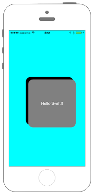

# UIViewにUIMotionEffectを追加



## Swift3.0
```swift
//
//  ViewController.swift
//  UIKit034_3.0
//
//  Created by KimikoWatanabe on 2016/08/18.
//  Copyright © 2016年 FaBo, Inc. All rights reserved.
//

import UIKit

class ViewController: UIViewController {

    override func viewDidLoad() {

        super.viewDidLoad()

        self.view.backgroundColor = UIColor.cyan

        // UIViewを作成.
        let myBox = UIView(frame: CGRect(x:0,y:0,width:200,height:200))
        myBox.backgroundColor = UIColor.black
        myBox.layer.masksToBounds = true
        myBox.layer.cornerRadius = 20.0
        myBox.layer.position = self.view.center
        myBox.layer.zPosition = 1
        self.view.addSubview(myBox)

        // Labelを作成.
        let myLabel = UILabel(frame: CGRect(x:0,y:0,width:200,height:200))
        myLabel.backgroundColor = UIColor.gray
        myLabel.layer.masksToBounds = true
        myLabel.layer.cornerRadius = 20.0
        myLabel.text = "Hello Swift!!"
        myLabel.textColor = UIColor.white
        myLabel.shadowColor = UIColor.gray
        myLabel.textAlignment = NSTextAlignment.center
        myLabel.layer.position = self.view.center
        myLabel.layer.zPosition = 2
        self.view.addSubview(myLabel)

        //端末のｘ軸方向の傾きに応じてmyBoxの位置を変えるエフェクトを作成.
        let xAxis1 = UIInterpolatingMotionEffect(keyPath: "center.x", type: UIInterpolatingMotionEffectType.tiltAlongHorizontalAxis)
        xAxis1.minimumRelativeValue = -100.0
        xAxis1.maximumRelativeValue = 100.0

        //端末のy軸方向の傾きに応じてmyBoxの位置を変えるエフェクトを作成.
        let yAxis1 = UIInterpolatingMotionEffect(keyPath: "center.y", type: UIInterpolatingMotionEffectType.tiltAlongVerticalAxis)
        yAxis1.minimumRelativeValue = -100.0
        yAxis1.maximumRelativeValue = 100.0

        //モーションエフェクトのグループを作成.
        let group1 = UIMotionEffectGroup()
        group1.motionEffects = [xAxis1, yAxis1]

        //端末のｘ軸方向の傾きに応じてmyLabelの位置を変えるエフェクトを作成.
        let xAxis = UIInterpolatingMotionEffect(keyPath: "center.x", type: UIInterpolatingMotionEffectType.tiltAlongHorizontalAxis)
        xAxis.minimumRelativeValue = -50.0
        xAxis.maximumRelativeValue = 50.0

        //端末のy軸方向の傾きに応じてmyLabelの位置を変えるエフェクトを作成.
        let yAxis = UIInterpolatingMotionEffect(keyPath: "center.y", type: UIInterpolatingMotionEffectType.tiltAlongVerticalAxis)
        yAxis.minimumRelativeValue = -50.0
        yAxis.maximumRelativeValue = 50.0

        //モーションエフェクトのグループを作成.
        let group = UIMotionEffectGroup()
        group.motionEffects = [xAxis, yAxis]

        //myLabelにエフェクトを適用させる.
        myBox.addMotionEffect(group)
        myLabel.addMotionEffect(group1)

    }

}
```

## Swift 2.3
```swift
//
//  ViewController.swift
//  UIKit034_2.3
//
//  Created by KimikoWatanabe on 2016/08/18.
//  Copyright © 2016年 FaBo, Inc. All rights reserved.
//

import UIKit

class ViewController: UIViewController {

    override func viewDidLoad() {

        super.viewDidLoad()

        self.view.backgroundColor = UIColor.cyanColor()

        // UIViewを作成.
        let myBox = UIView(frame: CGRectMake(0,0,200,200))
        myBox.backgroundColor = UIColor.blackColor()
        myBox.layer.masksToBounds = true
        myBox.layer.cornerRadius = 20.0
        myBox.layer.position = self.view.center
        myBox.layer.zPosition = 1
        self.view.addSubview(myBox)

        // Labelを作成.
        let myLabel = UILabel(frame: CGRectMake(0,0,200,200))
        myLabel.backgroundColor = UIColor.grayColor()
        myLabel.layer.masksToBounds = true
        myLabel.layer.cornerRadius = 20.0
        myLabel.text = "Hello Swift!!"
        myLabel.textColor = UIColor.whiteColor()
        myLabel.shadowColor = UIColor.grayColor()
        myLabel.textAlignment = NSTextAlignment.Center
        myLabel.layer.position = self.view.center
        myLabel.layer.zPosition = 2
        self.view.addSubview(myLabel)

        //端末のｘ軸方向の傾きに応じてmyBoxの位置を変えるエフェクトを作成.
        let xAxis1 = UIInterpolatingMotionEffect(keyPath: "center.x", type: UIInterpolatingMotionEffectType.TiltAlongHorizontalAxis)
        xAxis1.minimumRelativeValue = -100.0
        xAxis1.maximumRelativeValue = 100.0

        //端末のy軸方向の傾きに応じてmyBoxの位置を変えるエフェクトを作成.
        let yAxis1 = UIInterpolatingMotionEffect(keyPath: "center.y", type: UIInterpolatingMotionEffectType.TiltAlongVerticalAxis)
        yAxis1.minimumRelativeValue = -100.0
        yAxis1.maximumRelativeValue = 100.0

        //モーションエフェクトのグループを作成.
        let group1 = UIMotionEffectGroup()
        group1.motionEffects = [xAxis1, yAxis1]

        //端末のｘ軸方向の傾きに応じてmyLabelの位置を変えるエフェクトを作成.
        let xAxis = UIInterpolatingMotionEffect(keyPath: "center.x", type: UIInterpolatingMotionEffectType.TiltAlongHorizontalAxis)
        xAxis.minimumRelativeValue = -50.0
        xAxis.maximumRelativeValue = 50.0

        //端末のy軸方向の傾きに応じてmyLabelの位置を変えるエフェクトを作成.
        let yAxis = UIInterpolatingMotionEffect(keyPath: "center.y", type: UIInterpolatingMotionEffectType.TiltAlongVerticalAxis)
        yAxis.minimumRelativeValue = -50.0
        yAxis.maximumRelativeValue = 50.0

        //モーションエフェクトのグループを作成.
        let group = UIMotionEffectGroup()
        group.motionEffects = [xAxis, yAxis]

        //myLabelにエフェクトを適用させる.
        myBox.addMotionEffect(group)
        myLabel.addMotionEffect(group1)

    }

}

```

## 2.3と3.0の差分
* UIColorの参照方法が変更(UIColor.grayColor()->UIColor.gray)
* CGRect,CGPointの初期化方法の変更(CGRectMake,CGPointMakeの廃止)

## Reference
* UIInterpolatingMotionEffect Class
 * [https://developer.apple.com/reference/uikit/uiinterpolatingmotioneffect](https://developer.apple.com/reference/uikit/uiinterpolatingmotioneffect)
* UIMotionEffectGroup Class
 * [https://developer.apple.com/reference/uikit/uimotioneffectgroup](https://developer.apple.com/reference/uikit/uimotioneffectgroup)
