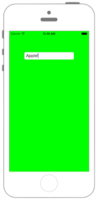

# UITextFieldに文字数制限を設ける



## Swift3.0
```swift
//
//  ViewController.swift
//  UIKit038_3.0
//
//  Created by KimikoWatanabe on 2016/08/18.
//  Copyright © 2016年 FaBo, Inc. All rights reserved.
//


```

## Swift 2.3
```swift
//
//  ViewController.swift
//  UIKit038_2.3
//
//  Created by KimikoWatanabe on 2016/08/18.
//  Copyright © 2016年 FaBo, Inc. All rights reserved.
//

import UIKit

class ViewController: UIViewController, UITextFieldDelegate {

    override func viewDidLoad() {
        super.viewDidLoad()

        // 背景を緑色に設定.
        self.view.backgroundColor = UIColor.greenColor()

        //  UITextFieldを生成.
        let myTextField: UITextField = UITextField(frame: CGRectMake(0, 0, 200, 30))

        // 最初に表示する文字.
        myTextField.text = "Hi"

        // Delegateを設定.
        myTextField.delegate = self

        // 枠の線を表示.
        myTextField.borderStyle = UITextBorderStyle.RoundedRect

        // UITextFieldの表示する位置.
        myTextField.layer.position = CGPointMake(self.view.bounds.width/2, 100)

        // TextViewをviewに追加する.
        self.view.addSubview(myTextField)
    }

    override func didReceiveMemoryWarning() {
        super.didReceiveMemoryWarning()
    }

    /*
     UITextFieldが編集開始された直後に呼ばれる.
     */
    func textFieldDidBeginEditing(textField: UITextField) {
        print("textFieldDidBeginEditing: \(textField.text)")
    }

    /*
     テキストが編集された際に呼ばれる.
     */
    func textField(textField: UITextField, shouldChangeCharactersInRange range: NSRange, replacementString string: String) -> Bool {

        // 文字数最大を決める.
        let maxLength: Int = 6

        // 入力済みの文字と入力された文字を合わせて取得.
        let str = textField.text! + string

        // 文字数がmaxLength以下ならtrueを返す.
        if str.characters.count < maxLength {
            return true
        }
        print("6文字を超えています")
        return false
    }

    /*
     UITextFieldが編集終了する直前に呼ばれる.
     */
    func textFieldShouldEndEditing(textField: UITextField) -> Bool {
        print("textFieldShouldEndEditing: \(textField.text)")
        return true
    }

    /*
     改行ボタンが押された際に呼ばれる.
     */
    func textFieldShouldReturn(textField: UITextField) -> Bool {
        print("textFieldShouldReturn: \(textField.text)")
        return true
    }

}
```

## 2.3と3.0の差分
* UIColorの参照方法が変更(UIColor.grayColor()->UIColor.gray)
* CGRect,CGPointの初期化方法の変更(CGRectMake,CGPointMakeの廃止)

## Reference
* shouldChangeCharactersInRange Tasks
