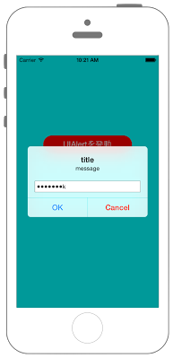

# UIAlertControllerをパスワード形式にする



## Swift3.0
```swift
//
//  ViewController.swift
//  UIKit041_3.0
//
//  Created by KimikoWatanabe on 2016/08/18.
//  Copyright © 2016年 FaBo, Inc. All rights reserved.
//

import UIKit

class ViewController: UIViewController {

    override func viewDidLoad() {
        super.viewDidLoad()

        self.view.backgroundColor = UIColor.cyan

        let myButton = UIButton(frame: CGRect(x:0, y:0, width:200, height:40))
        myButton.layer.position = CGPoint(x:self.view.frame.width/2, y:200)
        myButton.layer.cornerRadius = 20.0
        myButton.backgroundColor = UIColor.red
        myButton.setTitle("UIAlertを発動", for: .normal)
        myButton.addTarget(self, action: #selector(ViewController.onClickMyButton(sender:)), for: .touchUpInside)

        self.view.addSubview(myButton)
    }

    override func didReceiveMemoryWarning() {
        super.didReceiveMemoryWarning()
    }

    /*
     ボタンアクション時に設定したメソッド.
     */
    internal func onClickMyButton(sender: UIButton) {

        // Alert生成.
        let myAlert: UIAlertController = UIAlertController(title: "title", message: "message", preferredStyle: UIAlertControllerStyle.alert)

        // OKアクション生成.
        let OkAction = UIAlertAction(title: "OK", style: UIAlertActionStyle.default) { (action: UIAlertAction!) -> Void in
            print("OK")
        }

        // Cancelアクション生成.
        let CancelAction = UIAlertAction(title: "Cancel", style: UIAlertActionStyle.destructive) { (action: UIAlertAction!) -> Void in
            print("Cancel")
        }

        // AlertにTextFieldを追加.
        myAlert.addTextField { (textField: UITextField!) -> Void in

            // 入力された文字を非表示にする.
            textField.isSecureTextEntry = true

            // NotificationCenterを生成.
            let myNotificationCenter = NotificationCenter.default

            // textFieldに変更があればchangeTextFieldメソッドに通知.
            myNotificationCenter.addObserver(self, selector: #selector(ViewController.changeTextField(sender:)), name: NSNotification.Name.UITextFieldTextDidChange, object: nil)
        }

        // Alertにアクションを追加.
        myAlert.addAction(OkAction)
        myAlert.addAction(CancelAction)

        // Alertを発動.
        present(myAlert, animated: true, completion: nil)
    }

    /*
     textFieldに変更が会った時に通知されるメソッド.
     */
    internal func changeTextField (sender: NSNotification) {
        let textField = sender.object as! UITextField

        // 入力された文字を表示.
        print(textField.text!)
    }
}
```

## Swift 2.3
```swift
//
//  ViewController.swift
//  UIKit041_2.3
//
//  Created by KimikoWatanabe on 2016/08/18.
//  Copyright © 2016年 FaBo, Inc. All rights reserved.
//

import UIKit

class ViewController: UIViewController {

    override func viewDidLoad() {
        super.viewDidLoad()

        self.view.backgroundColor = UIColor.cyanColor()

        let myButton = UIButton(frame: CGRectMake(0, 0, 200, 40))
        myButton.layer.position = CGPointMake(self.view.frame.width/2, 200)
        myButton.layer.cornerRadius = 20.0
        myButton.backgroundColor = UIColor.redColor()
        myButton.setTitle("UIAlertを発動", forState: .Normal)
        myButton.addTarget(self, action: #selector(ViewController.onClickMyButton(_:)), forControlEvents: .TouchUpInside)

        self.view.addSubview(myButton)
    }

    override func didReceiveMemoryWarning() {
        super.didReceiveMemoryWarning()
    }

    /*
     ボタンアクション時に設定したメソッド.
     */
    internal func onClickMyButton(sender: UIButton) {

        // Alert生成.
        let myAlert: UIAlertController = UIAlertController(title: "title", message: "message", preferredStyle: UIAlertControllerStyle.Alert)

        // OKアクション生成.
        let OkAction = UIAlertAction(title: "OK", style: UIAlertActionStyle.Default) { (action: UIAlertAction!) -> Void in
            print("OK")
        }

        // Cancelアクション生成.
        let CancelAction = UIAlertAction(title: "Cancel", style: UIAlertActionStyle.Destructive) { (action: UIAlertAction!) -> Void in
            print("Cancel")
        }

        // AlertにTextFieldを追加.
        myAlert.addTextFieldWithConfigurationHandler { (textField: UITextField!) -> Void in

            // 入力された文字を非表示にする.
            textField.secureTextEntry = true

            // NotificationCenterを生成.
            let myNotificationCenter = NSNotificationCenter.defaultCenter()

            // textFieldに変更があればchangeTextFieldメソッドに通知.
            myNotificationCenter.addObserver(self, selector: #selector(ViewController.changeTextField(_:)), name: UITextFieldTextDidChangeNotification, object: nil)
        }

        // Alertにアクションを追加.
        myAlert.addAction(OkAction)
        myAlert.addAction(CancelAction)

        // Alertを発動.
        presentViewController(myAlert, animated: true, completion: nil)
    }

    /*
     textFieldに変更が会った時に通知されるメソッド.
     */
    internal func changeTextField (sender: NSNotification) {
        let textField = sender.object as! UITextField

        // 入力された文字を表示.
        print(textField.text!)
    }
}
```

## 2.3と3.0の差分
* UIColorの参照方法が変更(UIColor.grayColor()->UIColor.gray)
* CGRect,CGPointの初期化方法の変更(CGRectMake,CGPointMakeの廃止)
* UIAlertの一部メソッド名の変更(addTextFieldWithConfigurationHandler->addTextField)

## Reference
* UIAlertController Class
 * [https://developer.apple.com/reference/uikit/uialertcontroller](https://developer.apple.com/reference/uikit/uialertcontroller)
* UIAlertAction Class
 * [https://developer.apple.com/reference/uikit/uialertaction](https://developer.apple.com/reference/uikit/uialertaction)
* UITextInputTraits Protocol
 * [https://developer.apple.com/reference/uikit/uitextinputtraits](https://developer.apple.com/reference/uikit/uitextinputtraits)
