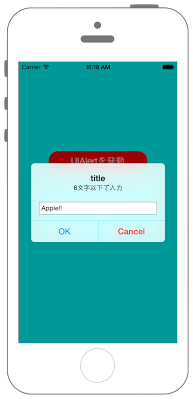

#



## Swift3.0
```swift
//
//  ViewController.swift
//  UIKit042_3.0
//
//  Created by KimikoWatanabe on 2016/08/18.
//  Copyright © 2016年 FaBo, Inc. All rights reserved.
//


```

## Swift 2.3
```swift
//
//  ViewController.swift
//  UIKit042_2.3
//
//  Created by KimikoWatanabe on 2016/08/18.
//  Copyright © 2016年 FaBo, Inc. All rights reserved.
//

import UIKit

class ViewController: UIViewController {

    var InputStr:String!

    // 入力できる最大文字数.
    let maxLength: Int = 6

    override func viewDidLoad() {
        super.viewDidLoad()

        self.view.backgroundColor = UIColor.cyanColor()

        let myButton = UIButton(frame: CGRectMake(0, 0, 200, 40))
        myButton.layer.position = CGPointMake(self.view.frame.width/2, 200)
        myButton.layer.cornerRadius = 20.0
        myButton.backgroundColor = UIColor.redColor()
        myButton.setTitle("UIAlertを発動", forState: .Normal)
        myButton.addTarget(self, action: #selector(ViewController.onClickMyButton(_:)), forControlEvents: .TouchUpInside)

        self.view.addSubview(myButton)
    }

    override func didReceiveMemoryWarning() {
        super.didReceiveMemoryWarning()
    }

    func onClickMyButton(sender: UIButton) {

        // Alert生成.
        let myAlert: UIAlertController = UIAlertController(title: "title", message: "6文字以下で入力", preferredStyle: UIAlertControllerStyle.Alert)


        // OKアクション生成.
        let OkAction = UIAlertAction(title: "OK", style: UIAlertActionStyle.Default) { (action: UIAlertAction!) -> Void in
            print("OK")
        }

        // Cancelアクション生成.
        let CancelAction = UIAlertAction(title: "Cancel", style: UIAlertActionStyle.Destructive) { (action: UIAlertAction!) -> Void in
            print("Cancel")
        }

        // AlertにTextFieldを追加.
        myAlert.addTextFieldWithConfigurationHandler { (textField: UITextField!) -> Void in

            // NotificationCenterを生成.
            let myNotificationCenter = NSNotificationCenter.defaultCenter()

            // textFieldに変更があればchangeTextFieldメソッドに通知.
            myNotificationCenter.addObserver(self, selector: #selector(ViewController.changeTextField(_:)), name: UITextFieldTextDidChangeNotification, object: nil)
        }

        // Alertにアクションを追加.
        myAlert.addAction(OkAction)
        myAlert.addAction(CancelAction)

        // Alertを発動する.
        presentViewController(myAlert, animated: true, completion: nil)
    }

    func changeTextField (sender: NSNotification) {

        let textField = sender.object as! UITextField

        // 入力された文字を取得.
        InputStr = textField.text

        // 入力された文字が6文字を超えたら入力を制限.
        if InputStr.characters.count < maxLength {
            textField.enabled = true

            // 入力された文字を表示.
            print(textField.text!)
        } else {
            textField.enabled = false
            print("6文字を超えています")
        }
    }
}
```

## 2.3と3.0の差分
* UIColorの参照方法が変更(UIColor.grayColor()->UIColor.gray)
* CGRect,CGPointの初期化方法の変更(CGRectMake,CGPointMakeの廃止)

## Reference
* UIAlertController Class
* UIAlertAction Class
* NSNotificationCenter Class
