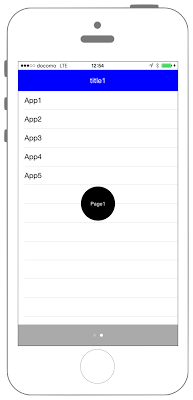

# UITableViewをSlideさせる




## Swift3.0
```swift
//
//  ViewController.swift
//  UIKit046_3.0
//
//  Created by KimikoWatanabe on 2016/08/21.
//  Copyright © 2016年 FaBo, Inc. All rights reserved.
//

import UIKit

class ViewController: UIViewController, UIScrollViewDelegate, UITableViewDelegate, UITableViewDataSource {

    // UIPageControl.
    var pageControl: UIPageControl!
    // UIScrollView.
    var scrollView: UIScrollView!
    // TableViewのアイテム.
    let myItems: [[String]] = [["TEST1", "TEST2", "TEST3"],["App1", "App2", "App3", "App4", "App5"]]
    // TableViewに表示するタイトル.
    let myTitles: [String] = ["title0","title1"]
    // TableView.
    var myTableView: [UITableView] = []
    // ページ番号.
    let pageSize = 2

    override func viewDidLoad() {

        // ScrollViewの設定.
        let width = self.view.frame.maxX, height = self.view.frame.maxY
        scrollView = UIScrollView(frame: self.view.frame)
        scrollView.showsHorizontalScrollIndicator = false;
        scrollView.showsVerticalScrollIndicator = false
        scrollView.isPagingEnabled = true
        scrollView.delegate = self
        scrollView.contentSize = CGSize(width:CGFloat(pageSize) * width, height:0)
        self.view.addSubview(scrollView)

        // Status Barの高さを取得.
        let barHeight: CGFloat = UIApplication.shared.statusBarFrame.size.height

        // Viewの高さと幅を取得.
        let displayWidth: CGFloat = self.view.frame.width
        let displayHeight: CGFloat = self.view.frame.height

        // TableViewの生成( status barの高さ分ずらして表示 ).
        for i in 0 ..< pageSize {

            let tableView: UITableView = UITableView(frame: CGRect(x: CGFloat(i) * width, y: barHeight, width: displayWidth, height: displayHeight - barHeight))
            myTableView.append(tableView)
            myTableView[i].register(UITableViewCell.self, forCellReuseIdentifier: "MyCell")
            myTableView[i].dataSource = self
            myTableView[i].delegate = self
            scrollView.addSubview(myTableView[i])

            //ページごとに異なるラベルを表示.
            let myLabel:UILabel = UILabel(frame: CGRect(x:CGFloat(i) * width + width/2 - 40, y:height/2 - 40, width:80, height:80))
            myLabel.backgroundColor = UIColor.black
            myLabel.textColor = UIColor.white
            myLabel.textAlignment = NSTextAlignment.center
            myLabel.layer.masksToBounds = true
            myLabel.text = "Page\(i)"
            myLabel.font = UIFont.systemFont(ofSize: UIFont.smallSystemFontSize)
            myLabel.layer.cornerRadius = 40.0

            scrollView.addSubview(myLabel)
        }

        // PageControlを作成.
        pageControl = UIPageControl(frame: CGRect(x:0, y:self.view.frame.maxY - 50, width:width, height:50))
        pageControl.backgroundColor = UIColor.lightGray

        // PageControlするページ数を設定.
        pageControl.numberOfPages = pageSize

        // 現在ページを設定.
        pageControl.currentPage = 0
        pageControl.isUserInteractionEnabled = false

        self.view.addSubview(pageControl)
    }


    func scrollViewDidEndDecelerating(_ scrollView: UIScrollView) {

        // スクロール数が1ページ分になったら.
        if fmod(scrollView.contentOffset.x, scrollView.frame.maxX) == 0 {
            // ページの場所を切り替える.
            pageControl.currentPage = Int(scrollView.contentOffset.x / scrollView.frame.maxX)
        }
    }

    /*
     Cellが選択された際に呼び出される.
     */
    func tableView(_ tableView: UITableView, didSelectRowAt indexPath: IndexPath) {
        if tableView == myTableView[0] {
            print("Num: \(indexPath.row)")
            print("Value: \(myItems[0][indexPath.row])")
        } else if tableView == myTableView[1] {
            print("Num: \(indexPath.row)")
            print("Value: \(myItems[1][indexPath.row])")
        }

    }

    /*
     Cellの総数を返す.
     */
    func tableView(_ tableView: UITableView, numberOfRowsInSection section: Int) -> Int {
        if tableView == myTableView[0] {
            return myItems[0].count
        } else if tableView == myTableView[1] {
            return myItems[1].count
        } else{
            return 0
        }

    }

    /*
     Headerを追加.
     */
    func tableView(_ tableView: UITableView, viewForHeaderInSection section: Int) -> UIView? {
        let myLabel: UILabel = UILabel(frame: CGRect(x: 0, y: 0, width: self.view.bounds.width, height: 100))

        myLabel.textAlignment = .center

        if tableView == myTableView[0] {
            myLabel.backgroundColor = UIColor.black
            myLabel.textColor = UIColor.white
            myLabel.text = myTitles[0]
        } else if tableView == myTableView[1] {
            myLabel.backgroundColor = UIColor.blue
            myLabel.textColor = UIColor.white
            myLabel.text = myTitles[1]
        }

        return myLabel
    }

    /*
     Headerの高さ.
     */
    func tableView(_ tableView: UITableView, heightForHeaderInSection section: Int) -> CGFloat {
        return 50.0
    }

    /*
     Cellに値を設定する.
     */
    func tableView(_ tableView: UITableView, cellForRowAt indexPath: IndexPath) -> UITableViewCell {
        let cell: UITableViewCell = tableView.dequeueReusableCell(withIdentifier: "MyCell", for: indexPath as IndexPath)

        if tableView == myTableView[0] {
            cell.textLabel?.text = "\(myItems[0][indexPath.row])"
        } else if tableView == myTableView[1] {
            cell.textLabel?.text = "\(myItems[1][indexPath.row])"
        }

        return cell
    }

}
```

## Swift 2.3
```swift
//
//  ViewController.swift
//  UIKit046_2.3
//
//  Created by KimikoWatanabe on 2016/08/21.
//  Copyright © 2016年 FaBo, Inc. All rights reserved.
//

import UIKit

class ViewController: UIViewController, UIScrollViewDelegate, UITableViewDelegate, UITableViewDataSource {

    // UIPageControl.
    var pageControl: UIPageControl!
    // UIScrillView.
    var scrollView: UIScrollView!
    // TableViewのアイテム.
    let myItems: [[String]] = [["TEST1", "TEST2", "TEST3"],["App1", "App2", "App3", "App4", "App5"]]
    // TableViewに表示するタイトル.
    let myTitles: [String] = ["title0","title1"]
    // TableView.
    var myTableView: [UITableView] = []
    // ページ番号.
    let pageSize = 2

    override func viewDidLoad() {

        // ScrollViewの設定.
        let width = self.view.frame.maxX, height = self.view.frame.maxY
        scrollView = UIScrollView(frame: self.view.frame)
        scrollView.showsHorizontalScrollIndicator = false;
        scrollView.showsVerticalScrollIndicator = false
        scrollView.pagingEnabled = true
        scrollView.delegate = self
        scrollView.contentSize = CGSizeMake(CGFloat(pageSize) * width, 0)
        self.view.addSubview(scrollView)

        // Status Barの高さを取得.
        let barHeight: CGFloat = UIApplication.sharedApplication().statusBarFrame.size.height

        // Viewの高さと幅を取得.
        let displayWidth: CGFloat = self.view.frame.width
        let displayHeight: CGFloat = self.view.frame.height

        // TableViewの生成( status barの高さ分ずらして表示 ).
        for i in 0 ..< pageSize {

            let tableView: UITableView = UITableView(frame: CGRect(x: CGFloat(i) * width, y: barHeight, width: displayWidth, height: displayHeight - barHeight))
            myTableView.append(tableView)
            myTableView[i].registerClass(UITableViewCell.self, forCellReuseIdentifier: "MyCell")
            myTableView[i].dataSource = self
            myTableView[i].delegate = self
            scrollView.addSubview(myTableView[i])

            //ページごとに異なるラベルを表示.
            let myLabel:UILabel = UILabel(frame: CGRectMake(CGFloat(i) * width + width/2 - 40, height/2 - 40, 80, 80))
            myLabel.backgroundColor = UIColor.blackColor()
            myLabel.textColor = UIColor.whiteColor()
            myLabel.textAlignment = NSTextAlignment.Center
            myLabel.layer.masksToBounds = true
            myLabel.text = "Page\(i)"
            myLabel.font = UIFont.systemFontOfSize(UIFont.smallSystemFontSize())
            myLabel.layer.cornerRadius = 40.0

            scrollView.addSubview(myLabel)
        }

        // PageControlを作成.
        pageControl = UIPageControl(frame: CGRectMake(0, self.view.frame.maxY - 50, width, 50))
        pageControl.backgroundColor = UIColor.lightGrayColor()

        // PageControlするページ数を設定.
        pageControl.numberOfPages = pageSize

        // 現在ページを設定.
        pageControl.currentPage = 0
        pageControl.userInteractionEnabled = false

        self.view.addSubview(pageControl)
    }


    func scrollViewDidEndDecelerating(scrollView: UIScrollView) {

        // スクロール数が1ページ分になったら.
        if fmod(scrollView.contentOffset.x, scrollView.frame.maxX) == 0 {
            // ページの場所を切り替える.
            pageControl.currentPage = Int(scrollView.contentOffset.x / scrollView.frame.maxX)
        }
    }

    /*
     Cellが選択された際に呼び出される.
     */
    func tableView(tableView: UITableView, didSelectRowAtIndexPath indexPath: NSIndexPath) {
        if tableView == myTableView[0] {
            print("Num: \(indexPath.row)")
            print("Value: \(myItems[0][indexPath.row])")
        } else if tableView == myTableView[1] {
            print("Num: \(indexPath.row)")
            print("Value: \(myItems[1][indexPath.row])")
        }

    }

    /*
     Cellの総数を返す.
     */
    func tableView(tableView: UITableView, numberOfRowsInSection section: Int) -> Int {
        if tableView == myTableView[0] {
            return myItems[0].count
        } else if tableView == myTableView[1] {
            return myItems[1].count
        } else{
            return 0
        }

    }

    /*
     Headerを追加.
     */
    func tableView(tableView: UITableView, viewForHeaderInSection section: Int) -> UIView? {
        let myLabel: UILabel = UILabel(frame: CGRect(x: 0, y: 0, width: self.view.bounds.width, height: 100))

        myLabel.textAlignment = .Center

        if tableView == myTableView[0] {
            myLabel.backgroundColor = UIColor.blackColor()
            myLabel.textColor = UIColor.whiteColor()
            myLabel.text = myTitles[0]
        } else if tableView == myTableView[1] {
            myLabel.backgroundColor = UIColor.blueColor()
            myLabel.textColor = UIColor.whiteColor()
            myLabel.text = myTitles[1]
        }

        return myLabel
    }

    /*
     Headerの高さ.
     */
    func tableView(tableView: UITableView, heightForHeaderInSection section: Int) -> CGFloat {
        return 50.0
    }

    /*
     Cellに値を設定する.
     */
    func tableView(tableView: UITableView, cellForRowAtIndexPath indexPath: NSIndexPath) -> UITableViewCell {
        let cell: UITableViewCell = tableView.dequeueReusableCellWithIdentifier("MyCell", forIndexPath: indexPath)

        if tableView == myTableView[0] {
            cell.textLabel?.text = "\(myItems[0][indexPath.row])"
        } else if tableView == myTableView[1] {
            cell.textLabel?.text = "\(myItems[1][indexPath.row])"
        }

        return cell
    }

}
```

## 2.3と3.0の差分
* UIColorの参照方法が変更(UIColor.grayColor()->UIColor.gray)
* CGRect,CGSizeの初期化方法の変更(CGRectMake,CGSizetMakeの廃止)
* UITableViewDelegateのデリゲートメソッドの引数が変更
* UIScrollViewの一部プロパティの変更
* UITableViewの一部プロパティ名の変更
* NSIndexPathの廃止、IndexPathに変更

## Reference
* UITableView Class
