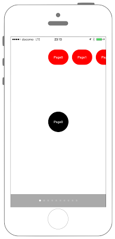
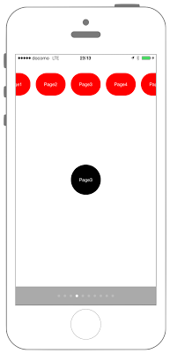

# 周期の違うUIScrollViewを同期させる




## Swift3.0
```swift
//
//  ViewController.swift
//  UIKit047_3.0
//
//  Created by KimikoWatanabe on 2016/08/21.
//  Copyright © 2016年 FaBo, Inc. All rights reserved.
//

import UIKit

class ViewController: UIViewController, UIScrollViewDelegate {

    // UIPageControl.
    var pageControl: UIPageControl!
    // UIScrillView.
    var scrollViewHeader: UIScrollView!
    var scrollViewMain: UIScrollView!
    // ページ番号.
    let pageSize = 10

    override func viewDidLoad() {

        // 画面サイズの取得.
        let width = self.view.frame.maxX, height = self.view.frame.maxY

        // ScrollViewHeaderの設定.
        scrollViewHeader = UIScrollView(frame: self.view.frame)
        scrollViewHeader.showsHorizontalScrollIndicator = false
        scrollViewHeader.showsVerticalScrollIndicator = false
        scrollViewHeader.isPagingEnabled = true
        scrollViewHeader.delegate = self
        scrollViewHeader.contentSize = CGSize(width:CGFloat(pageSize) * width, height:0)
        self.view.addSubview(scrollViewHeader)

        // ScrollViewMainの設定.
        scrollViewMain = UIScrollView(frame: self.view.frame)
        scrollViewMain.showsHorizontalScrollIndicator = false
        scrollViewMain.showsVerticalScrollIndicator = false
        scrollViewMain.isPagingEnabled = true
        scrollViewMain.delegate = self
        scrollViewMain.contentSize = CGSize(width:CGFloat(pageSize) * width, height:0)
        self.view.addSubview(scrollViewMain)

        // ScrollView1に貼付けるLabelの生成.
        for i in 0 ..< pageSize {

            //ページごとに異なるラベルを表示.
            let myLabel:UILabel = UILabel(frame: CGRect(x:CGFloat(i)*width+width/2-40, y:height/2 - 40, width:80, height:80))
            myLabel.backgroundColor = UIColor.black
            myLabel.textColor = UIColor.white
            myLabel.textAlignment = NSTextAlignment.center
            myLabel.layer.masksToBounds = true
            myLabel.text = "Page\(i)"
            myLabel.font = UIFont.systemFont(ofSize: UIFont.smallSystemFontSize)
            myLabel.layer.cornerRadius = 40.0

            scrollViewMain.addSubview(myLabel)
        }

        // ScrollView2に貼付ける Labelの生成.
        for i in 0 ..< pageSize {

            //ページごとに異なるラベルを表示.
            let myLabel:UILabel = UILabel(frame: CGRect(x:CGFloat(i)*width/4, y:50, width:80, height:60))
            myLabel.backgroundColor = UIColor.red
            myLabel.textColor = UIColor.white
            myLabel.textAlignment = NSTextAlignment.center
            myLabel.layer.masksToBounds = true
            myLabel.text = "Page\(i)"
            myLabel.font = UIFont.systemFont(ofSize: UIFont.smallSystemFontSize)
            myLabel.layer.cornerRadius = 30.0

            scrollViewHeader.addSubview(myLabel)
        }

        // PageControlを作成.
        pageControl = UIPageControl(frame: CGRect(x:0, y:self.view.frame.maxY - 50, width:width, height:50))
        pageControl.backgroundColor = UIColor.lightGray

        // PageControlするページ数を設定.
        pageControl.numberOfPages = pageSize

        // 現在ページを設定.
        pageControl.currentPage = 0
        pageControl.isUserInteractionEnabled = false

        self.view.addSubview(pageControl)
    }

    /*
     ScrollViewが移動した際に呼ばれる.
     */
    func scrollViewDidScroll(_ scrollView: UIScrollView) {
        if scrollView == scrollViewMain {
            scrollViewHeader.contentOffset.x = scrollViewMain.contentOffset.x/4
        }
    }

    /*
     移動が完了したら呼ばれる.
     */
    func scrollViewDidEndDecelerating(_ scrollView: UIScrollView) {

        // スクロール数が1ページ分になったら.
        if fmod(scrollViewMain.contentOffset.x, scrollViewMain.frame.maxX) == 0 {
            // ページの場所を切り替える.
            pageControl.currentPage = Int(scrollViewMain.contentOffset.x / scrollViewMain.frame.maxX)
        }
    }
}
```

## Swift 2.3
```swift
//
//  ViewController.swift
//  UIKit047_2.3
//
//  Created by KimikoWatanabe on 2016/08/21.
//  Copyright © 2016年 FaBo, Inc. All rights reserved.
//

import UIKit

class ViewController: UIViewController, UIScrollViewDelegate {

    // UIPageControl.
    var pageControl: UIPageControl!
    // UIScrillView.
    var scrollViewHeader: UIScrollView!
    var scrollViewMain: UIScrollView!
    // ページ番号.
    let pageSize = 10

    override func viewDidLoad() {

        // 画面サイズの取得.
        let width = self.view.frame.maxX, height = self.view.frame.maxY

        // ScrollViewHeaderの設定.
        scrollViewHeader = UIScrollView(frame: self.view.frame)
        scrollViewHeader.showsHorizontalScrollIndicator = false
        scrollViewHeader.showsVerticalScrollIndicator = false
        scrollViewHeader.pagingEnabled = true
        scrollViewHeader.delegate = self
        scrollViewHeader.contentSize = CGSizeMake(CGFloat(pageSize) * width, 0)
        self.view.addSubview(scrollViewHeader)

        // ScrollViewMainの設定.
        scrollViewMain = UIScrollView(frame: self.view.frame)
        scrollViewMain.showsHorizontalScrollIndicator = false
        scrollViewMain.showsVerticalScrollIndicator = false
        scrollViewMain.pagingEnabled = true
        scrollViewMain.delegate = self
        scrollViewMain.contentSize = CGSizeMake(CGFloat(pageSize) * width, 0)
        self.view.addSubview(scrollViewMain)

        // ScrollView1に貼付けるLabelの生成.
        for i in 0 ..< pageSize {

            //ページごとに異なるラベルを表示.
            let myLabel:UILabel = UILabel(frame: CGRectMake(CGFloat(i) * width + width/2 - 40, height/2 - 40, 80, 80))
            myLabel.backgroundColor = UIColor.blackColor()
            myLabel.textColor = UIColor.whiteColor()
            myLabel.textAlignment = NSTextAlignment.Center
            myLabel.layer.masksToBounds = true
            myLabel.text = "Page\(i)"
            myLabel.font = UIFont.systemFontOfSize(UIFont.smallSystemFontSize())
            myLabel.layer.cornerRadius = 40.0

            scrollViewMain.addSubview(myLabel)
        }

        // ScrollView2に貼付ける Labelの生成.
        for i in 0 ..< pageSize {

            //ページごとに異なるラベルを表示.
            let myLabel:UILabel = UILabel(frame: CGRectMake(CGFloat(i) * width/4, 50, 80, 60))
            myLabel.backgroundColor = UIColor.redColor()
            myLabel.textColor = UIColor.whiteColor()
            myLabel.textAlignment = NSTextAlignment.Center
            myLabel.layer.masksToBounds = true
            myLabel.text = "Page\(i)"
            myLabel.font = UIFont.systemFontOfSize(UIFont.smallSystemFontSize())
            myLabel.layer.cornerRadius = 30.0

            scrollViewHeader.addSubview(myLabel)
        }

        // PageControlを作成.
        pageControl = UIPageControl(frame: CGRectMake(0, self.view.frame.maxY - 50, width, 50))
        pageControl.backgroundColor = UIColor.lightGrayColor()

        // PageControlするページ数を設定.
        pageControl.numberOfPages = pageSize

        // 現在ページを設定.
        pageControl.currentPage = 0
        pageControl.userInteractionEnabled = false

        self.view.addSubview(pageControl)
    }

    /*
     ScrollViewが移動した際に呼ばれる.
     */
    func scrollViewDidScroll(scrollView: UIScrollView) {
        if scrollView == scrollViewMain {
            scrollViewHeader.contentOffset.x = scrollViewMain.contentOffset.x/4
        }
    }

    /*
     移動が完了したら呼ばれる.
     */
    func scrollViewDidEndDecelerating(scrollView: UIScrollView) {

        // スクロール数が1ページ分になったら.
        if fmod(scrollViewMain.contentOffset.x, scrollViewMain.frame.maxX) == 0 {
            // ページの場所を切り替える.
            pageControl.currentPage = Int(scrollViewMain.contentOffset.x / scrollViewMain.frame.maxX)
        }
    }
}
```

## 2.3と3.0の差分
* UIColorの参照方法が変更(UIColor.grayColor()->UIColor.gray)
* CGRect,CGSizeの初期化方法の変更(CGRectMake,CGSizetMakeの廃止)
* UIScrollViewの一部プロパティ名の変更

## Reference
* UIScrollView Class
