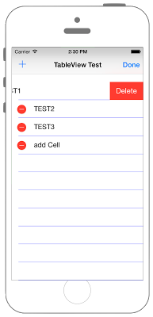
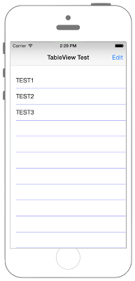

# UITableViewに追加・削除機能を追加




## Swift3.0
### AppDelegate.swift
```swift
//
//  AppDelegate.swift
//  UIKit051_3.0
//
//  Created by KimikoWatanabe on 2016/08/21.
//  Copyright © 2016年 FaBo, Inc. All rights reserved.
//


```
### UIViewController.swift
```swift
//
//  ViewController.swift
//  UIKit051_3.0
//
//  Created by KimikoWatanabe on 2016/08/21.
//  Copyright © 2016年 FaBo, Inc. All rights reserved.
//


```

## Swift 2.3
### AppDelegate.swift
```swift
//
//  AppDelegate.swift
//  UIKit051_2.3
//
//  Created by KimikoWatanabe on 2016/08/21.
//  Copyright © 2016年 FaBo, Inc. All rights reserved.
//
```

### UIViewController.swift
```swift
//
//  ViewController.swift
//  UIKit051_2.3
//
//  Created by KimikoWatanabe on 2016/08/21.
//  Copyright © 2016年 FaBo, Inc. All rights reserved.
//
```

## 2.3と3.0の差分
* UIColorの参照方法が変更(UIColor.grayColor()->UIColor.gray)
* CGRect,CGPointの初期化方法の変更(CGRectMake,CGPointMakeの廃止)

## Reference
* UITableView Class
* UITableViewDelegate
* UITableViewDataSource
