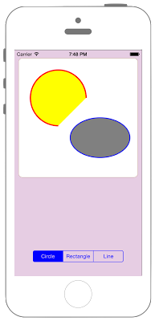

# UIBezierPathで図形を描画



## Swift3.0
### UIViewController.swift
```swift
//
//  ViewController.swift
//  UIKit052_3.0
//
//  Created by KimikoWatanabe on 2016/08/21.
//  Copyright © 2016年 FaBo, Inc. All rights reserved.
//

import UIKit

class ViewController: UIViewController {

    override func viewDidLoad() {
        super.viewDidLoad()

        // viewの背景色を設定.
        self.view.backgroundColor = UIColor(red: 0.902, green: 0.803, blue: 0.890, alpha: 1.0)

        // SegmentedControllerを生成.
        let mySegcon = UISegmentedControl(items: ["Circle", "Rectangle", "Line"])
        mySegcon.layer.position = CGPoint(x:self.view.frame.width/2, y:self.view.frame.height - 50)
        mySegcon.tintColor = UIColor.blue
        mySegcon.addTarget(self, action: #selector(ViewController.changedValue(sender:)), for: UIControlEvents.valueChanged)

        // viewにSegmentedControllerを追加.
        self.view.addSubview(mySegcon)
    }

    /*
     SegmentedControllerの値が変わった時に呼ばれるメソッド.
     */
    func changedValue(sender: UISegmentedControl) {
        var myDrawView: UIView!

        // SegmentedControllerの値によってそれぞれのクラスのインスタンスを生成.
        switch(sender.selectedSegmentIndex) {

        case 0:
            myDrawView = drawCircleView(frame: CGRect(x:0, y:0, width:300, height:300))

        case 1:
            myDrawView = drawRectangleView(frame: CGRect(x:0, y:0, width:300, height:300))

        case 2:
            myDrawView = drawLineView(frame: CGRect(x:0, y:0, width:300, height:300))

        default:
            print("error")
            return
        }

        // 描画用viewの中心を設定.
        myDrawView.center = CGPoint(x:self.view.frame.width/2, y:170)
        myDrawView.backgroundColor = UIColor.white

        // 描画用viewをviewに追加.
        self.view.addSubview(myDrawView)
    }

    override func didReceiveMemoryWarning() {
        super.didReceiveMemoryWarning()
    }
}

```
### drawCircleView.swift
```swift
//
//  drawCircleView.swift
//  UIKit052_3.0
//
//  Created by KimikoWatanabe on 2016/08/21.
//  Copyright © 2016年 FaBo, Inc. All rights reserved.
//

import UIKit

/*
 直線を描写するclass.
 */
class drawCircleView: UIView {

    override init(frame: CGRect) {
        super.init(frame: frame)
    }

    required init(coder aDecoder: NSCoder) {
        fatalError("init(coder:) has not been implemented")
    }

    /*
     表示を更新する必要が生ずると自動的に呼び出される.
     */
    override func draw(_ rect: CGRect) {

        // viewの設定.
        self.layer.borderColor = UIColor.brown.cgColor
        self.layer.borderWidth = 0.5
        self.layer.cornerRadius = 10.0
        self.layer.masksToBounds = true

        let circlePoint = CGPoint(x:100, y:100)

        // 円のBezierPathを生成
        let myCircle: UIBezierPath = UIBezierPath(arcCenter: circlePoint,
                                                  // 半径.
            radius: 70.0,
            // 初角度.
            startAngle: 0.0,
            // 最終角度.
            endAngle: CGFloat(M_PI*2/4),
            // 反時計回り.
            clockwise: false)

        // 線の色を赤色に設定.
        UIColor.red.setStroke()

        // 塗りつぶしの色を黄色に設定.
        UIColor.yellow.setFill()

        // 線で閉じた内側を塗りつぶす.
        myCircle.fill()

        // 線の太さを設定.
        myCircle.lineWidth = 3.0

        // 描画.
        myCircle.stroke()

        // 楕円のBezierPathを生成.
        let myOval: UIBezierPath = UIBezierPath(ovalIn: CGRect(x:130, y:150, width:150, height:100))
        UIColor.blue.setStroke()
        UIColor.gray.setFill()
        myOval.fill()
        myOval.lineWidth = 2.0

        // 描画.
        myOval.stroke()
    }
}

```
### drawRectangleView.swift
```swift
//
//  drawRectangleView.swift
//  UIKit052_3.0
//
//  Created by KimikoWatanabe on 2016/08/21.
//  Copyright © 2016年 FaBo, Inc. All rights reserved.
//

import UIKit

/*
 直線を描写するclass.
 */
class drawRectangleView: UIView {

    override init(frame: CGRect) {
        super.init(frame: frame)
    }

    required init(coder aDecoder: NSCoder) {
        fatalError("init(coder:) has not been implemented")
    }

    /*
     表示を更新する必要が生ずると自動的に呼び出される.
     */
    override func draw(_ rect: CGRect) {

        // viewの設定.
        self.layer.borderColor = UIColor.brown.cgColor
        self.layer.borderWidth = 0.5
        self.layer.cornerRadius = 10.0
        self.layer.masksToBounds = true

        // 長方形のUIBezierPathを生成.
        let myRect1: UIBezierPath = UIBezierPath(rect: CGRect(x:5, y:5, width:290, height:290))

        // 線の色を青色に設定.
        UIColor.blue.setStroke()

        // 線の太さを設定.
        myRect1.lineWidth = 1.0

        // 描画.
        myRect1.stroke()

        // 角丸の長方形のUIBezierPathを生成.
        let myRect2: UIBezierPath = UIBezierPath(roundedRect: CGRect(x:50, y:50, width:200, height:100),

                                                 // 全ての角を丸くする.
            byRoundingCorners: UIRectCorner.allCorners,

            // 丸くする度を設定.
            cornerRadii: CGSize(width:5.0, height:5.0))

        // 線の色をオレンジ色に設定.
        UIColor.orange.setStroke()

        // 塗りつぶしの色を黄色に設定.
        UIColor.yellow.setFill()

        // 塗りつぶし.
        myRect2.fill()

        // 線の太さを設定.
        myRect2.lineWidth = 3.0

        // 描画.
        myRect2.stroke()

    }
}
```
### drawLineView.swift
```swift
//
//  drawLineView.swift
//  UIKit052_3.0
//
//  Created by KimikoWatanabe on 2016/08/21.
//  Copyright © 2016年 FaBo, Inc. All rights reserved.
//

import UIKit

/*
 直線を描写するclass.
 */
class drawLineView: UIView {

    override init(frame: CGRect) {
        super.init(frame: frame)
    }

    required init(coder aDecoder: NSCoder) {
        fatalError("init(coder:) has not been implemented")
    }

    /*
     表示を更新する必要が生ずると自動的に呼び出される.
     */
    override func draw(_ rect: CGRect) {

        // viewの設定.
        self.layer.borderColor = UIColor.brown.cgColor
        self.layer.borderWidth = 0.5
        self.layer.cornerRadius = 10.0
        self.layer.masksToBounds = true

        // BezierPathを生成.
        let myLine: UIBezierPath = UIBezierPath()

        // 線の色を青色に設定.
        UIColor.red.setStroke()

        // 始点を設定.
        myLine.move(to: CGPoint.zero)

        // 次点を設定.
        myLine.addLine(to: CGPoint(x:50, y:150))
        myLine.addLine(to: CGPoint(x:200,y:100))

        // 終点を設定.
        myLine.addLine(to: CGPoint(x:self.bounds.width, y:self.bounds.height))

        // 始点と終着点を繋いで閉じる.
        myLine.close()

        // 塗りつぶしの色を設定.
        UIColor.yellow.setFill()

        // 線で閉じた内側を塗りつぶす.
        myLine.fill()

        // 線の太さを設定.
        myLine.lineWidth = 3.0

        // 描画.
        myLine.stroke()
    }
}
```


## Swift 2.3
### UIViewController.swift
```swift
//
//  ViewController.swift
//  UIKit052_2.3
//
//  Created by KimikoWatanabe on 2016/08/21.
//  Copyright © 2016年 FaBo, Inc. All rights reserved.


import UIKit

class ViewController: UIViewController {

    override func viewDidLoad() {
        super.viewDidLoad()

        // viewの背景色を設定.
        self.view.backgroundColor = UIColor(red: 0.902, green: 0.803, blue: 0.890, alpha: 1.0)

        // SegmentedControllerを生成.
        let mySegcon = UISegmentedControl(items: ["Circle", "Rectangle", "Line"])
        mySegcon.layer.position = CGPointMake(self.view.frame.width/2, self.view.frame.height - 50)
        mySegcon.tintColor = UIColor.blueColor()
        mySegcon.addTarget(self, action: #selector(ViewController.changedValue(_:)), forControlEvents: UIControlEvents.ValueChanged)

        // viewにSegmentedControllerを追加.
        self.view.addSubview(mySegcon)
    }

    /*
     SegmentedControllerの値が変わった時に呼ばれるメソッド.
     */
    func changedValue(sender: UISegmentedControl) {
        var myDrawView: UIView!

        // SegmentedControllerの値によってそれぞれのクラスのインスタンスを生成.
        switch(sender.selectedSegmentIndex) {

        case 0:
            myDrawView = drawCircleView(frame: CGRectMake(0, 0, 300, 300))

        case 1:
            myDrawView = drawRectangleView(frame: CGRectMake(0, 0, 300, 300))

        case 2:
            myDrawView = drawLineView(frame: CGRectMake(0, 0, 300, 300))

        default:
            print("error")
            return
        }

        // 描画用viewの中心を設定.
        myDrawView.center = CGPointMake(self.view.frame.width/2, 170)
        myDrawView.backgroundColor = UIColor.whiteColor()

        // 描画用viewをviewに追加.
        self.view.addSubview(myDrawView)
    }

    override func didReceiveMemoryWarning() {
        super.didReceiveMemoryWarning()
    }
}
```
### drawCircleView.swift
```swift
//
//  drawCircleView.swift
//  UIKit052_2.3
//
//  Created by KimikoWatanabe on 2016/08/21.
//  Copyright © 2016年 FaBo, Inc. All rights reserved.
//

import UIKit

/*
 直線を描写するclass.
 */
class drawCircleView: UIView {

    override init(frame: CGRect) {
        super.init(frame: frame)
    }

    required init(coder aDecoder: NSCoder) {
        fatalError("init(coder:) has not been implemented")
    }

    /*
     表示を更新する必要が生ずると自動的に呼び出される.
     */
    override func drawRect(rect: CGRect) {

        // viewの設定.
        self.layer.borderColor = UIColor.brownColor().CGColor
        self.layer.borderWidth = 0.5
        self.layer.cornerRadius = 10.0
        self.layer.masksToBounds = true

        let circlePoint = CGPointMake(100, 100)
        let ovalPoint = CGPointMake(200, 200)

        // 円のBezierPathを生成
        let myCircle: UIBezierPath = UIBezierPath(arcCenter: circlePoint,
                                                  // 半径.
            radius: 70.0,
            // 初角度.
            startAngle: 0.0,
            // 最終角度.
            endAngle: CGFloat(M_PI*2/4),
            // 反時計回り.
            clockwise: false)

        // 線の色を赤色に設定.
        UIColor.redColor().setStroke()

        // 塗りつぶしの色を黄色に設定.
        UIColor.yellowColor().setFill()

        // 線で閉じた内側を塗りつぶす.
        myCircle.fill()

        // 線の太さを設定.
        myCircle.lineWidth = 3.0

        // 描画.
        myCircle.stroke()

        // 楕円のBezierPathを生成.
        let myOval: UIBezierPath = UIBezierPath(ovalInRect: CGRectMake(130, 150, 150, 100))
        UIColor.blueColor().setStroke()
        UIColor.grayColor().setFill()
        myOval.fill()
        myOval.lineWidth = 2.0

        // 描画.
        myOval.stroke()
    }
}
```
### drawRectangleView.swift
```swift
//
//  drawRectangleView.swift
//  UIKit052_2.3
//
//  Created by KimikoWatanabe on 2016/08/21.
//  Copyright © 2016年 FaBo, Inc. All rights reserved.
//

import UIKit

/*
 直線を描写するclass.
 */
class drawRectangleView: UIView {

    override init(frame: CGRect) {
        super.init(frame: frame)
    }

    required init(coder aDecoder: NSCoder) {
        fatalError("init(coder:) has not been implemented")
    }

    /*
     表示を更新する必要が生ずると自動的に呼び出される.
     */
    override func drawRect(rect: CGRect) {

        // viewの設定.
        self.layer.borderColor = UIColor.brownColor().CGColor
        self.layer.borderWidth = 0.5
        self.layer.cornerRadius = 10.0
        self.layer.masksToBounds = true

        // 長方形のUIBezierPathを生成.
        let myRect1: UIBezierPath = UIBezierPath(rect: CGRectMake(5, 5, 290, 290))

        // 線の色を青色に設定.
        UIColor.blueColor().setStroke()

        // 線の太さを設定.
        myRect1.lineWidth = 1.0

        // 描画.
        myRect1.stroke()

        // 角丸の長方形のUIBezierPathを生成.
        let myRect2: UIBezierPath = UIBezierPath(roundedRect: CGRectMake(50, 50, 200, 100),

                                                 // 全ての角を丸くする.
            byRoundingCorners: UIRectCorner.AllCorners,

            // 丸くする度を設定.
            cornerRadii: CGSizeMake(5.0, 5.0))

        // 線の色をオレンジ色に設定.
        UIColor.orangeColor().setStroke()

        // 塗りつぶしの色を黄色に設定.
        UIColor.yellowColor().setFill()

        // 塗りつぶし.
        myRect2.fill()

        // 線の太さを設定.
        myRect2.lineWidth = 3.0

        // 描画.
        myRect2.stroke()

    }
}
```
### drawLineView.swift
```swift
//
//  drawLineView.swift
//  UIKit052_2.3
//
//  Created by KimikoWatanabe on 2016/08/21.
//  Copyright © 2016年 FaBo, Inc. All rights reserved.
//

import UIKit

/*
 直線を描写するclass.
 */
class drawLineView: UIView {

    override init(frame: CGRect) {
        super.init(frame: frame)
    }

    required init(coder aDecoder: NSCoder) {
        fatalError("init(coder:) has not been implemented")
    }

    /*
     表示を更新する必要が生ずると自動的に呼び出される.
     */
    override func drawRect(rect: CGRect) {

        // viewの設定.
        self.layer.borderColor = UIColor.brownColor().CGColor
        self.layer.borderWidth = 0.5
        self.layer.cornerRadius = 10.0
        self.layer.masksToBounds = true

        // BezierPathを生成.
        let myLine: UIBezierPath = UIBezierPath()

        // 線の色を青色に設定.
        UIColor.redColor().setStroke()

        // 始点を設定.
        myLine.moveToPoint(CGPointZero)

        // 次点を設定.
        myLine.addLineToPoint(CGPointMake(50, 150))
        myLine.addLineToPoint(CGPointMake(200, 100))

        // 終点を設定.
        myLine.addLineToPoint(CGPointMake(self.bounds.width, self.bounds.height))

        // 始点と終着点を繋いで閉じる.
        myLine.closePath()

        // 塗りつぶしの色を設定.
        UIColor.yellowColor().setFill()

        // 線で閉じた内側を塗りつぶす.
        myLine.fill()

        // 線の太さを設定.
        myLine.lineWidth = 3.0

        // 描画.
        myLine.stroke()
    }
}
```

## 2.3と3.0の差分
* UIColorの参照方法が変更(UIColor.grayColor()->UIColor.gray)
* CGRect,CGPointの初期化方法の変更(CGRectMake,CGPointMakeの廃止)
* ```drawRect(rect: CGRect)```が```draw(_ rect: CGRect)```に変更
* ```UIBezierPath(ovalInRect:)```が```UIBezierPath(ovalIn:)```に変更


## Reference
* UIBezierPath Class
 * [https://developer.apple.com/reference/uikit/uibezierpath](https://developer.apple.com/reference/uikit/uibezierpath)
