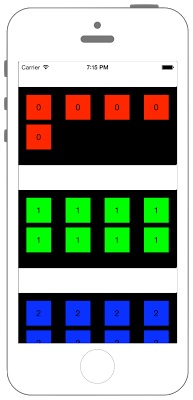

# UICollectionViewをセクション毎に分ける



## Swift3.0
### UIViewController.swift
```swift
//
//  ViewController.swift
//  UIKit055_3.0
//
//  Created by KimikoWatanabe on 2016/08/21.
//  Copyright © 2016年 FaBo, Inc. All rights reserved.
//

```
### CustomUICollectionViewCell.swift
```swift
//
//  CustomUICollectionViewCell.swift
//  UIKit055_3.0
//
//  Created by KimikoWatanabe on 2016/08/21.
//  Copyright © 2016年 FaBo, Inc. All rights reserved.
//

```

## Swift 2.3
### UIViewController.swift
```swift
//
//  ViewController.swift
//  UIKit055_2.3
//
//  Created by KimikoWatanabe on 2016/08/21.
//  Copyright © 2016年 FaBo, Inc. All rights reserved.
//
```

### CustomUICollectionViewCell.swift
```swift
//
//  CustomUICollectionViewCell.swift
//  UIKit055_2.3
//
//  Created by KimikoWatanabe on 2016/08/21.
//  Copyright © 2016年 FaBo, Inc. All rights reserved.
//
```


## 2.3と3.0の差分
* UIColorの参照方法が変更(UIColor.grayColor()->UIColor.gray)
* CGRect,CGPointの初期化方法の変更(CGRectMake,CGPointMakeの廃止)

## Reference
* UICollectionViewFlowLayout Class
* UICollectionView Class
* UIEdgeInsetsMake
* UICollectionDelegate
* UICollectionDataSource
* UIKit Class
